# 真题分类概率

> 转换说明：本文件的文本层用于检索和后续切题，但 PDF 中的分式、矩阵、分段函数、上下标以及 Symbol 字体可能无法仅靠文字层准确还原。
> 如果页面下方有“原始页面”图片，请以图片中的数学符号为准；需要可编辑公式时，再使用公式 OCR 转成 LaTeX。

> 源 PDF（相对源目录）：`线代概率篇/原PDF及解析/真题分类概率.pdf`

## PDF 第 1 页

### 原始页面（数学符号以此为准）

### 文本层（用于搜索/导入，公式可能失真）

~~~text
1987~2025
  概率论
真题分类汇编
~~~

## PDF 第 2 页

### 原始页面（数学符号以此为准）

> 生成原页图的原因：文字层为空，可能是扫描页。

### 文本层（用于搜索/导入，公式可能失真）

> 此页没有提取到文字层，请直接使用原页图或源 PDF。

## PDF 第 3 页

### 原始页面（数学符号以此为准）

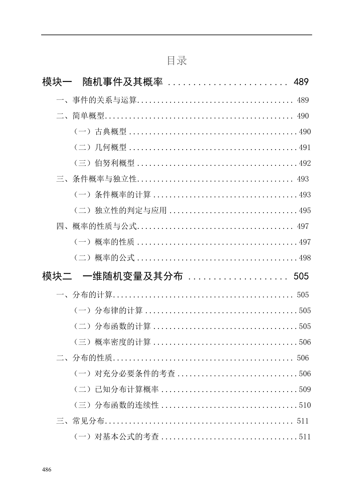

> 生成原页图的原因：包含疑似公式布局。

### 文本层（用于搜索/导入，公式可能失真）

~~~text
                               目录
模块一         随机事件及其概率 ........................ 489
      一、事件的关系与运算 ....................................... 489
      二、简单概型 ............................................... 490
         （一）古典概型 ..........................................490
         （二）几何概型 ..........................................491
         （三）伯努利概型 ........................................492
      三、条件概率与独立性 ....................................... 493
         （一）条件概率的计算 ....................................493
         （二）独立性的判定与应用 ................................495
      四、概率的性质与公式 ....................................... 497
         （一）概率的性质 ........................................497
         （二）概率的公式 ........................................498

模块二         一维随机变量及其分布 .................... 505
      一、分布的计算 ............................................. 505
         （一）分布律的计算 ......................................505
         （二）分布函数的计算 ....................................505
         （三）概率密度的计算 ....................................506
      二、分布的性质 ............................................. 506
         （一）对充分必要条件的考查 ..............................506
         （二）已知分布计算概率 ..................................509
         （三）分布函数的连续性 ..................................510
      三、常见分布 ............................................... 511
         （一）对基本公式的考查 ..................................511

486
~~~

## PDF 第 4 页

### 原始页面（数学符号以此为准）

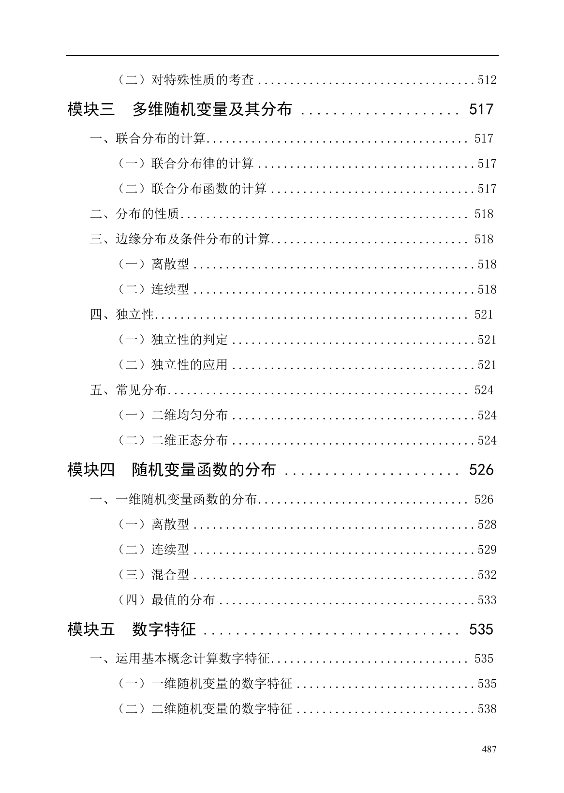

> 生成原页图的原因：包含疑似公式布局。

### 文本层（用于搜索/导入，公式可能失真）

~~~text
    （二）对特殊性质的考查 ..................................512

模块三    多维随机变量及其分布 .................... 517
 一、联合分布的计算 ......................................... 517
    （一）联合分布律的计算 ..................................517
    （二）联合分布函数的计算 ................................517
 二、分布的性质 ............................................. 518
 三、边缘分布及条件分布的计算 ............................... 518
    （一）离散型 ............................................518
    （二）连续型 ............................................518
 四、独立性 ................................................. 521
    （一）独立性的判定 ......................................521
    （二）独立性的应用 ......................................521
 五、常见分布 ............................................... 524
    （一）二维均匀分布 ......................................524
    （二）二维正态分布 ......................................524

模块四    随机变量函数的分布 ...................... 526
 一、一维随机变量函数的分布 ................................. 526
    （一）离散型 ............................................528
    （二）连续型 ............................................529
    （三）混合型 ............................................532
    （四）最值的分布 ........................................533

模块五    数字特征 ................................ 535
 一、运用基本概念计算数字特征 ............................... 535
    （一）一维随机变量的数字特征 ............................535
    （二）二维随机变量的数字特征 ............................538

                                                          487
~~~

## PDF 第 5 页

### 原始页面（数学符号以此为准）

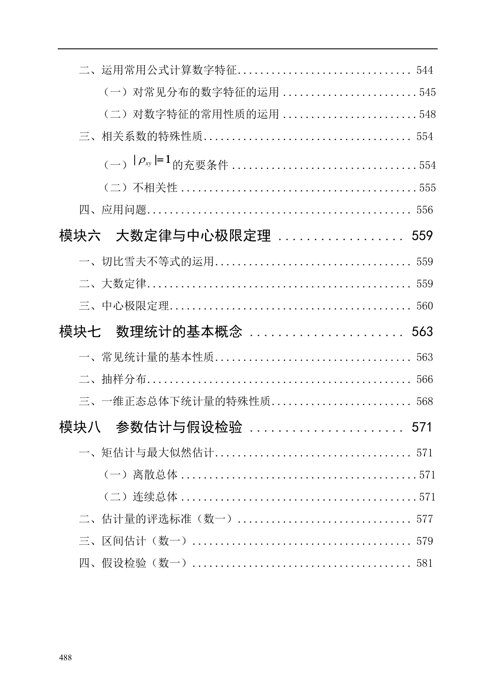

> 生成原页图的原因：包含 Symbol/私用区字形；包含疑似公式布局。

### 文本层（用于搜索/导入，公式可能失真）

~~~text
      二、运用常用公式计算数字特征 ............................... 544
         （一）对常见分布的数字特征的运用 ........................545
         （二）对数字特征的常用性质的运用 ........................548
      三、相关系数的特殊性质 ..................................... 554
                 xy = 
         （一）                 的充要条件 .................................554

         （二）不相关性 ..........................................555
      四、应用问题 ............................................... 556

模块六         大数定律与中心极限定理 .................. 559
      一、切比雪夫不等式的运用 ................................... 559
      二、大数定律 ............................................... 559
      三、中心极限定理 ........................................... 560

模块七         数理统计的基本概念 ...................... 563
      一、常见统计量的基本性质 ................................... 563
      二、抽样分布 ............................................... 566
      三、一维正态总体下统计量的特殊性质 ......................... 568

模块八         参数估计与假设检验 ...................... 571
      一、矩估计与最大似然估计 ................................... 571
         （一）离散总体 ..........................................571
         （二）连续总体 ..........................................571
      二、估计量的评选标准（数一） ............................... 577
      三、区间估计（数一） ....................................... 579
      四、假设检验（数一） ....................................... 581

488
~~~

## PDF 第 6 页

### 原始页面（数学符号以此为准）

> 生成原页图的原因：文字层为空，可能是扫描页。

### 文本层（用于搜索/导入，公式可能失真）

> 此页没有提取到文字层，请直接使用原页图或源 PDF。

## PDF 第 7 页

### 原始页面（数学符号以此为准）

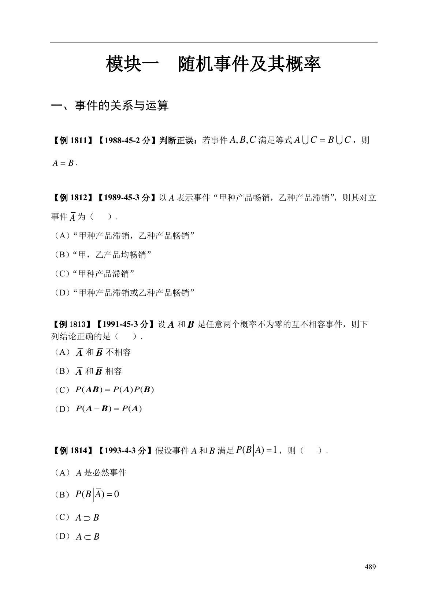

> 生成原页图的原因：包含 Symbol/私用区字形；包含疑似公式布局。

### 文本层（用于搜索/导入，公式可能失真）

~~~text
               模块一              随机事件及其概率

一、事件的关系与运算

【例 1811】【1988-45-2 分】判断正误：若事件 A, B, C 满足等式 A        C=B   C ，则

A= B.

【例 1812】【1989-45-3 分】以 A 表示事件“甲种产品畅销，乙种产品滞销”，则其对立

事件 A 为（        ）.

（A）“甲种产品滞销，乙种产品畅销”

（B）
  “甲，乙产品均畅销”

（C）
  “甲种产品滞销”

（D）“甲种产品滞销或乙种产品畅销”

【例 1813】【1991-45-3 分】设 A 和 B 是任意两个概率不为零的互不相容事件，则下
列结论正确的是（              ）.
（A） A 和 B 不相容

（B） A 和 B 相容

（C） P ( AB ) = P ( A) P ( B )

（D） P ( A − B ) = P ( A)

【例 1814】【1993-4-3 分】假设事件 A 和 B 满足 P( B A) = 1 ，则（   ）.

（A） A 是必然事件

（B） P ( B A) = 0

（C） A  B

（D） A  B

                                                             489
~~~

## PDF 第 8 页

### 原始页面（数学符号以此为准）

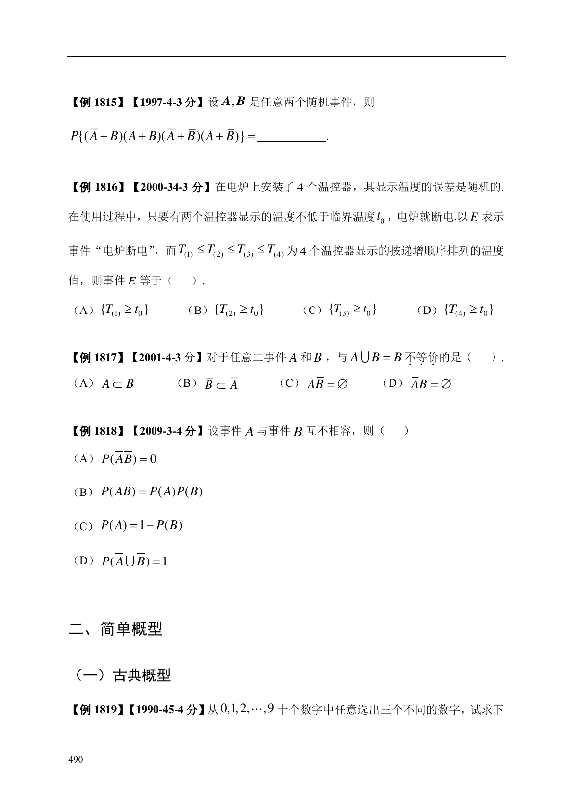

> 生成原页图的原因：包含 Symbol/私用区字形；包含疑似公式布局。

### 文本层（用于搜索/导入，公式可能失真）

~~~text
【例 1815】【1997-4-3 分】设 A, B 是任意两个随机事件，则

P{( A + B)( A + B )( A + B )( A + B )} =              .

【例 1816】【2000-34-3 分】在电炉上安装了 4 个温控器，其显示温度的误差是随机的.

在使用过程中，只要有两个温控器显示的温度不低于临界温度 t 0 ，电炉就断电.以 E 表示

事件“电炉断电”，而 T(1)  T(2)  T(3)  T(4) 为 4 个温控器显示的按递增顺序排列的温度

值，则事件 E 等于（                 ）.

（A） {T(1)  t0 }           （B） {T(2)  t0 }      （C） {T(3)  t0 }   （D） {T(4)  t0 }

【例 1817】【2001-4-3 分】对于任意二事件 A 和 B ，与 A                         B = B 不等价
                                                                     ．．．的是（        ）.

（A） A  B              （B） B  A              （C） AB =         （D） AB = 

【例 1818】【2009-3-4 分】设事件 A 与事件 B 互不相容，则（                             ）

（A） P ( AB ) = 0

（B） P ( AB ) = P ( A) P ( B )

（C） P ( A) = 1 − P ( B )

（D） P ( A     B) = 1

二、简单概型

（一）古典概型

【例 1819】【1990-45-4 分】从 0,1, 2,             ,9 十个数字中任意选出三个不同的数字，试求下

490
~~~

## PDF 第 9 页

### 原始页面（数学符号以此为准）

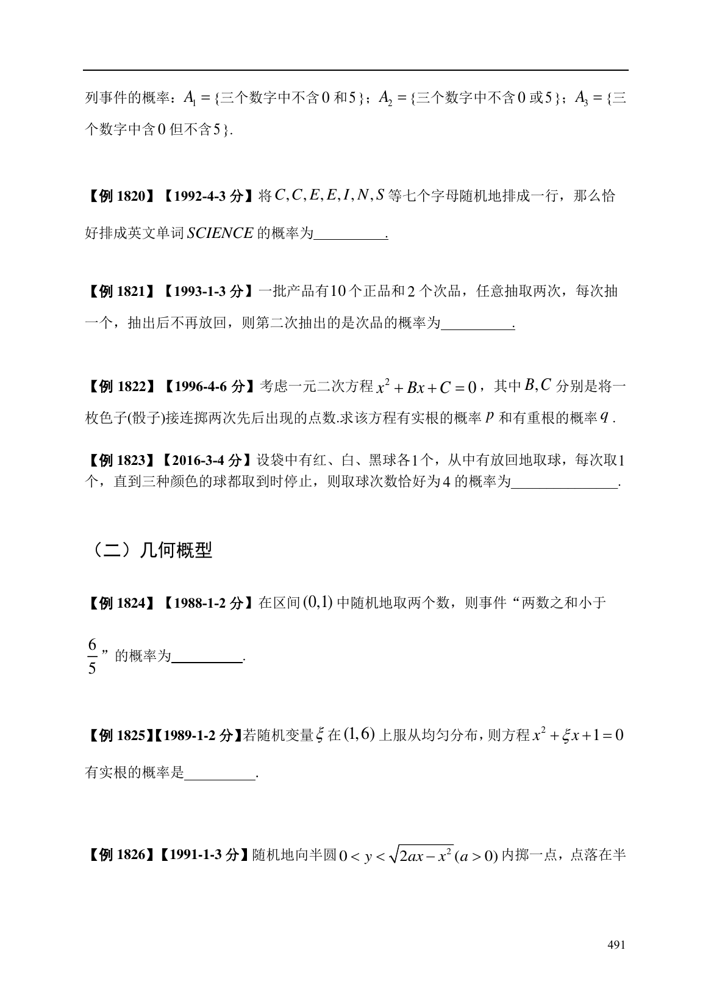

> 生成原页图的原因：包含 Symbol/私用区字形；包含疑似公式布局。

### 文本层（用于搜索/导入，公式可能失真）

~~~text
列事件的概率：A1 = {三个数字中不含 0 和 5 }；A2 = {三个数字中不含 0 或 5 }；A3 = {三

个数字中含 0 但不含 5 }.

【例 1820】【1992-4-3 分】将 C , C , E , E , I , N , S 等七个字母随机地排成一行，那么恰

好排成英文单词 SCIENCE 的概率为                .

【例 1821】【1993-1-3 分】一批产品有 10 个正品和 2 个次品，任意抽取两次，每次抽

一个，抽出后不再放回，则第二次抽出的是次品的概率为                            .

【例 1822】【1996-4-6 分】考虑一元二次方程 x 2 + Bx + C = 0 ，其中 B, C 分别是将一

枚色子(骰子)接连掷两次先后出现的点数.求该方程有实根的概率 p 和有重根的概率 q .

【例 1823】【2016-3-4 分】设袋中有红、白、黑球各 1 个，从中有放回地取球，每次取 1
个，直到三种颜色的球都取到时停止，则取球次数恰好为 4 的概率为_______________.

（二）几何概型

【例 1824】【1988-1-2 分】在区间 (0,1) 中随机地取两个数，则事件“两数之和小于

6
  ”的概率为            .
5

       【1989-1-2 分】若随机变量  在 (1, 6) 上服从均匀分布，则方程 x +  x + 1 = 0
                                                         2
【例 1825】

有实根的概率是                .

【例 1826】【1991-1-3 分】随机地向半圆 0  y       2ax − x 2 (a  0) 内掷一点，点落在半

                                                                491
~~~

## PDF 第 10 页

### 原始页面（数学符号以此为准）

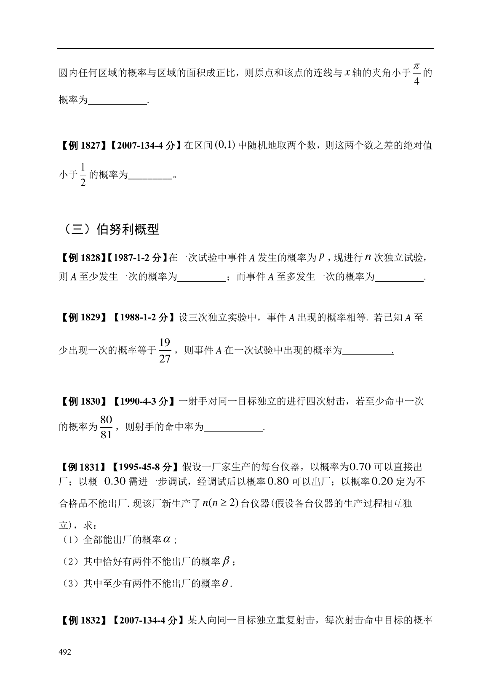

> 生成原页图的原因：包含 Symbol/私用区字形；包含疑似公式布局。

### 文本层（用于搜索/导入，公式可能失真）

~~~text
                                                    
圆内任何区域的概率与区域的面积成正比，则原点和该点的连线与 x 轴的夹角小于                的
                                                    4
概率为             .

【例 1827】【2007-134-4 分】在区间 (0,1) 中随机地取两个数，则这两个数之差的绝对值

      1
小于      的概率为_________。
      2

（三）伯努利概型

       【1987-1-2 分】在一次试验中事件 A 发生的概率为 p ，现进行 n 次独立试验，
【例 1828】
则 A 至少发生一次的概率为              ；而事件 A 至多发生一次的概率为        .

【例 1829】【1988-1-2 分】设三次独立实验中，事件 A 出现的概率相等. 若已知 A 至

                    19
少出现一次的概率等于             ，则事件 A 在一次试验中出现的概率为      .
                    27

【例 1830】【1990-4-3 分】一射手对同一目标独立的进行四次射击，若至少命中一次
         80
的概率为        ，则射手的命中率为           .
         81

【例 1831】【1995-45-8 分】假设一厂家生产的每台仪器，以概率为 0.70 可以直接出
厂；以概 0.30 需进一步调试，经调试后以概率 0.80 可以出厂；以概率 0.20 定为不

合格品不能出厂.现该厂新生产了 n( n  2) 台仪器(假设各台仪器的生产过程相互独

立)，求：
（1）全部能出厂的概率  ;

（2）其中恰好有两件不能出厂的概率  ；

（3）其中至少有两件不能出厂的概率  .

【例 1832】【2007-134-4 分】某人向同一目标独立重复射击，每次射击命中目标的概率

492
~~~

## PDF 第 11 页

### 原始页面（数学符号以此为准）

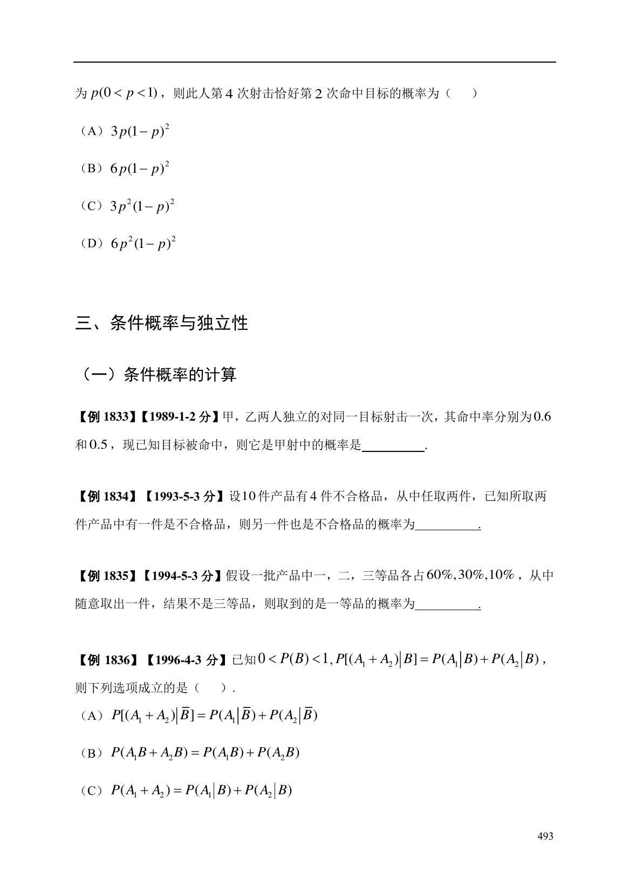

> 生成原页图的原因：包含 Symbol/私用区字形；包含疑似公式布局。

### 文本层（用于搜索/导入，公式可能失真）

~~~text
为 p (0  p  1) ，则此人第 4 次射击恰好第 2 次命中目标的概率为（                            ）

（A） 3 p (1 − p ) 2

（B） 6 p (1 − p ) 2

（C） 3 p 2 (1 − p ) 2

（D） 6 p 2 (1 − p ) 2

三、条件概率与独立性

（一）条件概率的计算

【例 1833】【1989-1-2 分】甲，乙两人独立的对同一目标射击一次，其命中率分别为 0.6

和 0.5 ，现已知目标被命中，则它是甲射中的概率是                                    .

【例 1834】【1993-5-3 分】设 10 件产品有 4 件不合格品，从中任取两件，已知所取两

件产品中有一件是不合格品，则另一件也是不合格品的概率为                                             .

【例 1835】【1994-5-3 分】假设一批产品中一，二，三等品各占 60%, 30%,10% ，从中

随意取出一件，结果不是三等品，则取到的是一等品的概率为                                             .

【例 1836】【1996-4-3 分】已知 0  P ( B )  1 , P[( A1 + A2 ) B ] = P ( A1 B ) + P ( A2 B ) ，

则下列选项成立的是（                    ）.

（A） P[( A1 + A2 ) B ] = P ( A1 B ) + P ( A2 B )

（B） P ( A1 B + A2 B ) = P ( A1 B ) + P ( A2 B )

（C） P( A1 + A2 ) = P ( A1 B ) + P ( A2 B )

                                                                                   493
~~~

## PDF 第 12 页

### 原始页面（数学符号以此为准）

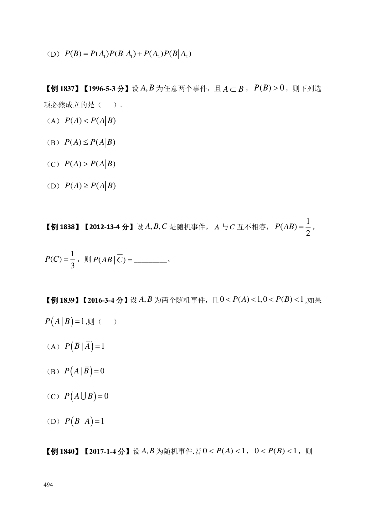

> 生成原页图的原因：包含 Symbol/私用区字形；包含疑似公式布局。

### 文本层（用于搜索/导入，公式可能失真）

~~~text
（D） P( B) = P( A1 ) P( B A1 ) + P( A2 ) P( B A2 )

【例 1837】【1996-5-3 分】设 A, B 为任意两个事件，且 A  B ， P ( B )  0 ，则下列选

项必然成立的是（               ）.

（A） P ( A)  P ( A B )

（B） P ( A)  P ( A B )

（C） P ( A)  P ( A B )

（D） P ( A)  P ( A B )

                                                                    1
【例 1838】【2012-13-4 分】设 A, B, C 是随机事件， A 与 C 互不相容， P( AB) =            ，
                                                                    2

       1
P(C ) = ，则 P( AB | C ) = _________。
       3

【例 1839】【2016-3-4 分】设 A, B 为两个随机事件，且 0  P ( A)  1, 0  P ( B )  1 ,如果

P ( A | B ) = 1 ,则（    ）

         (
（A） P B | A = 1)
        (
（B） P A | B = 0)

（C） P ( A     B) = 0

（D） P ( B | A ) = 1

【例 1840】【2017-1-4 分】设 A, B 为随机事件.若 0  P ( A)  1 ， 0  P ( B )  1 ，则

494
~~~

## PDF 第 13 页

### 原始页面（数学符号以此为准）

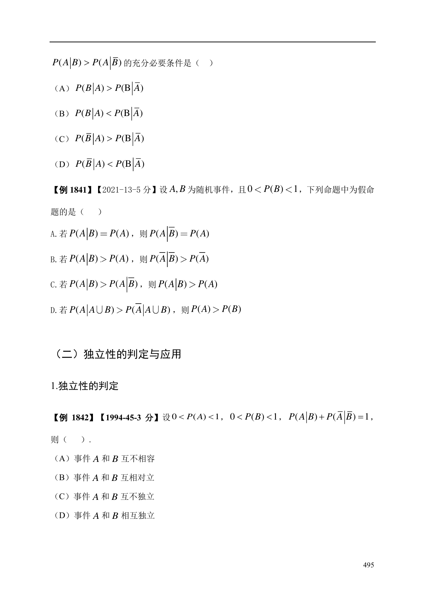

> 生成原页图的原因：包含 Symbol/私用区字形；包含疑似公式布局。

### 文本层（用于搜索/导入，公式可能失真）

~~~text
P( A B)  P( A B ) 的充分必要条件是（ ）

（A） P( B A)  P(B A)

（B） P( B A)  P(B A)

（C） P( B A)  P(B A)

（D） P( B A)  P (B A)

【例 1841】【2021-13-5 分】设 A, B 为随机事件，且 0                   P ( B ) 1 ，下列命题中为假命

题的是（         ）

A.若 P( A B)      P( A) ，则 P( A B)     P( A)

B.若 P( A B)      P( A) ，则 P( A B)     P( A)

C.若 P( A B)      P( A B) ，则 P( A B)     P( A)

D.若 P( A A    B)    P( A A B ) ，则 P ( A)        P( B)

（二）独立性的判定与应用

1.独立性的判定

【例 1842】【1994-45-3 分】设 0  P ( A)  1 ， 0  P ( B )  1 ， P ( A B ) + P ( A B ) = 1 ，

则（     ）.

（A）事件 A 和 B 互不相容

（B）事件 A 和 B 互相对立

（C）事件 A 和 B 互不独立

（D）事件 A 和 B 相互独立

                                                                                495
~~~

## PDF 第 14 页

### 原始页面（数学符号以此为准）

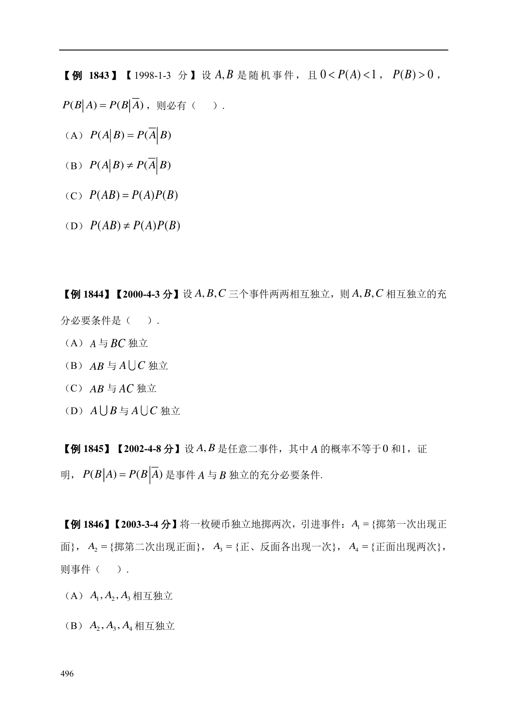

> 生成原页图的原因：包含 Symbol/私用区字形；包含疑似公式布局。

### 文本层（用于搜索/导入，公式可能失真）

~~~text
【 例 1843 】 【 1998-1-3 分 】 设 A, B 是 随 机 事 件 ， 且 0  P ( A)  1 ， P ( B )  0 ，

P( B A) = P( B A) ，则必有（         ）.

（A） P( A B) = P( A B)

（B） P( A B)  P( A B)

（C） P ( AB ) = P ( A) P ( B )

（D） P ( AB )  P ( A) P ( B )

【例 1844】【2000-4-3 分】设 A, B, C 三个事件两两相互独立，则 A, B, C 相互独立的充

分必要条件是（              ）.

（A） A 与 BC 独立

（B） AB 与 A        C 独立
（C） AB 与 AC 独立

（D） A       B 与 A C 独立

【例 1845】【2002-4-8 分】设 A, B 是任意二事件，其中 A 的概率不等于 0 和 1 ，证

明， P( B A) = P( B A) 是事件 A 与 B 独立的充分必要条件.

【例 1846】【2003-3-4 分】将一枚硬币独立地掷两次，引进事件： A1 = {掷第一次出现正

面}， A2 = {掷第二次出现正面}， A3 = {正、反面各出现一次}， A4 = {正面出现两次}，

则事件（         ）.

（A） A1 , A2 , A3 相互独立

（B） A2 , A3 , A4 相互独立

496
~~~

## PDF 第 15 页

### 原始页面（数学符号以此为准）

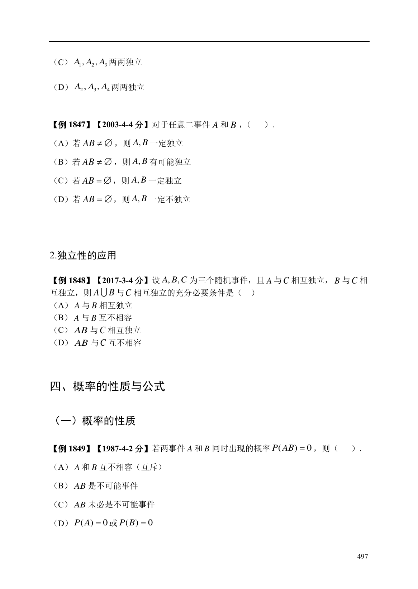

> 生成原页图的原因：包含 Symbol/私用区字形；包含疑似公式布局。

### 文本层（用于搜索/导入，公式可能失真）

~~~text
（C） A1 , A2 , A3 两两独立

（D） A2 , A3 , A4 两两独立

【例 1847】【2003-4-4 分】对于任意二事件 A 和 B ，
                                  （     ）.

（A）若 AB   ，则 A, B 一定独立

（B）若 AB   ，则 A, B 有可能独立

（C）若 AB =  ，则 A, B 一定独立

（D）若 AB =  ，则 A, B 一定不独立

2.独立性的应用

【例 1848】【2017-3-4 分】设 A, B, C 为三个随机事件，且 A 与 C 相互独立， B 与 C 相
互独立，则 A B 与 C 相互独立的充分必要条件是（ ）
（A） A 与 B 相互独立
（B） A 与 B 互不相容
（C） AB 与 C 相互独立
（D） AB 与 C 互不相容

四、概率的性质与公式

（一）概率的性质

【例 1849】【1987-4-2 分】若两事件 A 和 B 同时出现的概率 P ( AB ) = 0 ，则（   ）.

（A） A 和 B 互不相容（互斥）

（B） AB 是不可能事件

（C） AB 未必是不可能事件

（D） P ( A) = 0 或 P ( B ) = 0

                                                           497
~~~

## PDF 第 16 页

### 原始页面（数学符号以此为准）

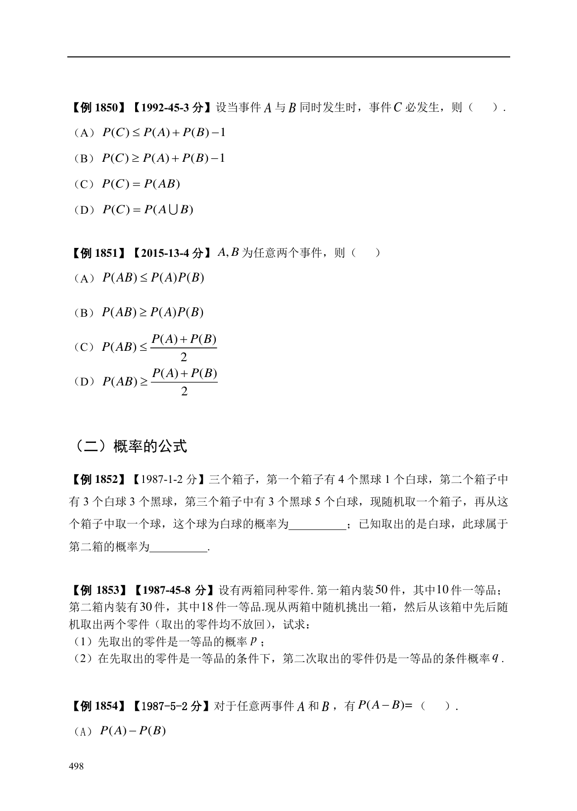

> 生成原页图的原因：包含 Symbol/私用区字形；包含疑似公式布局。

### 文本层（用于搜索/导入，公式可能失真）

~~~text
【例 1850】【1992-45-3 分】设当事件 A 与 B 同时发生时，事件 C 必发生，则（          ）.

（A） P (C )  P ( A) + P ( B ) − 1

（B） P (C )  P ( A) + P ( B ) − 1

（C） P (C ) = P ( AB )

（D） P (C ) = P( A       B)

【例 1851】【2015-13-4 分】 A, B 为任意两个事件，则（      ）

（A） P ( AB )  P ( A) P ( B )

（B） P ( AB )  P ( A) P ( B )

             P( A) + P( B)
（C） P( AB) 
                   2
             P( A) + P( B)
（D） P( AB) 
                   2

（二）概率的公式

【例 1852】【1987-1-2 分】三个箱子，第一个箱子有 4 个黑球 1 个白球，第二个箱子中
有 3 个白球 3 个黑球，第三个箱子中有 3 个黑球 5 个白球，现随机取一个箱子，再从这
个箱子中取一个球，这个球为白球的概率为                    ；已知取出的是白球，此球属于
第二箱的概率为                         .

【例 1853】【1987-45-8 分】设有两箱同种零件.第一箱内装 50 件，其中10 件一等品；
第二箱内装有 30 件，其中 18 件一等品.现从两箱中随机挑出一箱，然后从该箱中先后随
机取出两个零件（取出的零件均不放回）        ，试求：
（1）先取出的零件是一等品的概率 p ；
（2）在先取出的零件是一等品的条件下，第二次取出的零件仍是一等品的条件概率 q .

【例 1854】【1987-5-2 分】对于任意两事件 A 和 B ，有 P ( A − B )= （   ）.

（A） P ( A) − P ( B )

498
~~~

## PDF 第 17 页

### 原始页面（数学符号以此为准）

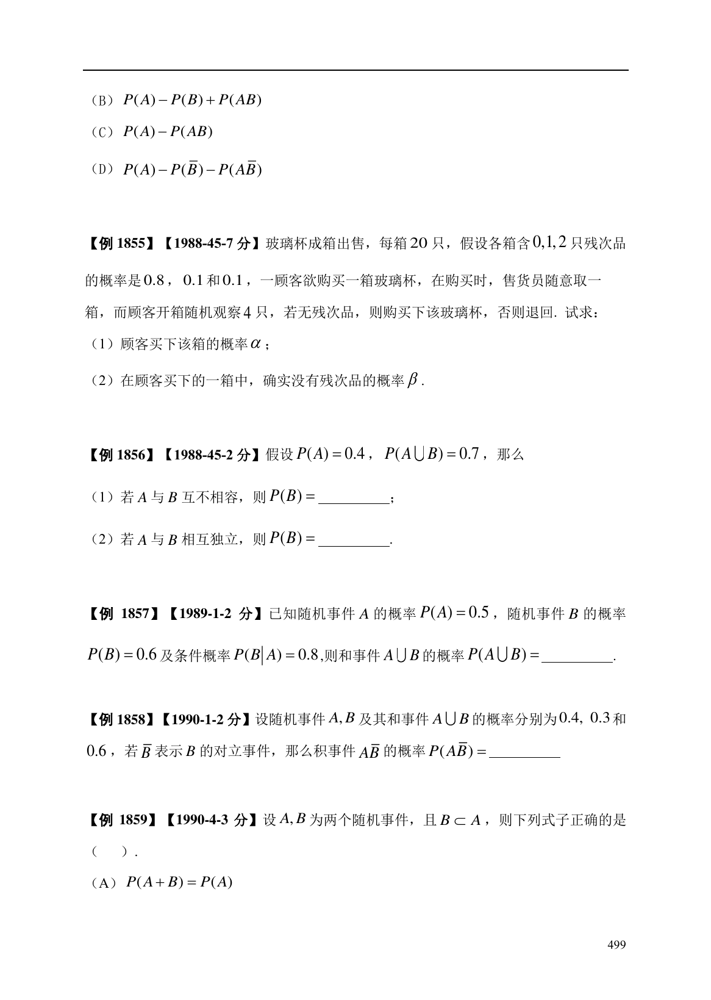

> 生成原页图的原因：包含 Symbol/私用区字形；包含疑似公式布局。

### 文本层（用于搜索/导入，公式可能失真）

~~~text
（B） P ( A) − P ( B ) + P ( AB )

（C） P ( A) − P ( AB )

（D） P ( A) − P ( B ) − P ( AB )

【例 1855】【1988-45-7 分】玻璃杯成箱出售，每箱 20 只，假设各箱含 0,1, 2 只残次品

的概率是 0.8 ， 0.1 和 0.1 ，一顾客欲购买一箱玻璃杯，在购买时，售货员随意取一

箱，而顾客开箱随机观察 4 只，若无残次品，则购买下该玻璃杯，否则退回. 试求：

（1）顾客买下该箱的概率  ；

（2）在顾客买下的一箱中，确实没有残次品的概率  .

【例 1856】【1988-45-2 分】假设 P ( A) = 0.4 ， P ( A   B ) = 0.7 ，那么

（1）若 A 与 B 互不相容，则 P ( B ) =             ；

（2）若 A 与 B 相互独立，则 P ( B ) =             .

【例 1857】【1989-1-2 分】已知随机事件 A 的概率 P ( A) = 0.5 ，随机事件 B 的概率

P( B) = 0.6 及条件概率 P( B A) = 0.8 ,则和事件 A B 的概率 P( A B ) =            .

【例 1858】【1990-1-2 分】设随机事件 A, B 及其和事件 A             B 的概率分别为 0.4, 0.3 和

0.6 ，若 B 表示 B 的对立事件，那么积事件 AB 的概率 P ( AB ) =

【例 1859】【1990-4-3 分】设 A, B 为两个随机事件，且 B  A ，则下列式子正确的是

（     ）.

（A） P ( A + B ) = P ( A)

                                                                   499
~~~

## PDF 第 18 页

### 原始页面（数学符号以此为准）

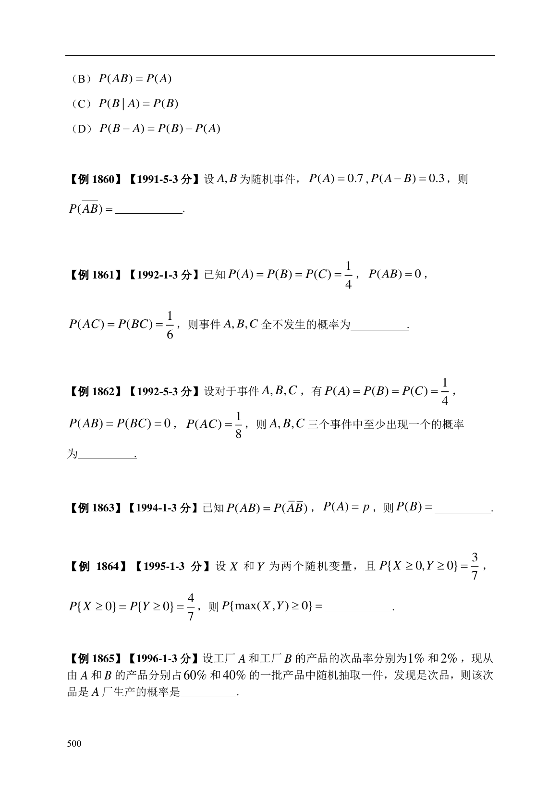

> 生成原页图的原因：包含 Symbol/私用区字形；包含疑似公式布局。

### 文本层（用于搜索/导入，公式可能失真）

~~~text
（B） P ( AB ) = P ( A)

（C） P ( B | A) = P( B)

（D） P ( B − A) = P ( B ) − P ( A)

【例 1860】【1991-5-3 分】设 A, B 为随机事件， P ( A) = 0.7 , P ( A − B ) = 0.3 ，则

P ( AB ) =               .

                                                          1
【例 1861】【1992-1-3 分】已知 P( A) = P( B) = P(C ) =              ， P ( AB ) = 0 ，
                                                          4

                      1
P( AC ) = P( BC ) =     ，则事件 A, B, C 全不发生的概率为                          .
                      6

                                                                               1
【例 1862】【1992-5-3 分】设对于事件 A, B, C ，有 P( A) = P( B) = P(C ) =                     ，
                                                                               4
                                   1
P ( AB ) = P ( BC ) = 0 ， P( AC ) = ，则 A, B, C 三个事件中至少出现一个的概率
                                   8
为             .

【例 1863】【1994-1-3 分】已知 P( AB) = P( AB ) ， P ( A) = p ，则 P ( B ) =                      .

                                                                                     3
【例 1864】【1995-1-3 分】设 X 和 Y 为两个随机变量，且 P{ X  0, Y  0} =                               ，
                                                                                     7
                             4
P{ X  0} = P{Y  0} =         ，则 P{max( X , Y )  0} =            .
                             7

【例 1865】【1996-1-3 分】设工厂 A 和工厂 B 的产品的次品率分别为 1% 和 2% ，现从
由 A 和 B 的产品分别占 60% 和 40% 的一批产品中随机抽取一件，发现是次品，则该次
品是 A 厂生产的概率是           .

500
~~~

## PDF 第 19 页

### 原始页面（数学符号以此为准）

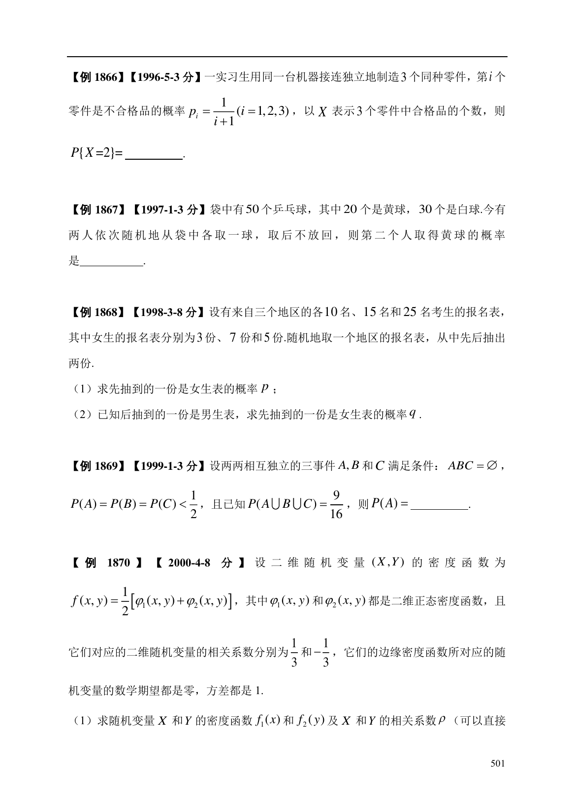

> 生成原页图的原因：包含 Symbol/私用区字形；包含疑似公式布局。

### 文本层（用于搜索/导入，公式可能失真）

~~~text
【例 1866】【1996-5-3 分】一实习生用同一台机器接连独立地制造 3 个同种零件，第 i 个

                                 1
零件是不合格品的概率 pi =                     (i = 1, 2,3) ，以 X 表示 3 个零件中合格品的个数，则
                               i +1

P{ X =2}=                 .

【例 1867】【1997-1-3 分】袋中有 50 个乒乓球，其中 20 个是黄球， 30 个是白球.今有

两人依次随机地从袋中各取一球，取后不放回，则第二个人取得黄球的概率

是                 .

【例 1868】【1998-3-8 分】设有来自三个地区的各 10 名、 15 名和 25 名考生的报名表，

其中女生的报名表分别为 3 份、 7 份和 5 份.随机地取一个地区的报名表，从中先后抽出

两份.

（1）求先抽到的一份是女生表的概率 p ；

（2）已知后抽到的一份是男生表，求先抽到的一份是女生表的概率 q .

【例 1869】【1999-1-3 分】设两两相互独立的三事件 A, B 和 C 满足条件： ABC =  ，

                       1                  9
P( A) = P( B) = P(C )  ，且已知 P( A B C ) = ，则 P ( A) =                         .
                       2                 16

【 例 1870 】 【 2000-4-8 分 】 设 二 维 随 机 变 量 ( X , Y ) 的 密 度 函 数 为

               1
f ( x, y ) =     1 ( x, y) + 2 ( x, y) ，其中 1 ( x, y ) 和 2 ( x, y ) 都是二维正态密度函数，且
               2

                                             1    1
它们对应的二维随机变量的相关系数分别为                            和 − ，它们的边缘密度函数所对应的随
                                             3    3

机变量的数学期望都是零，方差都是 1.

（1）求随机变量 X 和 Y 的密度函数 f1 ( x ) 和 f 2 ( y ) 及 X 和 Y 的相关系数  （可以直接

                                                                                  501
~~~

## PDF 第 20 页

### 原始页面（数学符号以此为准）

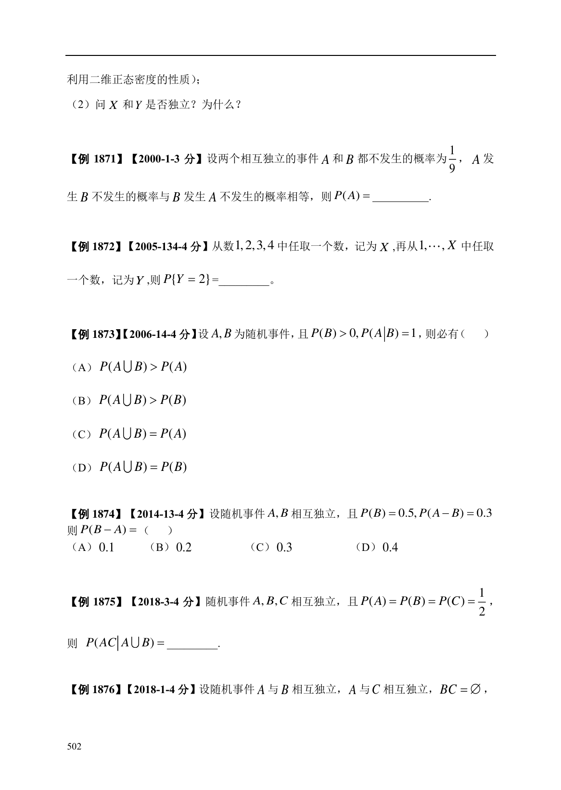

> 生成原页图的原因：包含 Symbol/私用区字形；包含疑似公式布局。

### 文本层（用于搜索/导入，公式可能失真）

~~~text
利用二维正态密度的性质）
           ；

（2）问 X 和 Y 是否独立？为什么？

                                                                 1
【例 1871】【2000-1-3 分】设两个相互独立的事件 A 和 B 都不发生的概率为                      ，A发
                                                                 9

生 B 不发生的概率与 B 发生 A 不发生的概率相等，则 P ( A) =                      .

【例 1872】【2005-134-4 分】从数 1, 2,3, 4 中任取一个数，记为 X ,再从 1,           , X 中任取

一个数，记为 Y ,则 P{Y = 2} =_________。

       【2006-14-4 分】设 A, B 为随机事件，且 P ( B )  0, P ( A B ) = 1 ，则必有（
【例 1873】                                                              ）

（A） P ( A   B)  P( A)

（B） P ( A   B)  P( B)

（C） P ( A   B) = P( A)

（D） P ( A   B) = P( B)

【例 1874】【2014-13-4 分】设随机事件 A, B 相互独立，且 P ( B ) = 0.5, P ( A − B ) = 0.3
则 P ( B − A) = （ ）
（A） 0.1         （B） 0.2 （C） 0.3      （D） 0.4

                                                                      1
【例 1875】【2018-3-4 分】随机事件 A, B, C 相互独立，且 P( A) = P( B) = P(C ) =         ，
                                                                      2

则 P( AC A    B) = _________.

【例 1876】【2018-1-4 分】设随机事件 A 与 B 相互独立， A 与 C 相互独立， BC =  ，

502
~~~

## PDF 第 21 页

### 原始页面（数学符号以此为准）

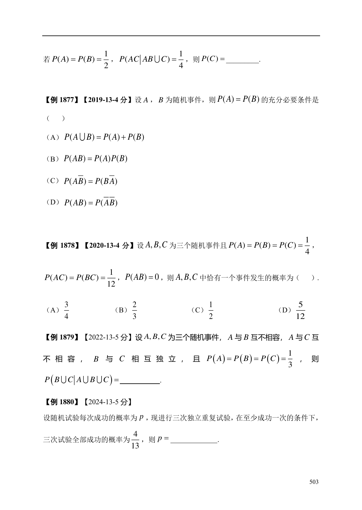

> 生成原页图的原因：包含疑似公式布局。

### 文本层（用于搜索/导入，公式可能失真）

~~~text
                    1                 1
若 P( A) = P( B) =     ， P( AC AB C ) = ，则 P (C ) = _________.
                    2                 4

【例 1877】【2019-13-4 分】设 A ， B 为随机事件，则 P ( A) = P ( B ) 的充分必要条件是

（     ）

（A） P ( A     B) = P( A) + P( B)

（B） P ( AB ) = P ( A) P ( B )

（C） P ( AB ) = P ( B A)

（D） P ( AB ) = P ( AB )

                                                                           1
【例 1878】【2020-13-4 分】设 A, B, C 为三个随机事件且 P( A) = P( B) = P(C ) =              ，
                                                                           4

                       1
P( AC ) = P( BC ) =      ， P ( AB ) = 0 ，则 A, B, C 中恰有一个事件发生的概率为（           ）.
                      12

       3                        2                 1                    5
（A）                    （B）                  （C）                 （D）
       4                        3                 2                   12

【例 1879】【2022-13-5 分】设 A, B, C 为三个随机事件， A 与 B 互不相容， A 与 C 互

                                                                 1
不 相 容 ， B 与 C 相 互 独 立 ， 且 P ( A) = P ( B ) = P ( C ) =             ， 则
                                                                 3
P(B C A B C) =                        .

【例 1880】【2024-13-5 分】

设随机试验每次成功的概率为 p ，现进行三次独立重复试验，在至少成功一次的条件下，

                                 4
三次试验全部成功的概率为                       ，则 p =             .
                                13

                                                                           503
~~~

## PDF 第 22 页

### 原始页面（数学符号以此为准）

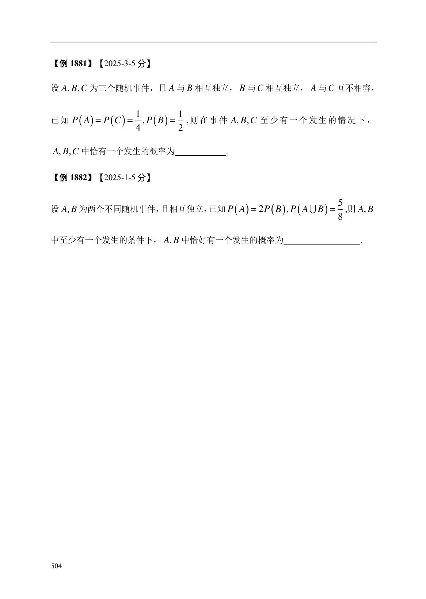

> 生成原页图的原因：包含疑似公式布局。

### 文本层（用于搜索/导入，公式可能失真）

~~~text
【例 1881】【2025-3-5 分】

设 A, B, C 为三个随机事件，且 A 与 B 相互独立， B 与 C 相互独立， A 与 C 互不相容，

                         1            1
已 知 P ( A) = P ( C ) =     , P ( B ) = , 则 在 事 件 A, B, C 至 少 有 一 个 发 生 的 情 况 下 ，
                         4            2

A, B, C 中恰有一个发生的概率为                          .

【例 1882】【2025-1-5 分】

                                                                         5
设 A, B 为两个不同随机事件，且相互独立，已知 P ( A) = 2 P ( B ) , P ( A              B) =     ,则 A, B
                                                                         8

中至少有一个发生的条件下， A, B 中恰好有一个发生的概率为                                               .

504
~~~

## PDF 第 23 页

### 原始页面（数学符号以此为准）

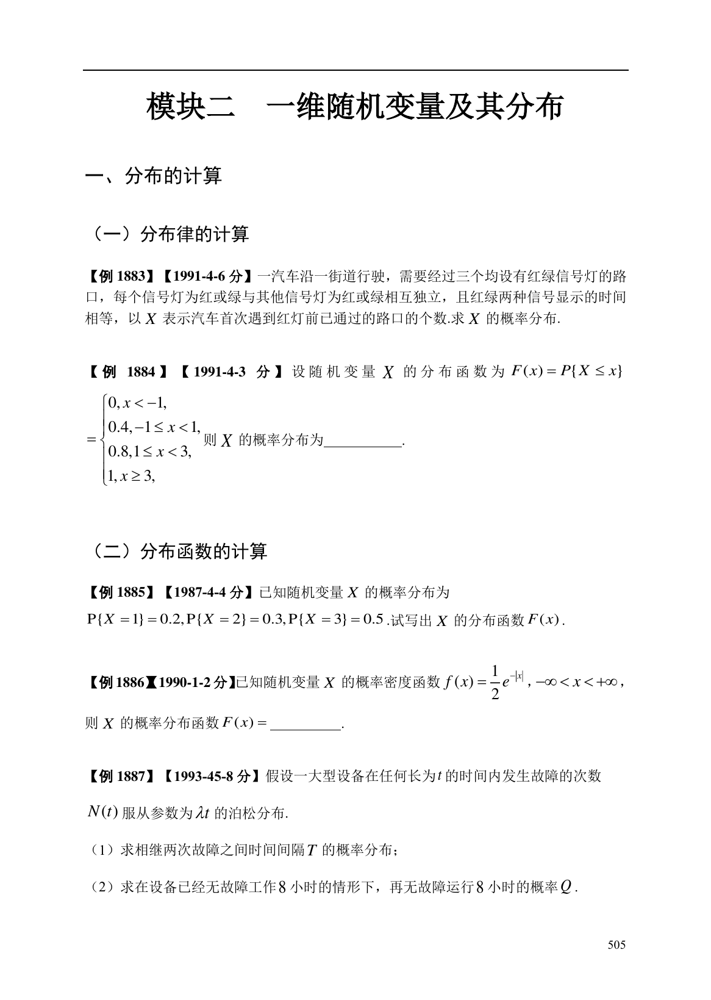

> 生成原页图的原因：包含 Symbol/私用区字形；包含疑似公式布局。

### 文本层（用于搜索/导入，公式可能失真）

~~~text
        模块二              一维随机变量及其分布

一、分布的计算

（一）分布律的计算

【例 1883】【1991-4-6 分】一汽车沿一街道行驶，需要经过三个均设有红绿信号灯的路
口，每个信号灯为红或绿与其他信号灯为红或绿相互独立，且红绿两种信号显示的时间
相等，以 X 表示汽车首次遇到红灯前已通过的路口的个数.求 X 的概率分布.

【 例 1884 】 【 1991-4-3 分 】 设 随 机 变 量 X 的 分 布 函 数 为 F ( x) = P{ X  x}

 0, x  −1,
 0.4, −1  x  1,
 
=                 则 X 的概率分布为                .
 0.8,1  x  3,
 
 1, x  3,

（二）分布函数的计算

【例 1885】【1987-4-4 分】已知随机变量 X 的概率分布为
P{X = 1} = 0.2, P{X = 2} = 0.3, P{X = 3} = 0.5 .试写出 X 的分布函数 F ( x ) .

                                                          1 −x
【例 1886】          已知随机变量 X 的概率密度函数 f ( x) =
       【1990-1-2 分】                                         e ，−  x  + ，
                                                          2
则 X 的概率分布函数 F ( x ) =               .

【例 1887】【1993-45-8 分】假设一大型设备在任何长为 t 的时间内发生故障的次数

N (t ) 服从参数为 t 的泊松分布.

（1）求相继两次故障之间时间间隔 T 的概率分布；

（2）求在设备已经无故障工作 8 小时的情形下，再无故障运行 8 小时的概率 Q .

                                                                        505
~~~

## PDF 第 24 页

### 原始页面（数学符号以此为准）

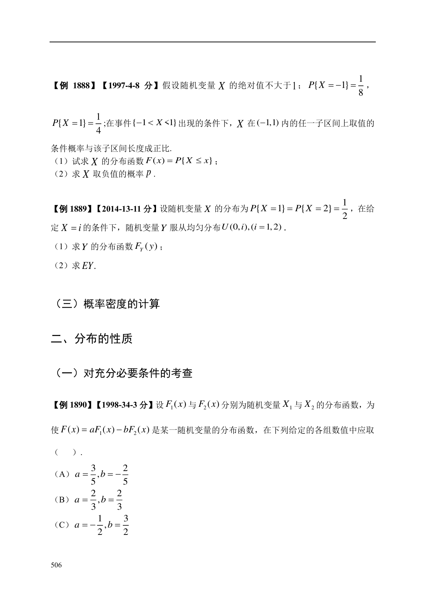

> 生成原页图的原因：包含 Symbol/私用区字形；包含疑似公式布局。

### 文本层（用于搜索/导入，公式可能失真）

~~~text
                                                                1
【例 1888】【1997-4-8 分】假设随机变量 X 的绝对值不大于 1 ； P{ X = −1} =             ，
                                                                8

              1
P{ X = 1} =     ;在事件 {−1  X <1} 出现的条件下，X 在 ( −1,1) 内的任一子区间上取值的
              4
条件概率与该子区间长度成正比.
（1）试求 X 的分布函数 F ( x) = P{ X  x} ；
（2）求 X 取负值的概率 p .

                                                             1
【例 1889】【2014-13-11 分】设随机变量 X 的分布为 P{ X = 1} = P{ X = 2} =     ，在给
                                                             2
定 X = i 的条件下，随机变量 Y 服从均匀分布 U (0, i ), (i = 1, 2) ．

（1）求 Y 的分布函数 FY ( y ) ；

（2）求 EY .

（三）概率密度的计算

二、分布的性质

（一）对充分必要条件的考查

【例 1890】【1998-34-3 分】设 F1 ( x ) 与 F2 ( x ) 分别为随机变量 X 1 与 X 2 的分布函数，为

使 F ( x ) = aF1 ( x ) − bF2 ( x ) 是某一随机变量的分布函数，在下列给定的各组数值中应取

（     ）.
        3        2
（A） a =   ,b = −
        5        5
        2      2
（B） a = , b =
        3      3
          1      3
（C） a = − , b =
          2      2

506
~~~

## PDF 第 25 页

### 原始页面（数学符号以此为准）

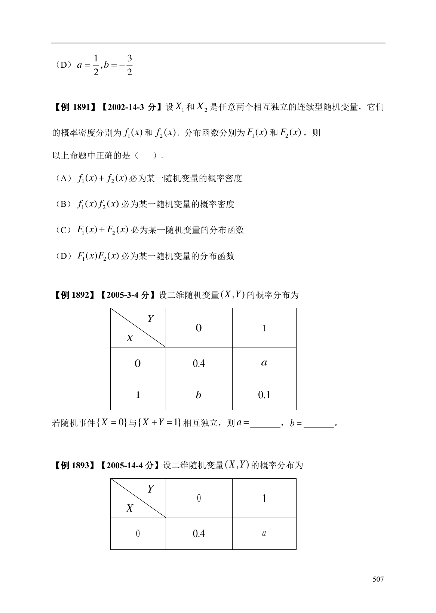

> 生成原页图的原因：包含疑似公式布局。

### 文本层（用于搜索/导入，公式可能失真）

~~~text
          1        3
（D） a =     ,b = −
          2        2

【例 1891】【2002-14-3 分】设 X 1 和 X 2 是任意两个相互独立的连续型随机变量，它们

的概率密度分别为 f1 ( x ) 和 f 2 ( x ) . 分布函数分别为 F1 ( x ) 和 F2 ( x ) ，则

以上命题中正确的是（                 ）.

（A） f1 ( x ) + f 2 ( x ) 必为某一随机变量的概率密度

（B） f1 ( x) f 2 ( x) 必为某一随机变量的概率密度

（C） F1 ( x ) + F2 ( x ) 必为某一随机变量的分布函数

（D） F1 ( x) F2 ( x) 必为某一随机变量的分布函数

【例 1892】【2005-3-4 分】设二维随机变量 ( X , Y ) 的概率分布为

                           Y
                                 0              1
                  X

                       0        0.4             a

                       1         b             0.1

若随机事件 { X = 0} 与 { X + Y = 1} 相互独立，则 a =             ，b =        。

【例 1893】【2005-14-4 分】设二维随机变量 ( X , Y ) 的概率分布为

                           Y
                                 0              1
                  X

                       0        0.4             a

                                                                     507
~~~

## PDF 第 26 页

### 原始页面（数学符号以此为准）

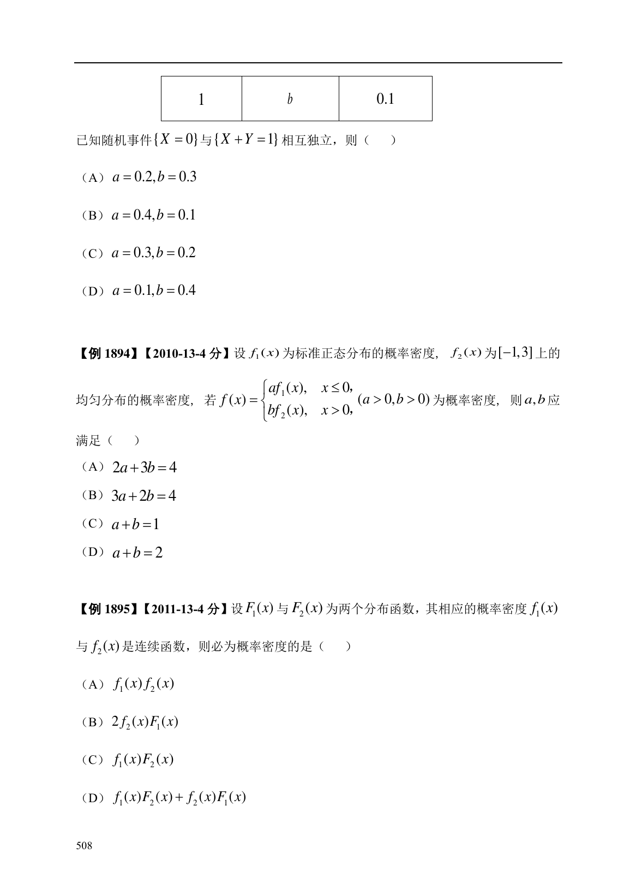

> 生成原页图的原因：包含 Symbol/私用区字形；包含疑似公式布局。

### 文本层（用于搜索/导入，公式可能失真）

~~~text
                           1                 b             0.1

已知随机事件 { X = 0} 与 { X + Y = 1} 相互独立，则（                        ）

（A） a = 0.2, b = 0.3

（B） a = 0.4, b = 0.1

（C） a = 0.3, b = 0.2

（D） a = 0.1, b = 0.4

【例 1894】【2010-13-4 分】设 f1 ( x ) 为标准正态分布的概率密度, f 2 ( x ) 为 [ −1,3] 上的

                                          af 1 ( x), x  0，
均匀分布的概率密度, 若 f ( x) =                                      (a  0, b  0) 为概率密度, 则 a, b 应
                                         bf 2 ( x), x  0，
满足（         ）

（A） 2a + 3b = 4

（B） 3a + 2b = 4

（C） a + b = 1

（D） a + b = 2

【例 1895】【2011-13-4 分】设 F1 ( x) 与 F2 ( x) 为两个分布函数，其相应的概率密度 f1 ( x)

与 f 2 ( x) 是连续函数，则必为概率密度的是（                           ）

（A） f1 ( x) f 2 ( x)

（B） 2 f 2 ( x) F1 ( x)

（C） f1 ( x ) F2 ( x )

（D） f1 ( x) F2 ( x) + f 2 ( x) F1 ( x)

508
~~~

## PDF 第 27 页

### 原始页面（数学符号以此为准）

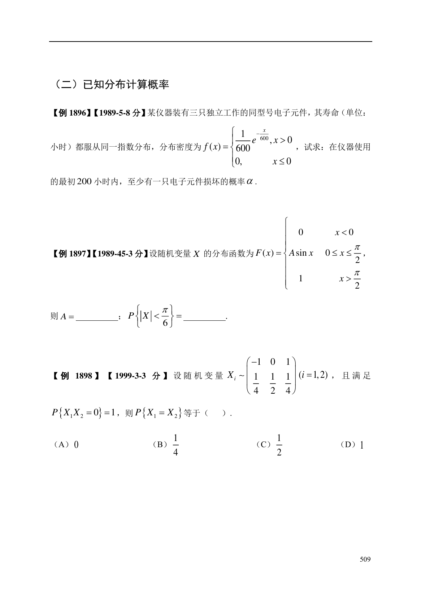

> 生成原页图的原因：包含 Symbol/私用区字形；包含疑似公式布局。

### 文本层（用于搜索/导入，公式可能失真）

~~~text
（二）已知分布计算概率

【例 1896】【1989-5-8 分】某仪器装有三只独立工作的同型号电子元件，其寿命（单位：

                             1 − 600
                                    x

                                 e ,x 0
小时）都服从同一指数分布，分布密度为 f ( x) =  600         ，试求：在仪器使用
                            0,       x0
                            
的最初 200 小时内，至少有一只电子元件损坏的概率  .

                                             
                                              0                            x0
                                             
                                                                                 
       【1989-45-3 分】设随机变量 X 的分布函数为 F ( x ) =  A sin x
【例 1897】                                                                  0 x       ，
                                                                                 2
                                                                                 
                                              1                            x
                                                                                  2

                             
则A=               ；P X       =             .
                             6

                                                    −1 0       1
                                                                 
【 例 1898 】 【 1999-3-3 分 】 设 随 机 变 量 X i
                                                   1 1         1  (i = 1, 2) ， 且 满 足
                                                   4 2         4

P  X 1 X 2 = 0 = 1 ，则 P  X 1 = X 2  等于（   ）.

                                 1                          1
（A） 0                     （B）                       （C）                      （D）1
                                 4                          2

                                                                                      509
~~~

## PDF 第 28 页

### 原始页面（数学符号以此为准）

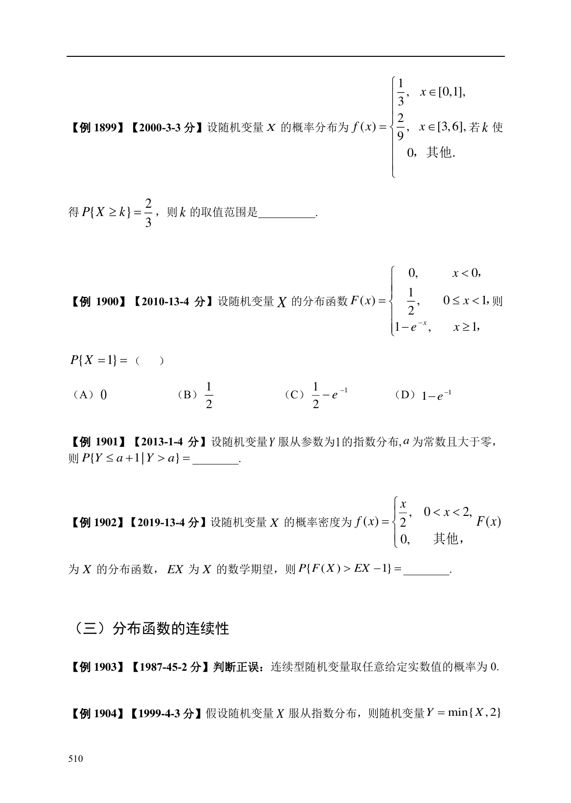

> 生成原页图的原因：包含 Symbol/私用区字形；包含疑似公式布局。

### 文本层（用于搜索/导入，公式可能失真）

~~~text
                                             1
                                              3 , x  [0,1],
                                             
                                             2
【例 1899】【2000-3-3 分】设随机变量 X 的概率分布为 f ( x ) =  , x  [3, 6], 若 k 使
                                             9
                                              0，其他.
                                             
                                             

                2
得 P{ X  k} =     ，则 k 的取值范围是          .
                3

                                              0,            x  0，
                                              1
                                             
【例 1900】【2010-13-4 分】设随机变量 X 的分布函数 F ( x ) =       ,      0  x  1，则
                                                 2
                                             1 − e − x ,   x  1，

P{ X = 1} = （    ）

                           1           1
（A） 0                （B）         （C）     − e −1    （D） 1 − e −1
                           2           2

【例 1901】【2013-1-4 分】设随机变量 Y 服从参数为1 的指数分布, a 为常数且大于零，
则 P{Y  a + 1| Y  a} = ________.

                                             x
                                              , 0  x  2,
【例 1902】【2019-13-4 分】设随机变量 X 的概率密度为 f ( x) =  2            F ( x)
                                              0, 其他，

为 X 的分布函数， EX 为 X 的数学期望，则 P{F ( X )  EX − 1} = ________.

（三）分布函数的连续性

【例 1903】【1987-45-2 分】判断正误：连续型随机变量取任意给定实数值的概率为 0.

【例 1904】【1999-4-3 分】假设随机变量 X 服从指数分布，则随机变量 Y = min{ X , 2}

510
~~~

## PDF 第 29 页

### 原始页面（数学符号以此为准）

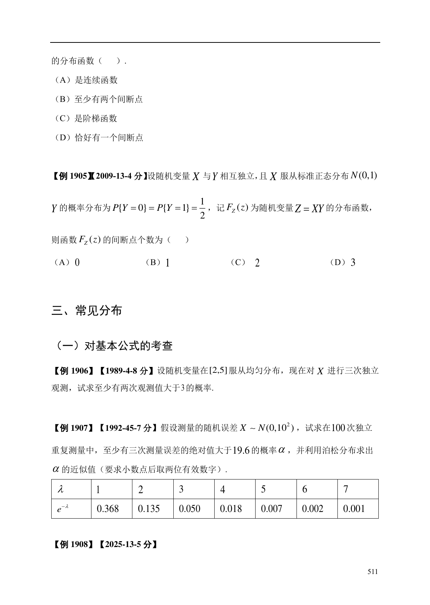

> 生成原页图的原因：包含 Symbol/私用区字形；包含疑似公式布局。

### 文本层（用于搜索/导入，公式可能失真）

~~~text
的分布函数（       ）.

（A）是连续函数

（B）至少有两个间断点

（C）是阶梯函数

（D）恰好有一个间断点

       【2009-13-4 分】设随机变量 X 与 Y 相互独立，且 X 服从标准正态分布 N (0,1)
【例 1905】

                                  1
Y 的概率分布为 P{Y = 0} = P{Y = 1} =      ，记 FZ ( z ) 为随机变量 Z = XY 的分布函数，
                                  2

则函数 FZ ( z ) 的间断点个数为（         ）

（A） 0             （B） 1                  （C） 2                   （D） 3

三、常见分布

（一）对基本公式的考查

【例 1906】【1989-4-8 分】设随机变量在 [2,5] 服从均匀分布，现在对 X 进行三次独立
观测，试求至少有两次观测值大于 3 的概率.

【例 1907】【1992-45-7 分】假设测量的随机误差 X             N (0,10 2 ) ，试求在100 次独立

重复测量中，至少有三次测量误差的绝对值大于 19.6 的概率  ，并利用泊松分布求出

 的近似值（要求小数点后取两位有效数字）.
        1        2       3          4           5       6         7
 e−     0.368    0.135   0.050      0.018       0.007   0.002     0.001

【例 1908】【2025-13-5 分】

                                                                           511
~~~

## PDF 第 30 页

### 原始页面（数学符号以此为准）

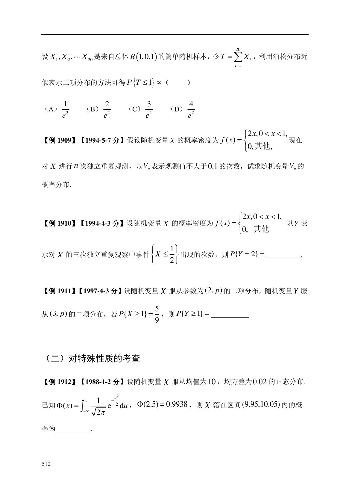

> 生成原页图的原因：包含 Symbol/私用区字形；包含疑似公式布局。

### 文本层（用于搜索/导入，公式可能失真）

~~~text
                                                                 20
设 X1, X 2 ,   X 20 是来自总体 B (1, 0.1) 的简单随机样本，令 T =  X i ，利用泊松分布近
                                                                 i =1

似表示二项分布的方法可得 P T  1  （                              ）

       1                   2              3             4
（A）           （B）                   （C）           （D）
       e2                  e2             e2            e2

                                                                        2 x, 0  x  1,
【例 1909】【1994-5-7 分】假设随机变量 X 的概率密度为 f ( x) =                                            现在
                                                                        0, 其他,

对 X 进行 n 次独立重复观测，以 Vn 表示观测值不大于 0.1 的次数，试求随机变量 Vn 的

概率分布.

                                                                  2 x, 0  x  1,
【例 1910】【1994-4-3 分】设随机变量 X 的概率密度为 f ( x) =                                       以Y 表
                                                                  0, 其他

                                                  1
示对 X 的三次独立重复观察中事件  X                               出现的次数，则 P{Y = 2} =                  .
                                                  2

【例 1911】【1997-4-3 分】设随机变量 X 服从参数为 (2, p ) 的二项分布，随机变量 Y 服

                                               5
从 (3, p ) 的二项分布，若 P{ X  1} =                    ，则 P{Y  1} =           .
                                               9

（二）对特殊性质的考查

【例 1912】【1988-1-2 分】设随机变量 X 服从均值为 10 ，均方差为 0.02 的正态分布.
                                2
                          1 − u2
                             e du ，  (2.5) = 0.9938 ，则 X 落在区间 (9.95,10.05) 内的概
                  x
已知 ( x) =    
              −
                          2
率为                    .

512
~~~

## PDF 第 31 页

### 原始页面（数学符号以此为准）

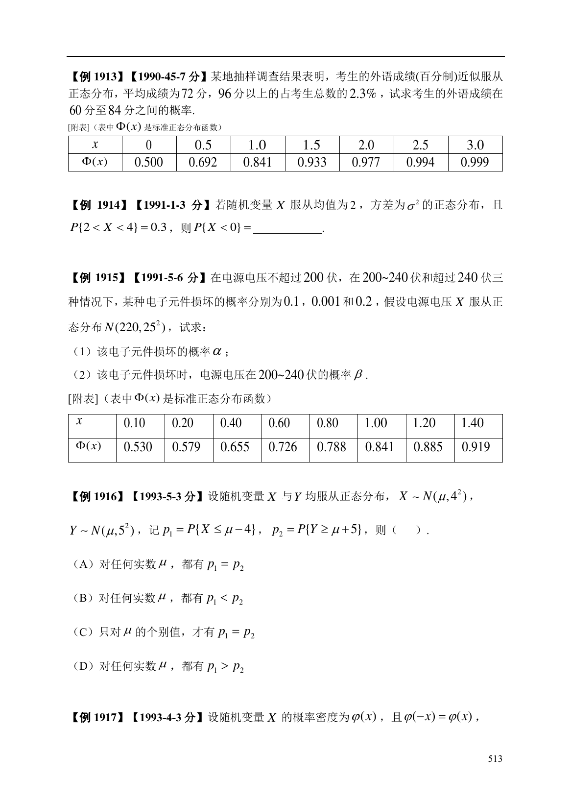

> 生成原页图的原因：包含 Symbol/私用区字形；包含疑似公式布局。

### 文本层（用于搜索/导入，公式可能失真）

~~~text
【例 1913】【1990-45-7 分】某地抽样调查结果表明，考生的外语成绩(百分制)近似服从
正态分布，平均成绩为 72 分，96 分以上的占考生总数的 2.3% ，试求考生的外语成绩在
 60 分至 84 分之间的概率.
[附表]（表中  ( x ) 是标准正态分布函数）

        x         0         0.5            1.0         1.5        2.0       2.5        3.0
     ( x)      0.500      0.692          0.841       0.933      0.977     0.994      0.999

【例 1914】【1991-1-3 分】若随机变量 X 服从均值为 2 ，方差为  2 的正态分布，且
P{2  X  4} = 0.3 ，则 P{ X  0} =                         .

【例 1915】【1991-5-6 分】在电源电压不超过 200 伏，在 200~240 伏和超过 240 伏三

种情况下，某种电子元件损坏的概率分别为 0.1 ，0.001 和 0.2 ，假设电源电压 X 服从正

态分布 N (220, 252 ) ，试求：

（1）该电子元件损坏的概率  ；

（2）该电子元件损坏时，电源电压在 200~240 伏的概率  .

[附表]（表中  ( x ) 是标准正态分布函数）
    x         0.10      0.20       0.40       0.60       0.80      1.00     1.20      1.40
  ( x)       0.530     0.579      0.655      0.726      0.788     0.841    0.885     0.919

【例 1916】【1993-5-3 分】设随机变量 X 与 Y 均服从正态分布， X                                   N (  , 42 ) ，

Y       N (  ,52 ) ，记 p1 = P{ X   − 4} ， p2 = P{Y   + 5} ，则（           ）.

（A）对任何实数  ，都有 p1 = p2

（B）对任何实数  ，都有 p1  p2

（C）只对  的个别值，才有 p1 = p2

（D）对任何实数  ，都有 p1  p2

【例 1917】【1993-4-3 分】设随机变量 X 的概率密度为  ( x ) ，且  ( − x ) =  ( x) ，

                                                                                              513
~~~

## PDF 第 32 页

### 原始页面（数学符号以此为准）

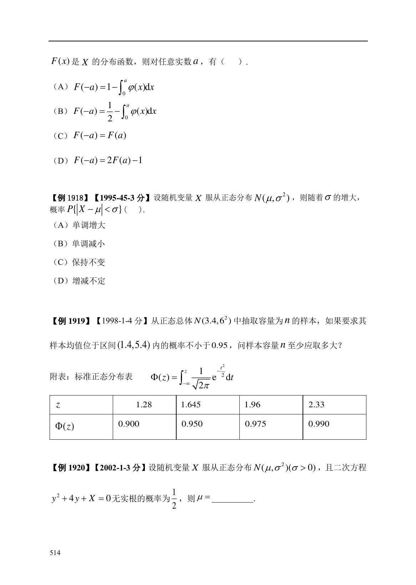

> 生成原页图的原因：包含 Symbol/私用区字形；包含疑似公式布局。

### 文本层（用于搜索/导入，公式可能失真）

~~~text
F ( x) 是 X 的分布函数，则对任意实数 a ，有（                             ）.

                      a
（A） F (−a) = 1 −      ( x)dx
                     0

                 1    a
（B） F (−a) =       −   ( x)dx
                 2 0
（C） F ( − a ) = F ( a )

（D） F (− a ) = 2 F ( a ) − 1

【例 1918】【1995-45-3 分】设随机变量 X 服从正态分布 N (  , 
                                                                   2
                                                                       ) ，则随着  的增大，
概率 P{ X −    } (       ).
（A）单调增大

（B）单调减小

（C）保持不变

（D）增减不定

【例 1919】【1998-1-4 分】从正态总体 N (3.4, 62 ) 中抽取容量为 n 的样本，如果要求其

样本均值位于区间 (1.4,5.4) 内的概率不小于 0.95 ，问样本容量 n 至少应取多大？

                                                    2
                                            z   1 − t2
附表：标准正态分布表                     ( z ) =           e dt
                                        −
                                                2
 z                        1.28          1.645              1.96           2.33

 ( z)              0.900               0.950              0.975          0.990

【例 1920】【2002-1-3 分】设随机变量 X 服从正态分布 N (  ,  )(  0) ，且二次方程
                                                                   2

                         1
y 2 + 4 y + X = 0 无实根的概率为 ，则  =                               .
                         2

514
~~~

## PDF 第 33 页

### 原始页面（数学符号以此为准）

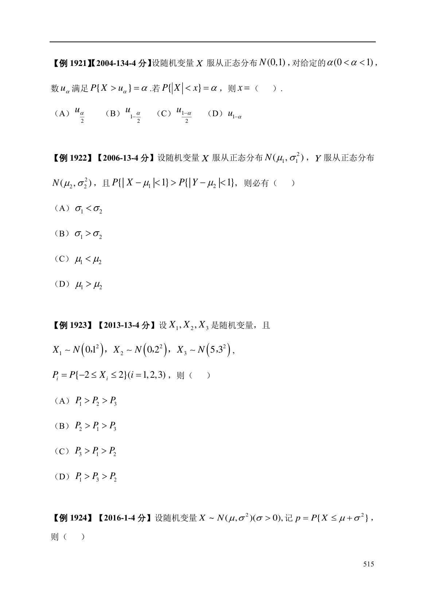

> 生成原页图的原因：包含 Symbol/私用区字形；包含疑似公式布局。

### 文本层（用于搜索/导入，公式可能失真）

~~~text
       【2004-134-4 分】设随机变量 X 服从正态分布 N (0,1) ，对给定的  (0    1) ，
【例 1921】

数 u 满足 P{ X  u } =  .若 P{ X  x} =  ，则 x = （           ）.

（A）
      u             u
              （B） 1−        （C）
                                   u1−    （D） u1−
       2                 2           2

【例 1922】【2006-13-4 分】设随机变量 X 服从正态分布 N ( 1 ,  1 ) ， Y 服从正态分布
                                                                 2

N (  2 ,  22 ) ，且 P{| X − 1 | 1}  P{| Y − 2 | 1}, 则必有（    ）

（A） 1   2

（B） 1   2

（C） 1  2

（D） 1  2

【例 1923】【2013-13-4 分】设 X 1 , X 2 , X 3 是随机变量，且

X1   N ( 0，
          12 )，X 2       N ( 0，
                              22 )，X 3    N ( 5，
                                               32 ) ,

Pi = P{−2  X i  2}(i = 1, 2,3) ，则（        ）

（A） P1  P2  P3

（B） P2  P1  P3

（C） P3  P1  P2

（D） P1  P3  P2

【例 1924】【2016-1-4 分】设随机变量 X ~ N (  ,  )(  0), 记 p = P{ X   +  } ，
                                                        2            2

则（     ）

                                                                     515
~~~

## PDF 第 34 页

### 原始页面（数学符号以此为准）

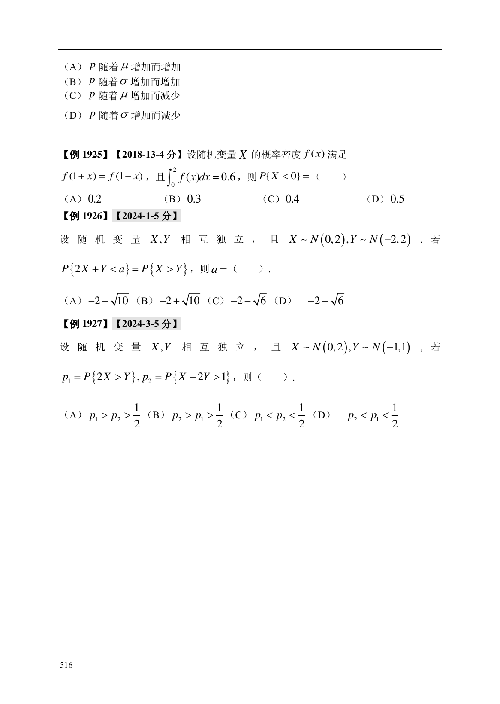

> 生成原页图的原因：包含 Symbol/私用区字形；包含疑似公式布局。

### 文本层（用于搜索/导入，公式可能失真）

~~~text
（A） p 随着  增加而增加
（B） p 随着  增加而增加
（C） p 随着  增加而减少
（D） p 随着  增加而减少

【例 1925】【2018-13-4 分】设随机变量 X 的概率密度 f ( x ) 满足
                            2
f (1 + x) = f (1 − x) ，且
                            f ( x)dx = 0.6 ，则 P{ X  0} = （
                           0
                                                                  ）

（A） 0.2               （B） 0.3                 （C） 0.4                      （D） 0.5
【例 1926】【2024-1-5 分】

设 随 机 变 量           X ,Y        相 互 独 立 ， 且          X   N ( 0, 2 ) , Y     N ( −2, 2 ) , 若

P 2 X + Y  a = P  X  Y  ，则 a = （        ）.

（A） −2 − 10 （B） −2 + 10 （C） −2 − 6 （D）                   −2 + 6

【例 1927】【2024-3-5 分】

设 随 机 变 量           X ,Y        相 互 独 立 ， 且          X    N ( 0, 2 ) , Y    N ( −1,1) , 若

p1 = P 2 X  Y  , p2 = P  X − 2Y  1 ，则（       ）.

                1              1             1                                  1
（A） p1  p2      （B） p2  p1  （C） p1  p2  （D）                   p2  p1 
                2              2             2                                  2

516
~~~

## PDF 第 35 页

### 原始页面（数学符号以此为准）

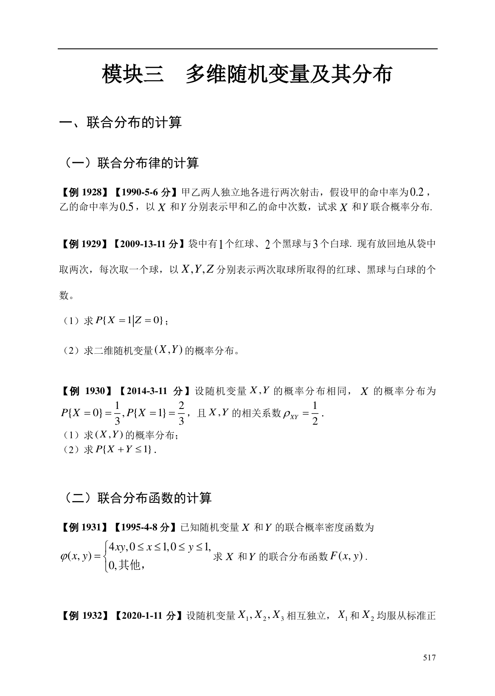

> 生成原页图的原因：包含 Symbol/私用区字形；包含疑似公式布局。

### 文本层（用于搜索/导入，公式可能失真）

~~~text
         模块三               多维随机变量及其分布

一、联合分布的计算

（一）联合分布律的计算

【例 1928】【1990-5-6 分】甲乙两人独立地各进行两次射击，假设甲的命中率为 0.2 ，
乙的命中率为 0.5 ，以 X 和 Y 分别表示甲和乙的命中次数，试求 X 和 Y 联合概率分布.

【例 1929】【2009-13-11 分】袋中有 1 个红球、 2 个黑球与 3 个白球. 现有放回地从袋中

取两次，每次取一个球，以 X , Y , Z 分别表示两次取球所取得的红球、黑球与白球的个

数。

（1）求 P{ X = 1 Z = 0} ；

（2）求二维随机变量 ( X , Y ) 的概率分布。

【例 1930】【2014-3-11 分】设随机变量 X , Y 的概率分布相同， X 的概率分布为
          1            2                     1
P{X = 0} = , P{X = 1} = ，且 X , Y 的相关系数  XY = ．
          3            3                     2
（1）求 ( X , Y ) 的概率分布；
（2）求 P{X + Y  1} ．

（二）联合分布函数的计算

【例 1931】【1995-4-8 分】已知随机变量 X 和 Y 的联合概率密度函数为

             4 xy,0  x  1,0  y  1,
 ( x, y ) =                           求 X 和 Y 的联合分布函数 F ( x, y ) .
             0, 其他，

【例 1932】【2020-1-11 分】设随机变量 X 1 , X 2 , X 3 相互独立， X 1 和 X 2 均服从标准正

                                                                       517
~~~

## PDF 第 36 页

### 原始页面（数学符号以此为准）

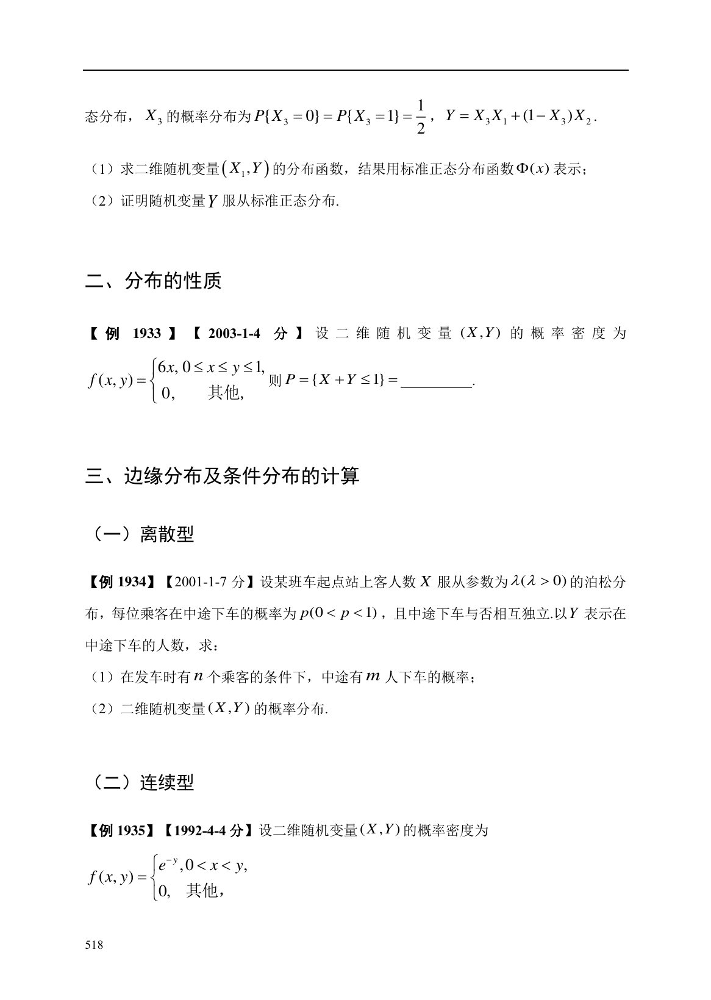

> 生成原页图的原因：包含 Symbol/私用区字形；包含疑似公式布局。

### 文本层（用于搜索/导入，公式可能失真）

~~~text
                                                         1
态分布， X 3 的概率分布为 P{ X 3 = 0} = P{ X 3 = 1} =                ， Y = X 3 X 1 + (1 − X 3 ) X 2 .
                                                         2

（1）求二维随机变量 ( X 1 , Y ) 的分布函数，结果用标准正态分布函数  ( x ) 表示；

（2）证明随机变量 Y 服从标准正态分布.

二、分布的性质

【 例 1933 】 【 2003-1-4 分 】 设 二 维 随 机 变 量 ( X , Y ) 的 概 率 密 度 为

             6 x, 0  x  y  1,
f ( x, y ) =                     则 P = { X + Y  1} =             .
              0,      其他,

三、边缘分布及条件分布的计算

（一）离散型

【例 1934】【2001-1-7 分】设某班车起点站上客人数 X 服从参数为  (   0) 的泊松分

布，每位乘客在中途下车的概率为 p (0  p  1) ，且中途下车与否相互独立.以 Y 表示在

中途下车的人数，求：

（1）在发车时有 n 个乘客的条件下，中途有 m 人下车的概率；

（2）二维随机变量 ( X , Y ) 的概率分布.

（二）连续型

【例 1935】【1992-4-4 分】设二维随机变量 ( X , Y ) 的概率密度为

             e − y , 0  x  y ,
f ( x, y ) = 
             0, 其他，

518
~~~

## PDF 第 37 页

### 原始页面（数学符号以此为准）

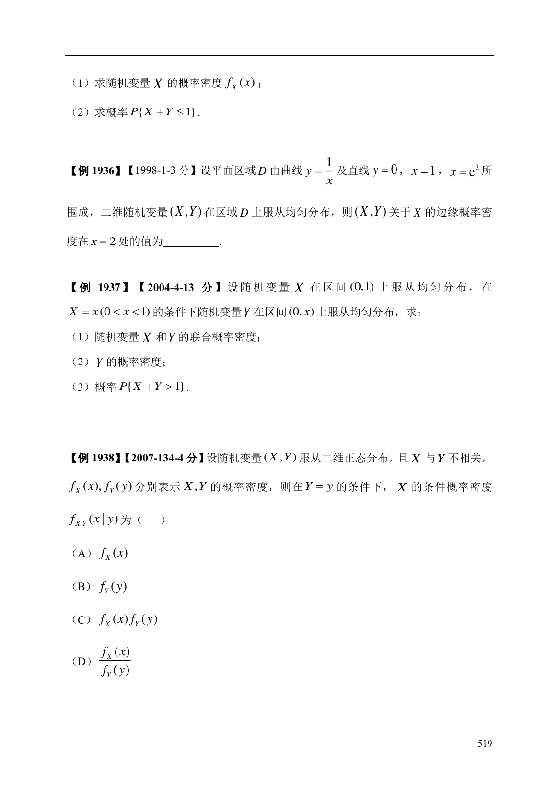

> 生成原页图的原因：包含 Symbol/私用区字形；包含疑似公式布局。

### 文本层（用于搜索/导入，公式可能失真）

~~~text
（1）求随机变量 X 的概率密度 f X ( x ) ；

（2）求概率 P{ X + Y  1} .

                                         1
【例 1936】【1998-1-3 分】设平面区域 D 由曲线 y =        及直线 y = 0 ， x = 1 ， x = e 2 所
                                         x

围成，二维随机变量 ( X , Y ) 在区域 D 上服从均匀分布，则 ( X , Y ) 关于 X 的边缘概率密

度在 x = 2 处的值为                .

【 例 1937 】 【 2004-4-13 分 】 设 随 机 变 量 X 在 区 间 (0,1) 上 服 从 均 匀 分 布 ， 在

X = x (0  x  1) 的条件下随机变量 Y 在区间 (0, x) 上服从均匀分布，求：

（1）随机变量 X 和 Y 的联合概率密度；

（2） Y 的概率密度；

（3）概率 P{ X + Y  1} .

【例 1938】【2007-134-4 分】设随机变量 ( X , Y ) 服从二维正态分布，且 X 与 Y 不相关，

 f X ( x ), fY ( y ) 分别表示 X , Y 的概率密度，则在 Y = y 的条件下， X 的条件概率密度

 f X |Y ( x | y ) 为（     ）

（A） f X ( x)

（B） fY ( y )

（C） f X ( x ) fY ( y )

         f X ( x)
（D）
         fY ( y )

                                                                     519
~~~

## PDF 第 38 页

### 原始页面（数学符号以此为准）

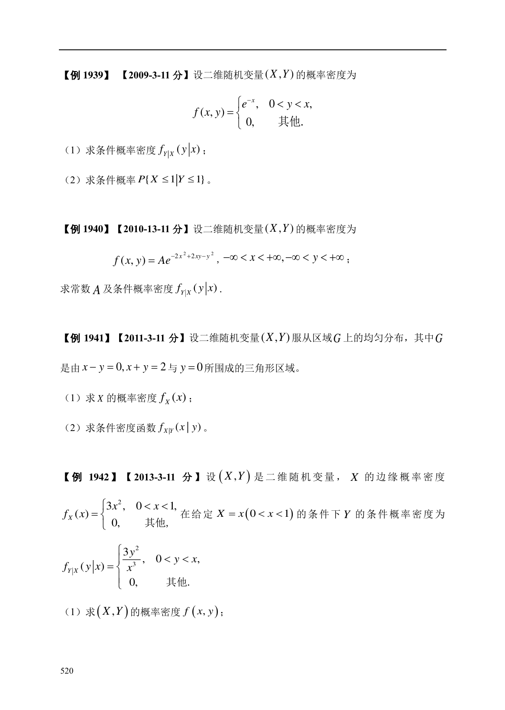

> 生成原页图的原因：包含 Symbol/私用区字形；包含疑似公式布局。

### 文本层（用于搜索/导入，公式可能失真）

~~~text
【例 1939】 【2009-3-11 分】设二维随机变量 ( X , Y ) 的概率密度为

                                               e − x , 0  y  x,
                                 f ( x, y ) = 
                                               0,        其他.

（1）求条件概率密度 fY X ( y x ) ；

（2）求条件概率 P{ X  1 Y  1} 。

【例 1940】【2010-13-11 分】设二维随机变量 ( X , Y ) 的概率密度为

            f ( x, y ) = Ae −2 x + 2 xy − y , −  x  +, −  y  + ；
                             2       2

求常数 A 及条件概率密度 fY X ( y x) .

【例 1941】【2011-3-11 分】设二维随机变量 ( X , Y ) 服从区域 G 上的均匀分布，其中 G

是由 x − y = 0, x + y = 2 与 y = 0 所围成的三角形区域。

（1）求 X 的概率密度 f X ( x) ；

（2）求条件密度函数 f X |Y ( x | y ) 。

【 例 1942 】 【 2013-3-11 分 】 设 ( X , Y ) 是 二 维 随 机 变 量 ， X 的 边 缘 概 率 密 度

           3x 2 , 0  x  1,
f X ( x) =                   在 给 定 X = x ( 0  x  1) 的 条 件 下 Y 的 条 件 概 率 密 度 为
            0,      其他,

               3y2
                    , 0  y  x,
fY X ( y x ) =  x 3
                0,      其他.
               

（1）求 ( X , Y ) 的概率密度 f ( x, y ) ；

520
~~~

## PDF 第 39 页

### 原始页面（数学符号以此为准）

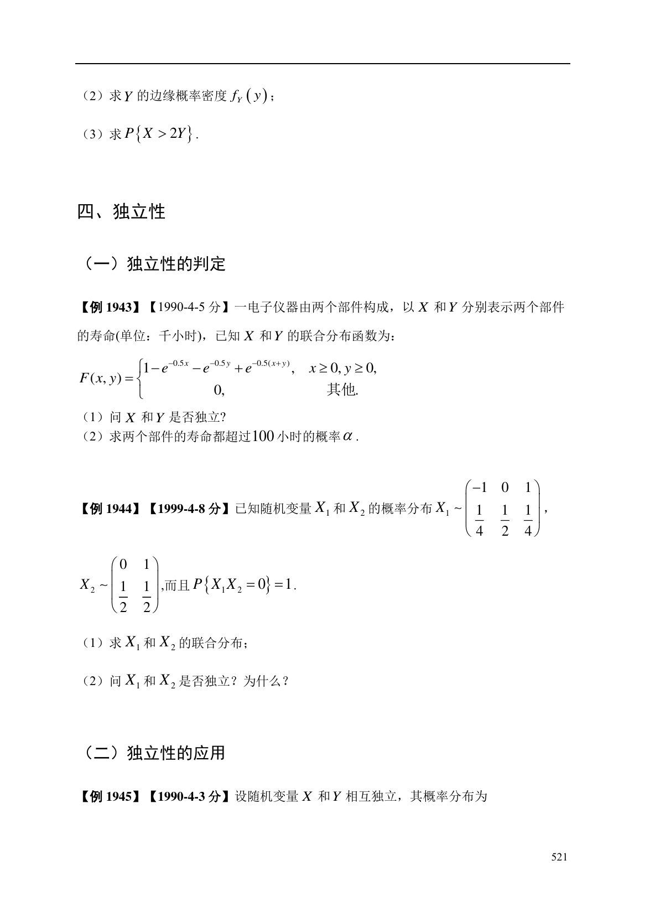

> 生成原页图的原因：包含 Symbol/私用区字形；包含疑似公式布局。

### 文本层（用于搜索/导入，公式可能失真）

~~~text
（2）求 Y 的边缘概率密度 fY ( y ) ；

（3）求 P  X  2Y  .

四、独立性

（一）独立性的判定

【例 1943】【1990-4-5 分】一电子仪器由两个部件构成，以 X 和 Y 分别表示两个部件

的寿命(单位：千小时)，已知 X 和 Y 的联合分布函数为：

            1 − e−0.5 x − e−0.5 y + e−0.5( x + y ) , x  0, y  0,
F ( x, y) = 
                            0,                          其他.
（1）问 X 和 Y 是否独立?
（2）求两个部件的寿命都超过 100 小时的概率  .

                                                                       −1 0   1
【例 1944】【1999-4-8 分】已知随机变量 X 1 和 X 2 的概率分布 X 1                                 
                                                                      1 1     1，
                                                                      4 2     4

       0     1
               
X2
       1     1  ,而且 P  X 1 X 2 = 0 = 1 .
       2     2

（1）求 X 1 和 X 2 的联合分布；

（2）问 X 1 和 X 2 是否独立？为什么？

（二）独立性的应用

【例 1945】【1990-4-3 分】设随机变量 X 和 Y 相互独立，其概率分布为

                                                                                 521
~~~

## PDF 第 40 页

### 原始页面（数学符号以此为准）

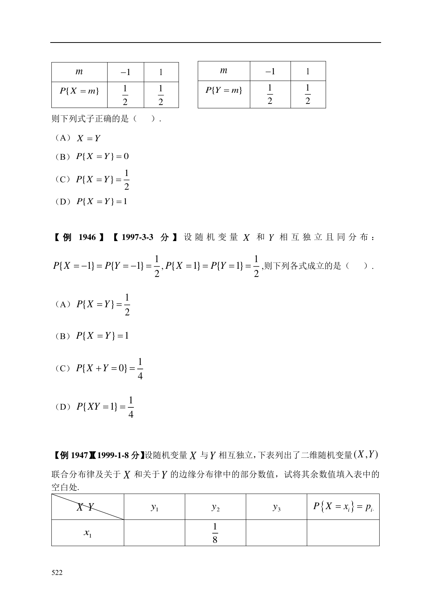

> 生成原页图的原因：包含 Symbol/私用区字形；包含疑似公式布局。

### 文本层（用于搜索/导入，公式可能失真）

~~~text
      m         −1                  1         m    −1       1

  P{ X = m}        1            1       P{Y = m}   1        1
                   2            2                  2        2
则下列式子正确的是（                     ）.

（A） X = Y

（B） P{ X = Y } = 0
                   1
（C） P{ X = Y } =
                   2
（D） P{ X = Y } = 1

【 例 1946 】 【 1997-3-3 分 】 设 随 机 变 量 X 和 Y 相 互 独 立 且 同 分 布 ：

                        1                        1
P{ X = −1} = P{Y = −1} = , P{ X = 1} = P{Y = 1} = ,则下列各式成立的是（                 ）.
                        2                        2

                   1
（A） P{ X = Y } =
                   2

（B） P{ X = Y } = 1

                           1
（C） P{ X + Y = 0} =
                           4

                       1
（D） P{ XY = 1} =
                       4

       【1999-1-8 分】设随机变量 X 与 Y 相互独立，下表列出了二维随机变量 ( X , Y )
【例 1947】

联合分布律及关于 X 和关于 Y 的边缘分布律中的部分数值，试将其余数值填入表中的
空白处.

      X Y                      y1        y2            y3       P  X = xi  = pi

                                         1
          x1
                                         8

522
~~~

## PDF 第 41 页

### 原始页面（数学符号以此为准）

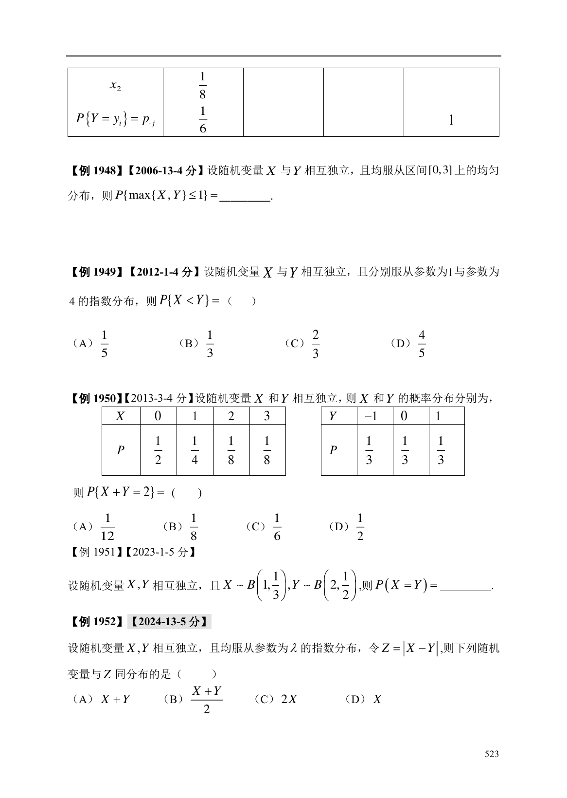

> 生成原页图的原因：包含 Symbol/私用区字形；包含疑似公式布局。

### 文本层（用于搜索/导入，公式可能失真）

~~~text
                                1
          x2
                                8
 P Y = yi  = p j
                                1
                                                                                           1
                                6

【例 1948】【2006-13-4 分】设随机变量 X 与 Y 相互独立，且均服从区间 [0,3] 上的均匀

分布，则 P{max{ X , Y }  1} = _________.

【例 1949】【2012-1-4 分】设随机变量 X 与 Y 相互独立，且分别服从参数为1 与参数为

4 的指数分布，则 P{ X  Y } = （                    ）

      1                             1                     2                        4
（A）                       （B）                       （C）                      （D）
      5                             3                     3                        5

【例 1950】
       【2013-3-4 分】设随机变量 X 和 Y 相互独立，则 X 和 Y 的概率分布分别为，
           X      0         1           2       3             Y         −1    0        1
                      1     1           1       1                       1     1        1
           P                                                  P
                      2     4           8       8                       3     3        3

 则 P{ X + Y = 2} = (            )

       1                    1                       1               1
（A）                   （B）                   （C）               （D）
      12                    8                       6               2
【例 1951】
       【2023-1-5 分】

                                               1           1
设随机变量 X , Y 相互独立，且 X                        B 1,  , Y   B  2,  ,则 P ( X = Y ) =             .
                                               3           2
【例 1952】【2024-13-5 分】

设随机变量 X , Y 相互独立，且均服从参数为  的指数分布，令 Z = X − Y ,则下列随机

变量与 Z 同分布的是（                        ）
                            X +Y
（A） X + Y             （B）                   （C） 2 X               （D） X
                              2

                                                                                               523
~~~

## PDF 第 42 页

### 原始页面（数学符号以此为准）

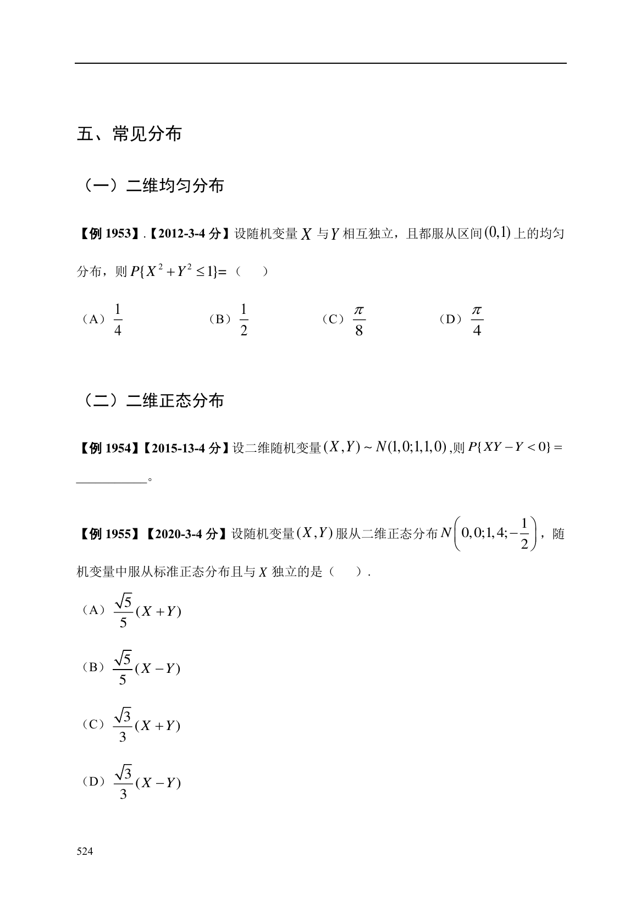

> 生成原页图的原因：包含 Symbol/私用区字形；包含疑似公式布局。

### 文本层（用于搜索/导入，公式可能失真）

~~~text
五、常见分布

（一）二维均匀分布

【例 1953】.【2012-3-4 分】设随机变量 X 与 Y 相互独立，且都服从区间 (0,1) 上的均匀

分布，则 P{ X + Y  1}= （
           2      2
                                ）

      1                     1                                   
（A）                   （B）           （C）                  （D）
      4                     2             8                      4

（二）二维正态分布

【例 1954】【2015-13-4 分】设二维随机变量 ( X , Y )         N (1, 0;1,1, 0) ,则 P{ XY − Y  0} =
___________。

                                                                         1
【例 1955】【2020-3-4 分】设随机变量 ( X , Y ) 服从二维正态分布 N  0, 0;1, 4; −               ，随
                                                                         2
机变量中服从标准正态分布且与 X 独立的是（                    ）.

       5
（A）      (X +Y)
      5

       5
（B）      (X −Y)
      5

       3
（C）      (X +Y)
      3

       3
（D）      (X −Y)
      3

524
~~~

## PDF 第 43 页

### 原始页面（数学符号以此为准）

### 文本层（用于搜索/导入，公式可能失真）

~~~text
525
~~~

## PDF 第 44 页

### 原始页面（数学符号以此为准）

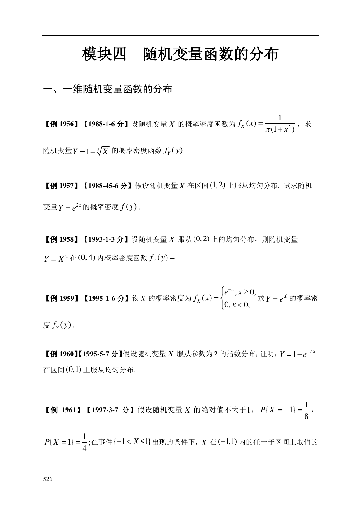

> 生成原页图的原因：包含 Symbol/私用区字形；包含疑似公式布局。

### 文本层（用于搜索/导入，公式可能失真）

~~~text
               模块四             随机变量函数的分布

一、一维随机变量函数的分布

                                                              1
【例 1956】【1988-1-6 分】设随机变量 X 的概率密度函数为 f X ( x) =                       ，求
                                                          (1 + x 2 )

随机变量 Y = 1 − 3 X 的概率密度函数 fY ( y ) .

【例 1957】【1988-45-6 分】假设随机变量 X 在区间 (1, 2) 上服从均匀分布. 试求随机

变量 Y = e 2 x 的概率密度 f ( y ) .

【例 1958】【1993-1-3 分】设随机变量 X 服从 (0, 2) 上的均匀分布，则随机变量

Y = X 2 在 (0, 4) 内概率密度函数 fY ( y ) =        .

                                          e− x , x  0,
【例 1959】【1995-1-6 分】设 X 的概率密度为 f X ( x) =               求 Y = e X 的概率密
                                           0, x   0,

度 fY ( y ) .

       【1995-5-7 分】假设随机变量 X 服从参数为 2 的指数分布，证明：Y = 1 − e −2 X
【例 1960】

在区间 (0,1) 上服从均匀分布.

                                                                     1
【例 1961】【1997-3-7 分】假设随机变量 X 的绝对值不大于 1 ， P{ X = −1} =                  ，
                                                                     8

               1
P{ X = 1} =      ;在事件 {−1  X <1} 出现的条件下，X 在 ( −1,1) 内的任一子区间上取值的
               4

526
~~~

## PDF 第 45 页

### 原始页面（数学符号以此为准）

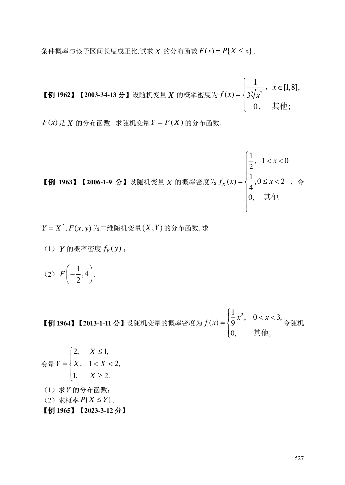

> 生成原页图的原因：包含 Symbol/私用区字形；包含疑似公式布局。

### 文本层（用于搜索/导入，公式可能失真）

~~~text
条件概率与该子区间长度成正比.试求 X 的分布函数 F ( x) = P{ X  x} .

                                               1
                                                       ，x  [1,8],
【例 1962】【2003-34-13 分】设随机变量 X 的概率密度为 f ( x) =  3 3 x 2
                                               0 , 其他;
                                              
F ( x) 是 X 的分布函数. 求随机变量 Y = F ( X ) 的分布函数.

                                             1
                                              2 , −1  x  0
                                             
                                             1
【例 1963】【2006-1-9 分】设随机变量 X 的概率密度为 X
                                  f  ( x ) =  , 0  x  2 ，令
                                             4
                                             0, 其他
                                             
                                             

Y = X 2 , F ( x, y ) 为二维随机变量 ( X , Y ) 的分布函数.求

（1） Y 的概率密度 fY ( y ) ；

        1 
（2） F  − ,4 .
        2 

                                          1 2
                                           x , 0  x  3,
【例 1964】【2013-1-11 分】设随机变量的概率密度为 f ( x) =  9              令随机
                                          
                                          0,   其他,

       2, X  1,
       
变量 Y =  X , 1  X  2,
       1,   X  2.
       
（1）求 Y 的分布函数；
（2）求概率 P{ X  Y } .
【例 1965】【2023-3-12 分】

                                                                 527
~~~

## PDF 第 46 页

### 原始页面（数学符号以此为准）

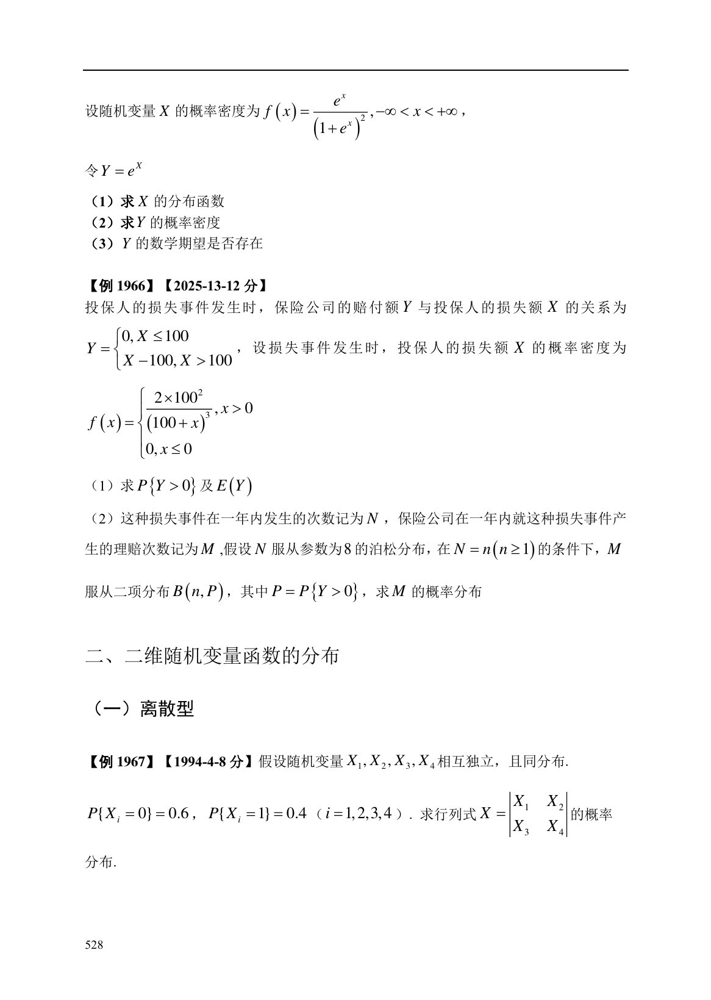

> 生成原页图的原因：包含 Symbol/私用区字形；包含疑似公式布局。

### 文本层（用于搜索/导入，公式可能失真）

~~~text
                                      ex
设随机变量 X 的概率密度为 f ( x ) =                         , −  x  + ，
                                   (1 + e )x 2

令Y = e
         X

（1）求 X 的分布函数
（2）求 Y 的概率密度
（3） Y 的数学期望是否存在

【例 1966】【2025-13-12 分】
投保人的损失事件发生时，保险公司的赔付额 Y 与投保人的损失额 X 的关系为

   0, X  100
Y =                  ，设损失事件发生时，投保人的损失额 X 的概率密度为
    X − 100, X  100

           2 1002
                        ,x 0
f ( x ) =  (100 + x )
                       3

          
          0, x  0

（1）求 P Y  0 及 E (Y )

（2）这种损失事件在一年内发生的次数记为 N ，保险公司在一年内就这种损失事件产

生的理赔次数记为 M ,假设 N 服从参数为 8 的泊松分布，在 N = n ( n  1) 的条件下，M

服从二项分布 B ( n, P ) ，其中 P = P Y  0 ，求 M 的概率分布

二、二维随机变量函数的分布

（一）离散型

【例 1967】【1994-4-8 分】假设随机变量 X 1 , X 2 , X 3 , X 4 相互独立，且同分布.

                                                                    X1   X2
P{ X i = 0} = 0.6 ， P{ X i = 1} = 0.4 （ i = 1, 2,3, 4 ）. 求行列式 X =             的概率
                                                                    X3   X4

分布.

528
~~~

## PDF 第 47 页

### 原始页面（数学符号以此为准）

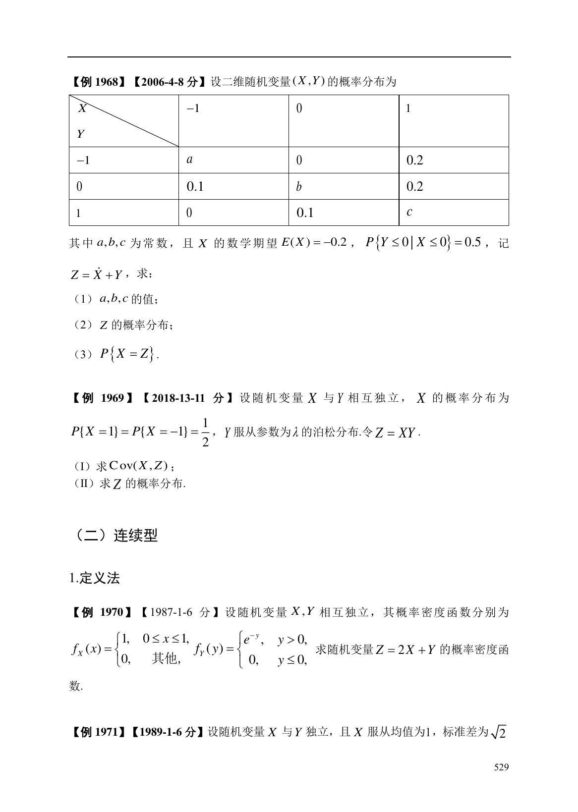

> 生成原页图的原因：包含 Symbol/私用区字形；包含疑似公式布局。

### 文本层（用于搜索/导入，公式可能失真）

~~~text
【例 1968】【2006-4-8 分】设二维随机变量 ( X , Y ) 的概率分布为

 X                       −1                      0                1

 Y

 −1                      a                       0                0.2
 0                       0.1                     b                0.2
 1                       0                       0.1              c

其 中 a, b, c 为 常 数 ， 且 X 的 数 学 期 望 E ( X ) = −0.2 ， P Y  0 | X  0 = 0.5 ， 记

Z = X + Y ，求：
（1） a, b, c 的值；

（2） Z 的概率分布；

（3） P  X = Z  .

【 例 1969 】 【 2018-13-11 分 】 设 随 机 变 量 X 与 Y 相 互 独 立 ， X 的 概 率 分 布 为

                        1
P{ X = 1} = P{ X = −1} = ， Y 服从参数为  的泊松分布.令 Z = XY .
                        2
（Ⅰ）求 C ov( X , Z ) ；
（Ⅱ）求 Z 的概率分布.

（二）连续型

1.定义法

【 例 1970】 【 1987-1-6 分 】设 随机 变量 X , Y 相 互独立 ，其 概率 密度函 数分别 为

           1, 0  x  1,          e − y ,   y  0,
f X ( x) =               f ( y) =                    求随机变量 Z = 2 X + Y 的概率密度函
           0,   其他, Y              0,       y  0,
数.

【例 1971】【1989-1-6 分】设随机变量 X 与 Y 独立，且 X 服从均值为1 ，标准差为 2

                                                                             529
~~~

## PDF 第 48 页

### 原始页面（数学符号以此为准）

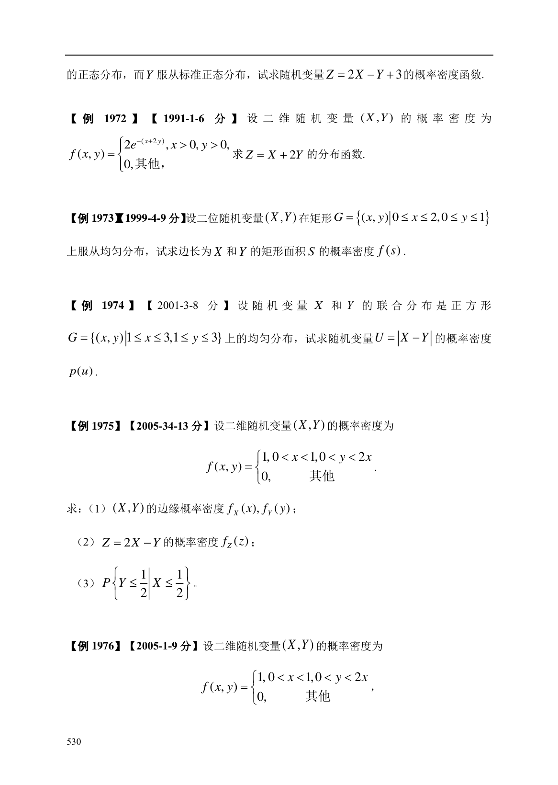

> 生成原页图的原因：包含 Symbol/私用区字形；包含疑似公式布局。

### 文本层（用于搜索/导入，公式可能失真）

~~~text
的正态分布，而 Y 服从标准正态分布，试求随机变量 Z = 2 X − Y + 3 的概率密度函数.

【 例 1972 】 【 1991-1-6 分 】 设 二 维 随 机 变 量 ( X , Y ) 的 概 率 密 度 为

             
             2e
                 −( x+2 y )
                            , x  0, y  0,
f ( x, y ) =                               求 Z = X + 2Y 的分布函数.
             
             0, 其他，

【例 1973】          设二位随机变量 ( X , Y ) 在矩形 G = ( x, y ) 0  x  2, 0  y  1
       【1999-4-9 分】

上服从均匀分布，试求边长为 X 和 Y 的矩形面积 S 的概率密度 f ( s ) .

【 例 1974 】 【 2001-3-8 分 】 设 随 机 变 量 X 和 Y 的 联 合 分 布 是 正 方 形

G = {( x, y ) 1  x  3,1  y  3} 上的均匀分布，试求随机变量 U = X − Y 的概率密度

p(u ) .

【例 1975】【2005-34-13 分】设二维随机变量 ( X , Y ) 的概率密度为

                                          1, 0  x  1, 0  y  2 x
                             f ( x, y ) =                           .
                                          0,         其他

求：（1） ( X , Y ) 的边缘概率密度 f X ( x), f Y ( y ) ；

 （2） Z = 2 X − Y 的概率密度 f Z ( z ) ；

             1    1
 （3） P Y      X  。
             2    2

【例 1976】【2005-1-9 分】设二维随机变量 ( X , Y ) 的概率密度为

                                         1, 0  x  1, 0  y  2 x
                            f ( x, y ) =                           ，
                                         0,         其他

530
~~~

## PDF 第 49 页

### 原始页面（数学符号以此为准）

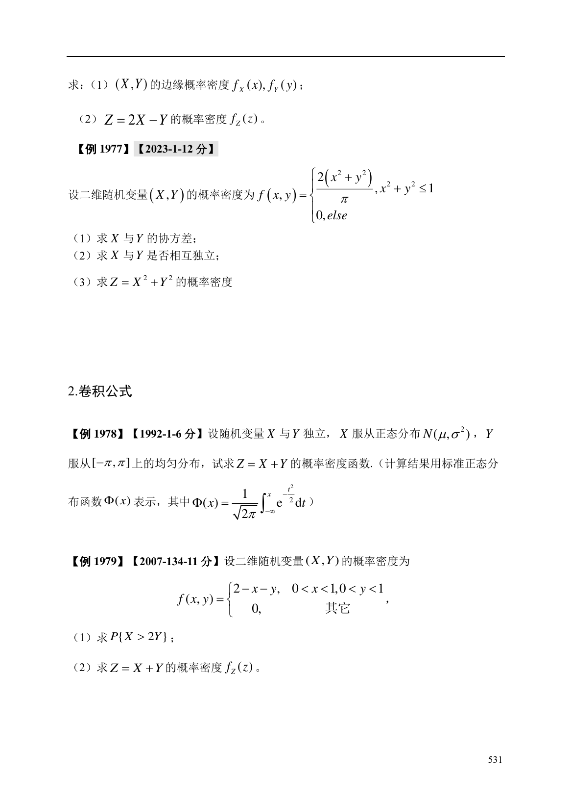

> 生成原页图的原因：包含 Symbol/私用区字形；包含疑似公式布局。

### 文本层（用于搜索/导入，公式可能失真）

~~~text
求：（1） ( X , Y ) 的边缘概率密度 f X ( x), f Y ( y ) ；

 （2） Z = 2 X − Y 的概率密度 f Z ( z ) 。

 【例 1977】【2023-1-12 分】

                                       2 ( x2 + y 2 )
                                                      , x2 + y 2  1
设二维随机变量 ( X , Y ) 的概率密度为 f ( x, y ) =        
                                      0, else
                                      
（1）求 X 与 Y 的协方差；
（2）求 X 与 Y 是否相互独立；

（3）求 Z = X + Y 的概率密度
              2   2

2.卷积公式

【例 1978】【1992-1-6 分】设随机变量 X 与 Y 独立， X 服从正态分布 N (  ,  ) ， Y
                                                                        2

服从 [ − ,  ] 上的均匀分布，试求 Z = X + Y 的概率密度函数.（计算结果用标准正态分
                                              2
                                   1 x − t2
布函数  ( x ) 表示，其中 ( x) =              e dt ）
                                   2 −

【例 1979】【2007-134-11 分】设二维随机变量 ( X , Y ) 的概率密度为

                                   2 − x − y, 0  x  1, 0  y  1
                      f ( x, y ) =                                 ，
                                    0,               其它

（1）求 P{ X  2Y } ；

（2）求 Z = X + Y 的概率密度 f Z ( z ) 。

                                                                            531
~~~

## PDF 第 50 页

### 原始页面（数学符号以此为准）

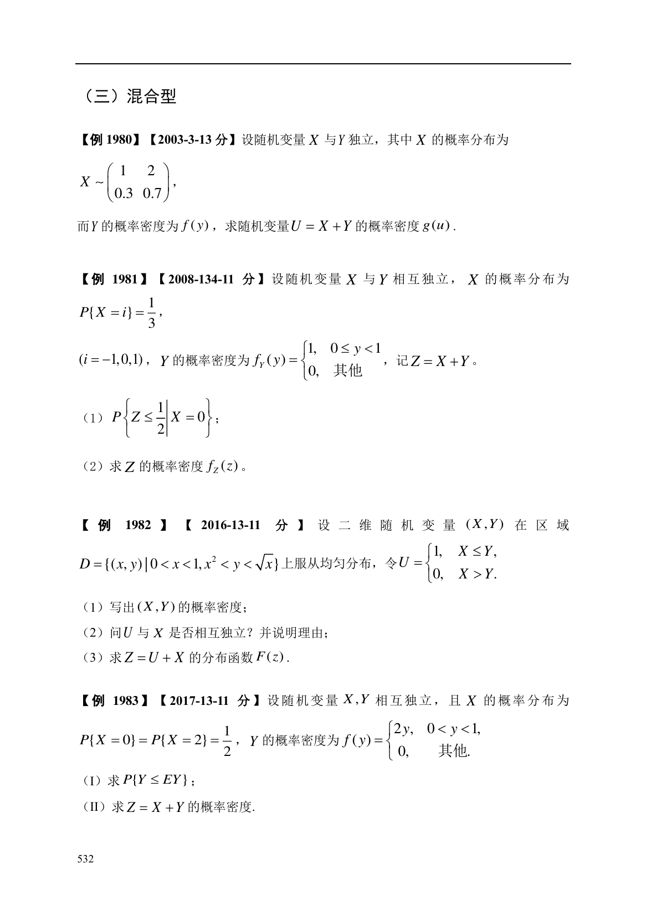

> 生成原页图的原因：包含 Symbol/私用区字形；包含疑似公式布局。

### 文本层（用于搜索/导入，公式可能失真）

~~~text
（三）混合型

【例 1980】【2003-3-13 分】设随机变量 X 与 Y 独立，其中 X 的概率分布为

       1 2 
X              ，
       0.3 0.7 
而 Y 的概率密度为 f ( y ) ，求随机变量 U = X + Y 的概率密度 g (u ) .

【 例 1981 】 【 2008-134-11 分 】 设 随 机 变 量 X 与 Y 相 互 独 立 ， X 的 概 率 分 布 为
           1
P{ X = i} = ，
           3
                                    1, 0  y  1
(i = −1, 0,1) ， Y 的概率密度为 fY ( y ) =              ，记 Z = X + Y 。
                                    0, 其他

             1      
（1） P  Z      X = 0 ；
             2      

（2）求 Z 的概率密度 f Z ( z ) 。

【 例     1982 】 【 2016-13-11      分 】 设 二 维 随 机 变 量 ( X ,Y ) 在 区 域

                                                       1, X  Y ,
D = {( x, y ) | 0  x  1, x 2  y  x } 上服从均匀分布，令 U = 
                                                       0, X  Y .
（1）写出 ( X , Y ) 的概率密度；
（2）问 U 与 X 是否相互独立？并说明理由；
（3）求 Z = U + X 的分布函数 F ( z ) .

【 例 1983 】 【 2017-13-11 分 】 设 随 机 变 量 X , Y 相 互 独 立 ， 且 X 的 概 率 分 布 为

                          1                      2 y, 0  y  1,
P{ X = 0} = P{ X = 2} =     ， Y 的概率密度为 f ( y ) = 
                          2                       0,    其他.
（I）求 P{Y  EY } ；
（II）求 Z = X + Y 的概率密度.

532
~~~

## PDF 第 51 页

### 原始页面（数学符号以此为准）

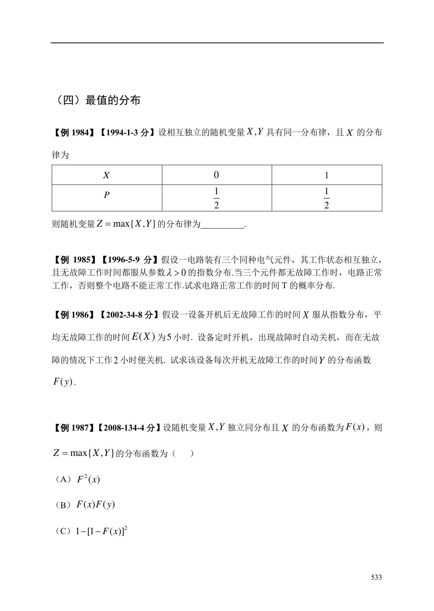

> 生成原页图的原因：包含 Symbol/私用区字形；包含疑似公式布局。

### 文本层（用于搜索/导入，公式可能失真）

~~~text
（四）最值的分布

【例 1984】【1994-1-3 分】设相互独立的随机变量 X , Y 具有同一分布律，且 X 的分布

律为

               X               0                 1

               P               1                 1
                               2                 2
则随机变量 Z = max{ X , Y } 的分布律为       .

【例 1985】【1996-5-9 分】假设一电路装有三个同种电气元件，其工作状态相互独立，
且无故障工作时间都服从参数   0 的指数分布.当三个元件都无故障工作时，电路正常
工作，否则整个电路不能正常工作.试求电路正常工作的时间 T 的概率分布.

【例 1986】【2002-34-8 分】假设一设备开机后无故障工作的时间 X 服从指数分布，平

均无故障工作的时间 E ( X ) 为 5 小时. 设备定时开机，出现故障时自动关机，而在无故

障的情况下工作 2 小时便关机. 试求该设备每次开机无故障工作的时间 Y 的分布函数

F ( y) .

【例 1987】【2008-134-4 分】设随机变量 X , Y 独立同分布且 X 的分布函数为 F ( x ) ，则

Z = max{ X , Y } 的分布函数为（   ）

           2
（A） F ( x )

（B） F ( x) F ( y )

（C） 1 − [1 − F ( x)]
                     2

                                                         533
~~~

## PDF 第 52 页

### 原始页面（数学符号以此为准）

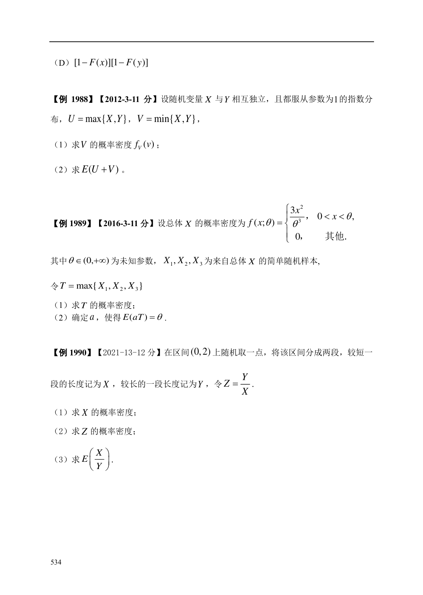

> 生成原页图的原因：包含 Symbol/私用区字形；包含疑似公式布局。

### 文本层（用于搜索/导入，公式可能失真）

~~~text
（D） [1 − F ( x)][1 − F ( y )]

【例 1988】【2012-3-11 分】设随机变量 X 与 Y 相互独立，且都服从参数为 1 的指数分

布， U = max{ X , Y } ， V = min{ X , Y } ，

（1）求 V 的概率密度 fV (v ) ；

（2）求 E (U + V ) 。

                                               3x 2
                                                    ， 0  x ,
【例 1989】【2016-3-11 分】设总体 X 的概率密度为 f ( x; ) =   3
                                               0，       其他.
                                              

其中   (0,+) 为未知参数， X 1 , X 2 , X 3 为来自总体 X 的简单随机样本,

令 T = max{ X 1 , X 2 , X 3 }

（1）求 T 的概率密度；
（2）确定 a ，使得 E (aT ) =  .

【例 1990】【2021-13-12 分】在区间 (0, 2) 上随机取一点，将该区间分成两段，较短一

                                           Y
段的长度记为 X ，较长的一段长度记为 Y ，令 Z =                 .
                                           X
（1）求 X 的概率密度；

（2）求 Z 的概率密度；

           X
（3）求 E       .
           Y 

534
~~~

## PDF 第 53 页

### 原始页面（数学符号以此为准）

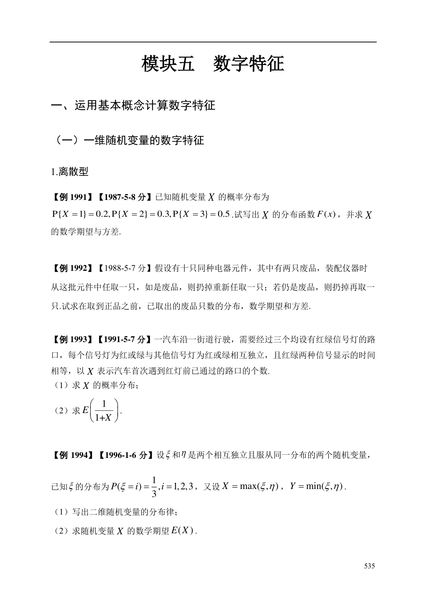

> 生成原页图的原因：包含 Symbol/私用区字形；包含疑似公式布局。

### 文本层（用于搜索/导入，公式可能失真）

~~~text
                    模块五                 数字特征

一、运用基本概念计算数字特征

（一）一维随机变量的数字特征

1.离散型

【例 1991】【1987-5-8 分】已知随机变量 X 的概率分布为
P{X = 1} = 0.2, P{X = 2} = 0.3, P{X = 3} = 0.5 .试写出 X 的分布函数 F ( x) ，并求 X

的数学期望与方差.

【例 1992】【1988-5-7 分】假设有十只同种电器元件，其中有两只废品，装配仪器时

从这批元件中任取一只，如是废品，则扔掉重新任取一只；若仍是废品，则扔掉再取一

只.试求在取到正品之前，已取出的废品只数的分布，数学期望和方差.

【例 1993】【1991-5-7 分】一汽车沿一街道行驶，需要经过三个均设有红绿信号灯的路
口，每个信号灯为红或绿与其他信号灯为红或绿相互独立，且红绿两种信号显示的时间
相等，以 X 表示汽车首次遇到红灯前已通过的路口的个数.
（1）求 X 的概率分布；

         1 
（2）求 E       .
         1+X 

【例 1994】【1996-1-6 分】设  和 是两个相互独立且服从同一分布的两个随机变量，

                        1
已知  的分布为 P( = i ) =     , i = 1, 2,3 ，又设 X = max( , ) ， Y = min( , ) .
                        3
（1）写出二维随机变量的分布律；

（2）求随机变量 X 的数学期望 E ( X ) .

                                                                               535
~~~

## PDF 第 54 页

### 原始页面（数学符号以此为准）

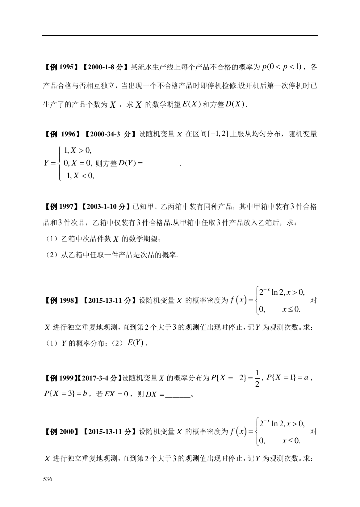

> 生成原页图的原因：包含 Symbol/私用区字形；包含疑似公式布局。

### 文本层（用于搜索/导入，公式可能失真）

~~~text
【例 1995】【2000-1-8 分】某流水生产线上每个产品不合格的概率为 p (0  p  1) ，各

产品合格与否相互独立，当出现一个不合格产品时即停机检修.设开机后第一次停机时已

生产了的产品个数为 X ，求 X 的数学期望 E ( X ) 和方差 D ( X ) .

【例 1996】【2000-34-3 分】设随机变量 X 在区间 [ −1, 2] 上服从均匀分布，随机变量

     1, X  0,
    
Y =  0, X = 0, 则方差 D (Y ) =       .
    −1, X  0,
    

【例 1997】【2003-1-10 分】已知甲、乙两箱中装有同种产品，其中甲箱中装有 3 件合格

品和 3 件次品，乙箱中仅装有 3 件合格品.从甲箱中任取 3 件产品放入乙箱后，求：

（1）乙箱中次品件数 X 的数学期望；

（2）从乙箱中任取一件产品是次品的概率.

                                               2− x ln 2, x  0,
【例 1998】【2015-13-11 分】设随机变量 X 的概率密度为 f ( x ) =                    对
                                                0,      x  0.

X 进行独立重复地观测，直到第 2 个大于 3 的观测值出现时停止，记 Y 为观测次数。求：
（1） Y 的概率分布；（2） E (Y ) 。

                                                    1
       【2017-3-4 分】设随机变量 X 的概率分布为 P{ X = −2} =
【例 1999】                                              ，P{ X = 1} = a ，
                                                    2
P{ X = 3} = b ，若 EX = 0 ，则 DX = _______。

                                               2− x ln 2, x  0,
【例 2000】【2015-13-11 分】设随机变量 X 的概率密度为 f ( x ) =                    对
                                                0,      x  0.

X 进行独立重复地观测，直到第 2 个大于 3 的观测值出现时停止，记 Y 为观测次数。求：

536
~~~

## PDF 第 55 页

### 原始页面（数学符号以此为准）

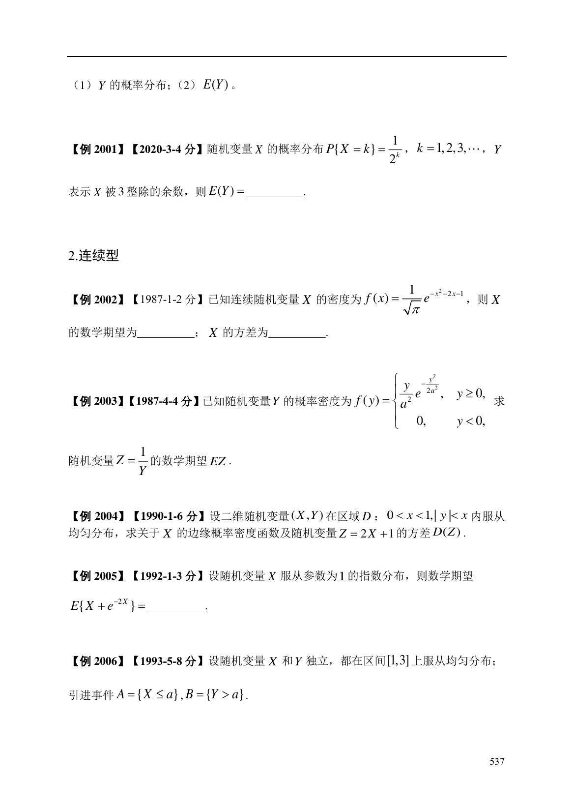

> 生成原页图的原因：包含 Symbol/私用区字形；包含疑似公式布局。

### 文本层（用于搜索/导入，公式可能失真）

~~~text
（1） Y 的概率分布；（2） E (Y ) 。

                                                 1
【例 2001】【2020-3-4 分】随机变量 X 的概率分布 P{ X = k} =        ， k = 1, 2,3,       ，Y
                                                 2k

表示 X 被 3 整除的余数，则 E (Y ) =           .

2.连续型

                                                     1
【例 2002】【1987-1-2 分】已知连续随机变量 X 的密度为 f ( x) =             e− x + 2 x −1 ，则 X
                                                               2

                                                     
的数学期望为                 ； X 的方差为         .

                                               y − y2
                                                           2

                                               e 2a ,             y  0,
【例 2003】【1987-4-4 分】已知随机变量 Y 的概率密度为 f ( y ) =  a 2                         求
                                               0,                 y  0,
                                              

               1
随机变量 Z =         的数学期望 EZ .
               Y

【例 2004】【1990-1-6 分】设二维随机变量 ( X , Y ) 在区域 D ： 0  x  1,| y | x 内服从
均匀分布，求关于 X 的边缘概率密度函数及随机变量 Z = 2 X + 1 的方差 D ( Z ) .

【例 2005】【1992-1-3 分】设随机变量 X 服从参数为 1 的指数分布，则数学期望

E{ X + e −2 X } =        .

【例 2006】【1993-5-8 分】设随机变量 X 和 Y 独立，都在区间 [1,3] 上服从均匀分布；

引进事件 A = { X  a} , B = {Y  a} .

                                                                            537
~~~

## PDF 第 56 页

### 原始页面（数学符号以此为准）

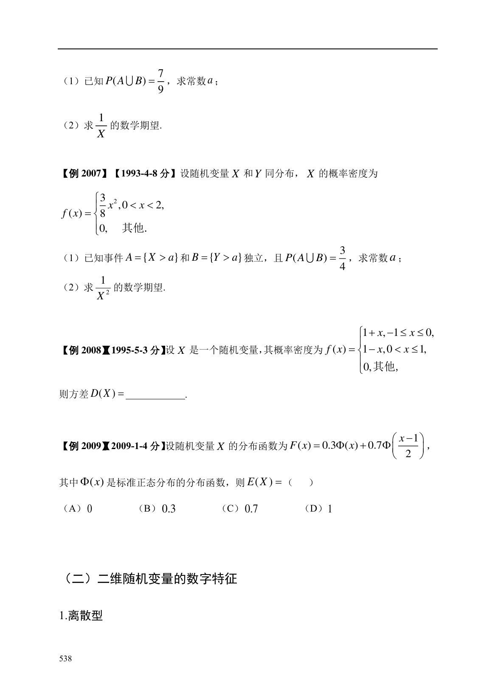

> 生成原页图的原因：包含 Symbol/私用区字形；包含疑似公式布局。

### 文本层（用于搜索/导入，公式可能失真）

~~~text
                        7
（1）已知 P( A       B) =     ，求常数 a ；
                        9

        1
（2）求      的数学期望.
        X

【例 2007】【1993-4-8 分】设随机变量 X 和 Y 同分布， X 的概率密度为

         3 2
          x , 0  x  2,
f ( x) =  8
         
         0, 其他.
                                                      3
（1）已知事件 A = { X  a} 和 B = {Y  a} 独立，且 P( A   B) =     ，求常数 a ；
                                                      4
        1
（2）求       的数学期望.
        X2

                                               1 + x, −1  x  0,
                                               
【例 2008】
       【1995-5-3 分】设 X 是一个随机变量，其概率密度为 f ( x) = 1 − x, 0  x  1,
                                               0, 其他,
                                               

则方差 D ( X ) =               .

                                                              x −1 
       【2009-1-4 分】设随机变量 X 的分布函数为 F ( x) = 0.3( x) + 0.7 
【例 2009】                                                            ，
                                                              2 

其中  ( x ) 是标准正态分布的分布函数，则 E ( X ) = （          ）

（A） 0            （B） 0.3        （C） 0.7    （D） 1

（二）二维随机变量的数字特征

1.离散型

538
~~~

## PDF 第 57 页

### 原始页面（数学符号以此为准）

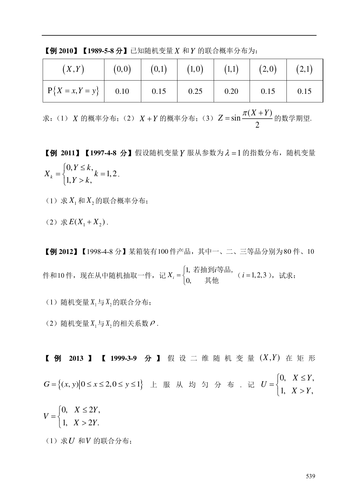

> 生成原页图的原因：包含 Symbol/私用区字形；包含疑似公式布局。

### 文本层（用于搜索/导入，公式可能失真）

~~~text
【例 2010】【1989-5-8 分】已知随机变量 X 和 Y 的联合概率分布为：

      ( X ,Y )           ( 0, 0 )    ( 0,1)   (1, 0 )   (1,1)      ( 2, 0 )     ( 2,1)
 P  X = x, Y = y       0.10        0.15     0.25      0.20        0.15         0.15

                                                                 (X +Y)
求：（1） X 的概率分布；               （3） Z = sin
              （2） X + Y 的概率分布；                                           的数学期望.
                                                                    2

【例 2011】【1997-4-8 分】假设随机变量 Y 服从参数为  = 1 的指数分布，随机变量

     0, Y  k ,
Xk =            k = 1, 2 .
     1, Y  k ,

（1）求 X 1 和 X 2 的联合概率分布；

（2）求 E ( X 1 + X 2 ) .

【例 2012】【1998-4-8 分】某箱装有 100 件产品，其中一、二、三等品分别为 80 件、10

                           1, 若抽到i等品,
件和 10 件，现在从中随机抽取一件，记 X i =           （ i = 1, 2,3 ），试求：
                           0,   其他

（1）随机变量 X 1 与 X 2 的联合分布；

（2）随机变量 X 1 与 X 2 的相关系数  .

【 例     2013 】 【 1999-3-9           分 】 假 设 二 维 随 机 变 量            ( X ,Y ) 在 矩 形

                                                                           0, X  Y ,
G = ( x, y ) 0  x  2, 0  y  1 上 服 从 均 匀 分 布 . 记 U = 
                                                                           1, X  Y ,

   0, X  2Y ,
V =
    1, X  2Y .
（1）求 U 和 V 的联合分布；

                                                                                   539
~~~

## PDF 第 58 页

### 原始页面（数学符号以此为准）

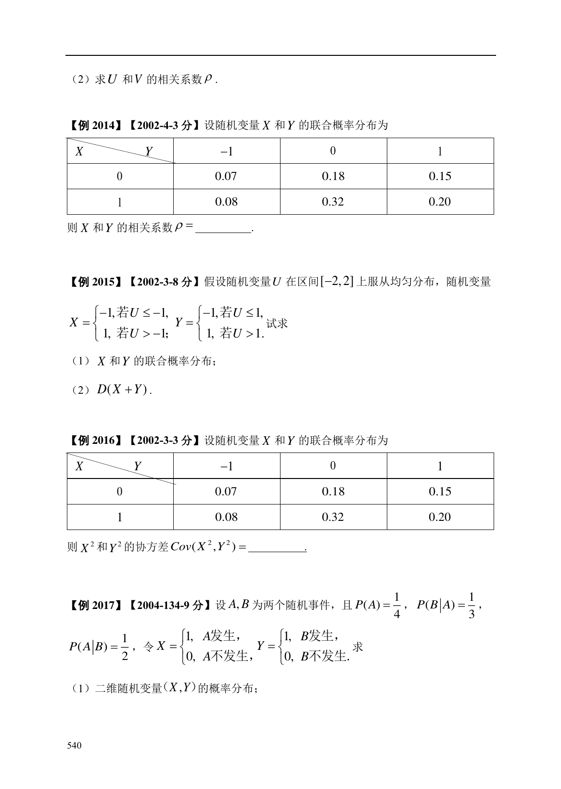

> 生成原页图的原因：包含 Symbol/私用区字形；包含疑似公式布局。

### 文本层（用于搜索/导入，公式可能失真）

~~~text
（2）求 U 和 V 的相关系数  .

【例 2014】【2002-4-3 分】设随机变量 X 和 Y 的联合概率分布为

 X               Y           −1              0           1
         0                   0.07           0.18        0.15

         1                   0.08           0.32        0.20

则 X 和 Y 的相关系数  =                   .

【例 2015】【2002-3-8 分】假设随机变量 U 在区间 [ −2, 2] 上服从均匀分布，随机变量

   −1, 若U  −1,    −1, 若U  1,
X =             Y =            试求
    1, 若U  −1；  1, 若U  1.
（1） X 和 Y 的联合概率分布；

（2） D( X + Y ) .

【例 2016】【2002-3-3 分】设随机变量 X 和 Y 的联合概率分布为

 X           Y               −1              0           1
         0                   0.07           0.18        0.15

         1                   0.08           0.32        0.20

则 X 2 和 Y 2 的协方差 Cov ( X , Y ) =
                         2     2
                                        .

                                                   1            1
【例 2017】【2004-134-9 分】设 A, B 为两个随机事件，且 P( A) =       ， P( B A) = ，
                                                   4            3
            1        1, A发生，    1, B发生，
P( A B) =     ，令 X =         Y =        求
            2        0, A不发生， 0, B不发生.

（1）二维随机变量（X , Y）的概率分布；

540
~~~

## PDF 第 59 页

### 原始页面（数学符号以此为准）

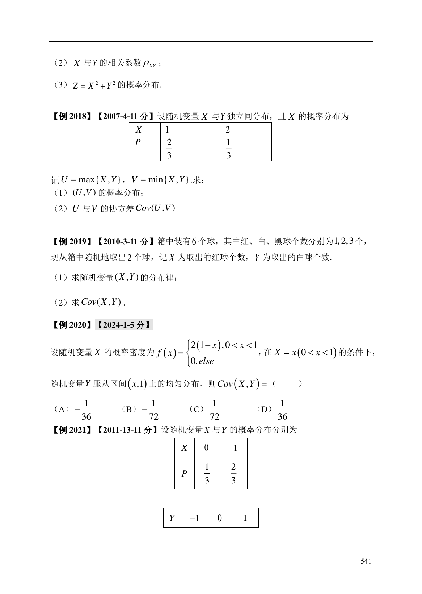

> 生成原页图的原因：包含 Symbol/私用区字形；包含疑似公式布局。

### 文本层（用于搜索/导入，公式可能失真）

~~~text
（2） X 与 Y 的相关系数  XY ；

（3） Z = X 2 + Y 2 的概率分布.

【例 2018】【2007-4-11 分】设随机变量 X 与 Y 独立同分布，且 X 的概率分布为
                      X        1                     2
                      P        2                     1
                               3                     3

记 U = max{ X , Y } ， V = min{ X , Y } .求：
（1） (U , V ) 的概率分布；
（2） U 与 V 的协方差 Cov(U , V ) .

【例 2019】【2010-3-11 分】箱中装有 6 个球，其中红、白、黑球个数分别为 1, 2, 3 个，
现从箱中随机地取出 2 个球，记 X 为取出的红球个数， Y 为取出的白球个数.

（1）求随机变量 ( X , Y ) 的分布律；

（2）求 Cov( X , Y ) .

【例 2020】【2024-1-5 分】

                                   2 (1 − x ) , 0  x  1
                                   
设随机变量 X 的概率密度为 f ( x ) =                                  ，在 X = x ( 0  x  1) 的条件下，
                                   
                                   0, else

随机变量 Y 服从区间 ( x,1) 上的均匀分布，则 Cov ( X , Y ) = （                               ）

        1                 1                     1                       1
（A） −            （B） −             （C）                           （D）
        36                72                    72                     36
【例 2021】【2011-13-11 分】设随机变量 X 与 Y 的概率分布分别为

                                   X        0            1

                                            1            2
                                   P
                                            3            3

                               Y       −1        0           1

                                                                                541
~~~

## PDF 第 60 页

### 原始页面（数学符号以此为准）

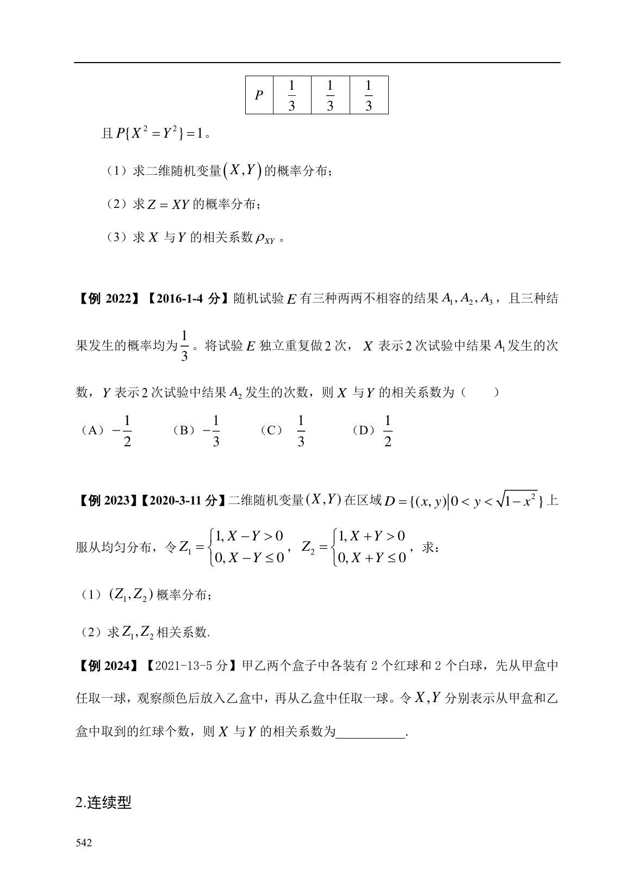

> 生成原页图的原因：包含 Symbol/私用区字形；包含疑似公式布局。

### 文本层（用于搜索/导入，公式可能失真）

~~~text
                                   1       1    1
                              P
                                   3       3    3
      且 P{ X = Y } = 1 。
             2   2

      （1）求二维随机变量 ( X , Y ) 的概率分布；

      （2）求 Z = XY 的概率分布；

      （3）求 X 与 Y 的相关系数  XY 。

【例 2022】【2016-1-4 分】随机试验 E 有三种两两不相容的结果 A1 , A2 , A3 ，且三种结

                     1
果发生的概率均为               。将试验 E 独立重复做 2 次， X 表示 2 次试验中结果 A1 发生的次
                     3

数， Y 表示 2 次试验中结果 A2 发生的次数，则 X 与 Y 的相关系数为（                       ）

         1               1             1             1
（A） −            （B） −        （C）              （D）
         2               3             3             2

【例 2023】【2020-3-11 分】二维随机变量 ( X , Y ) 在区域 D = {( x, y ) 0  y  1 − x 2 } 上

                       1, X − Y  0        1, X + Y  0
服从均匀分布，令 Z1 =                       ， Z2 =              ，求：
                       0, X − Y  0        0, X + Y  0

（1） ( Z1 , Z 2 ) 概率分布；

（2）求 Z1 , Z 2 相关系数.

【例 2024】【2021-13-5 分】甲乙两个盒子中各装有 2 个红球和 2 个白球，先从甲盒中

任取一球，观察颜色后放入乙盒中，再从乙盒中任取一球。令 X , Y 分别表示从甲盒和乙

盒中取到的红球个数，则 X 与 Y 的相关系数为                                 .

2.连续型

542
~~~

## PDF 第 61 页

### 原始页面（数学符号以此为准）

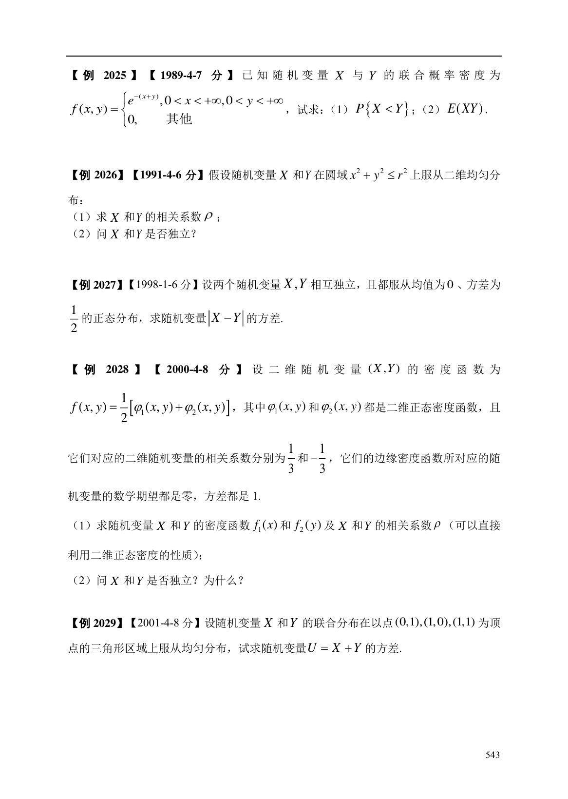

> 生成原页图的原因：包含 Symbol/私用区字形；包含疑似公式布局。

### 文本层（用于搜索/导入，公式可能失真）

~~~text
【 例 2025 】 【 1989-4-7 分 】 已 知 随 机 变 量 X 与 Y 的 联 合 概 率 密 度 为

             e− ( x + y )  0  x  +, 0  y  +
f ( x, y ) =                                       ，试求：（1） P  X  Y  ；（2） E ( XY ) .
             0             其他

【例 2026】【1991-4-6 分】假设随机变量 X 和 Y 在圆域 x 2 + y 2  r 2 上服从二维均匀分

布：
（1）求 X 和 Y 的相关系数  ；
（2）问 X 和 Y 是否独立？

【例 2027】【1998-1-6 分】设两个随机变量 X , Y 相互独立，且都服从均值为 0 、方差为

1
  的正态分布，求随机变量 X − Y 的方差.
2

【 例 2028 】 【 2000-4-8 分 】 设 二 维 随 机 变 量 ( X , Y ) 的 密 度 函 数 为

               1
f ( x, y ) =     1 ( x, y) + 2 ( x, y) ，其中 1 ( x, y ) 和 2 ( x, y ) 都是二维正态密度函数，且
               2

                                             1    1
它们对应的二维随机变量的相关系数分别为                            和 − ，它们的边缘密度函数所对应的随
                                             3    3
机变量的数学期望都是零，方差都是 1.

（1）求随机变量 X 和 Y 的密度函数 f1 ( x) 和 f 2 ( y ) 及 X 和 Y 的相关系数  （可以直接

利用二维正态密度的性质）
           ；

（2）问 X 和 Y 是否独立？为什么？

【例 2029】【2001-4-8 分】设随机变量 X 和 Y 的联合分布在以点 (0,1), (1, 0), (1,1) 为顶

点的三角形区域上服从均匀分布，试求随机变量 U = X + Y 的方差.

                                                                                      543
~~~

## PDF 第 62 页

### 原始页面（数学符号以此为准）

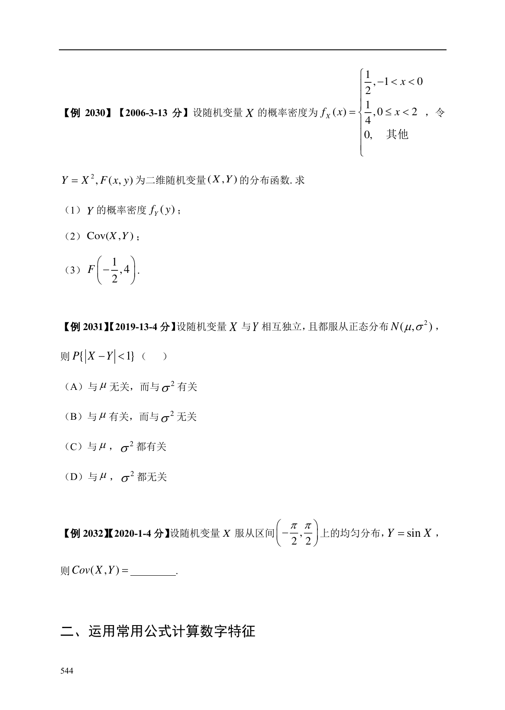

> 生成原页图的原因：包含 Symbol/私用区字形；包含疑似公式布局。

### 文本层（用于搜索/导入，公式可能失真）

~~~text
                                              1
                                               2 , −1  x  0
                                              
                                              1
【例 2030】【2006-3-13 分】设随机变量 X 的概率密度为 X
                                   f  ( x ) =  , 0  x  2 ，令
                                              4
                                              0, 其他
                                              
                                              

Y = X 2 , F ( x, y ) 为二维随机变量 ( X , Y ) 的分布函数.求

（1） Y 的概率密度 fY ( y ) ；

（2） Cov(X , Y ) ；

          1 
（3） F  −   ,4 .
          2 

       【2019-13-4 分】设随机变量 X 与 Y 相互独立，且都服从正态分布 N (  ,  ) ，
                                                             2
【例 2031】

则 P{ X − Y  1} （   ）

（A）与  无关，而与  2 有关

（B）与  有关，而与  2 无关

（C）与  ，  2 都有关

（D）与  ，  2 都无关

                                          
       【2020-1-4 分】设随机变量 X 服从区间  −
【例 2032】                                   ,  上的均匀分布，Y = sin X ，
                                         2 2

则 Cov ( X , Y ) =       .

二、运用常用公式计算数字特征

544
~~~

## PDF 第 63 页

### 原始页面（数学符号以此为准）

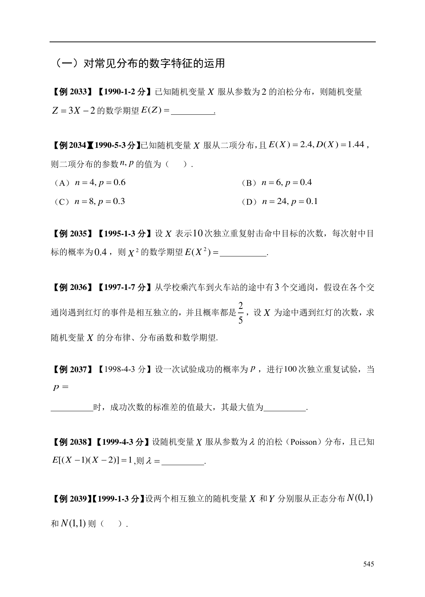

> 生成原页图的原因：包含 Symbol/私用区字形；包含疑似公式布局。

### 文本层（用于搜索/导入，公式可能失真）

~~~text
（一）对常见分布的数字特征的运用

【例 2033】【1990-1-2 分】已知随机变量 X 服从参数为 2 的泊松分布，则随机变量

Z = 3 X − 2 的数学期望 E ( Z ) =               .

【例 2034】                          且 E ( X ) = 2.4, D( X ) = 1.44 ，
       【1990-5-3 分】已知随机变量 X 服从二项分布，

则二项分布的参数 n, p 的值为（               ）.

（A） n = 4, p = 0.6                            （B） n = 6, p = 0.4

（C） n = 8, p = 0.3                            （D） n = 24, p = 0.1

【例 2035】【1995-1-3 分】设 X 表示 10 次独立重复射击命中目标的次数，每次射中目

标的概率为 0.4 ，则 X 2 的数学期望 E ( X 2 ) =                  .

【例 2036】【1997-1-7 分】从学校乘汽车到火车站的途中有 3 个交通岗，假设在各个交

                                              2
通岗遇到红灯的事件是相互独立的，并且概率都是                          ，设 X 为途中遇到红灯的次数，求
                                              5
随机变量 X 的分布律、分布函数和数学期望.

【例 2037】【1998-4-3 分】设一次试验成功的概率为 p ，进行100 次独立重复试验，当
p=

           时，成功次数的标准差的值最大，其最大值为                               .

【例 2038】【1999-4-3 分】设随机变量 X 服从参数为  的泊松（Poisson）分布，且已知

E[( X − 1)( X − 2)] = 1 ,则  =        .

       【1999-1-3 分】设两个相互独立的随机变量 X 和 Y 分别服从正态分布 N (0,1)
【例 2039】

和 N (1,1) 则（      ）.

                                                                    545
~~~

## PDF 第 64 页

### 原始页面（数学符号以此为准）

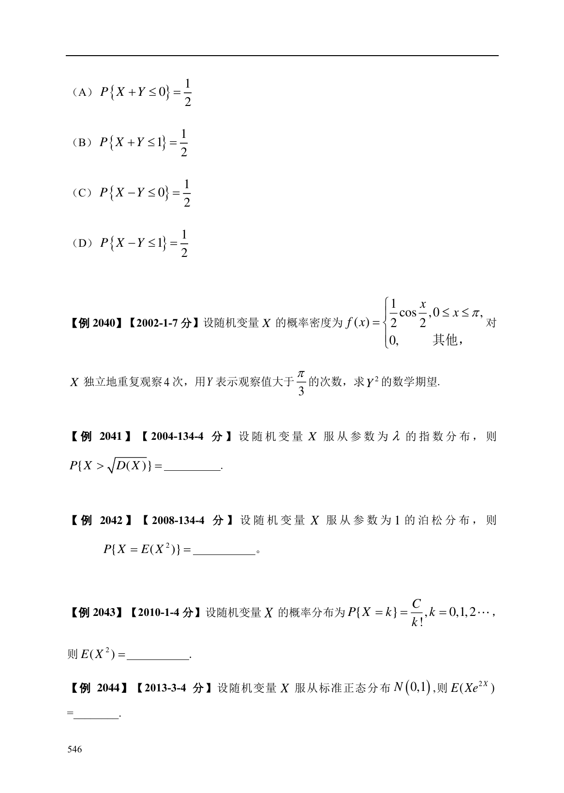

> 生成原页图的原因：包含 Symbol/私用区字形；包含疑似公式布局。

### 文本层（用于搜索/导入，公式可能失真）

~~~text
                       1
（A） P  X + Y  0 =
                       2

                       1
（B） P  X + Y  1 =
                       2

                       1
（C） P  X − Y  0 =
                       2

                       1
（D） P  X − Y  1 =
                       2

                                            1   x
                                             cos , 0  x   ,
【例 2040】【2002-1-7 分】设随机变量 X 的概率密度为 f ( x) =  2  2              对
                                            0,   其他，

                                       
X 独立地重复观察 4 次，用 Y 表示观察值大于                的次数，求 Y 2 的数学期望.
                                       3

【 例 2041 】 【 2004-134-4 分 】 设 随 机 变 量 X 服 从 参 数 为  的 指 数 分 布 ， 则

P{ X  D( X )} =               .

【 例 2042 】 【 2008-134-4 分 】 设 随 机 变 量 X 服 从 参 数 为 1 的 泊 松 分 布 ， 则

      P{ X = E ( X 2 )} =          。

                                                     C
【例 2043】【2010-1-4 分】设随机变量 X 的概率分布为 P{ X = k} =          , k = 0,1, 2        ，
                                                     k!

则 E( X ) =
       2
                           .

【例 2044】【2013-3-4 分】设随机变量 X 服从标准正态分布 N ( 0,1) ,则 E ( Xe
                                                                       2X
                                                                            )
=________.

546
~~~

## PDF 第 65 页

### 原始页面（数学符号以此为准）

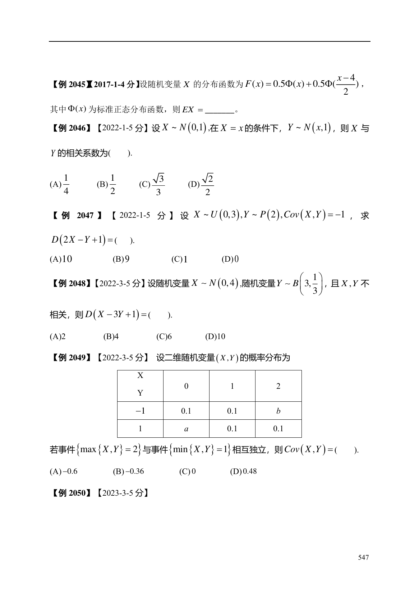

> 生成原页图的原因：包含 Symbol/私用区字形；包含疑似公式布局。

### 文本层（用于搜索/导入，公式可能失真）

~~~text
                                                                                             x−4
【例 2045】          设随机变量 X 的分布函数为 F ( x) = 0.5( x) + 0.5(
       【2017-1-4 分】                                                                              )，
                                                                                              2
其中  ( x ) 为标准正态分布函数，则 EX = _______。

【例 2046】【2022-1-5 分】设 X ~ N ( 0,1) ,在 X = x 的条件下， Y ~ N ( x,1) ，则 X 与

Y 的相关系数为(               ).

      1             1                   3                 2
(A)           (B)                (C)               (D)
      4             2                  3                 2

【 例 2047 】 【 2022-1-5 分 】 设 X ~ U ( 0,3) , Y ~ P ( 2 ) , Cov ( X , Y ) = −1 ， 求

D ( 2 X − Y + 1) = (        ).

(A) 10              (B) 9                    (C) 1            (D) 0

                                                                                     1
【例 2048】【2022-3-5 分】设随机变量 X                               N ( 0, 4 ) ,随机变量 Y      B  3,  ，且 X , Y 不
                                                                                     3

相关，则 D ( X − 3Y + 1) = (                    ).

(A)2           (B)4                    (C)6              (D)10

【例 2049】【2022-3-5 分】 设二维随机变量 ( X , Y ) 的概率分布为

                                 X
                                                  0              1          2
                                 Y

                                 −1              0.1             0.1        b

                                 1                a              0.1        0.1

                                                              
若事件 max  X , Y  = 2 与事件 min  X , Y  = 1 相互独立，则 Cov ( X , Y ) = (                             ).

(A) −0.6            (B) −0.36                    (C) 0           (D) 0.48

【例 2050】【2023-3-5 分】

                                                                                                  547
~~~

## PDF 第 66 页

### 原始页面（数学符号以此为准）

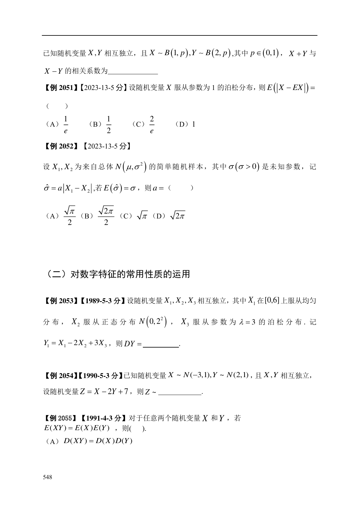

> 生成原页图的原因：包含 Symbol/私用区字形；包含疑似公式布局。

### 文本层（用于搜索/导入，公式可能失真）

~~~text
已知随机变量 X , Y 相互独立，且 X                           B (1, p ) , Y        B ( 2, p ) ,其中 p  ( 0,1) ， X + Y 与

X − Y 的相关系数为

【例 2051】【2023-13-5 分】设随机变量 X 服从参数为 1 的泊松分布，则 E X − EX                                     (         )=
（     ）
      1              1                  2
（A）            （B）            （C）                  （D） 1
      e              2                  e
【例 2052】【2023-13-5 分】

设 X 1 , X 2 为来自总体 N  ,  (     2
                                    ) 的简单随机样本，其中  (  0 ) 是未知参数， 记
ˆ = a X 1 − X 2 ,若 E (ˆ ) =  ，则 a = （                     ）

                   2
（A）           （B）      （C）  （D） 2
          2         2

（二）对数字特征的常用性质的运用

【例 2053】【1989-5-3 分】设随机变量 X 1 , X 2 , X 3 相互独立，其中 X 1 在 [0,6] 上服从均匀

分 布 ， X 2 服 从 正 态 分 布 N 0, 2        (       2
                                                ) ， X 服从参数为  =3 的泊松分布.记
                                                         3

Y1 = X 1 − 2 X 2 + 3 X 3 ，则 DY =                     .

       【1990-5-3 分】已知随机变量 X ~ N (−3,1), Y ~ N (2,1) ，且 X , Y 相互独立，
【例 2054】

设随机变量 Z = X − 2Y + 7 ，则 Z ~                                      .

【例 2055】【1991-4-3 分】对于任意两个随机变量 X 和 Y ，若
E ( XY ) = E ( X ) E (Y ) ，则(      ).
（A） D ( XY ) = D ( X ) D (Y )

548
~~~

## PDF 第 67 页

### 原始页面（数学符号以此为准）

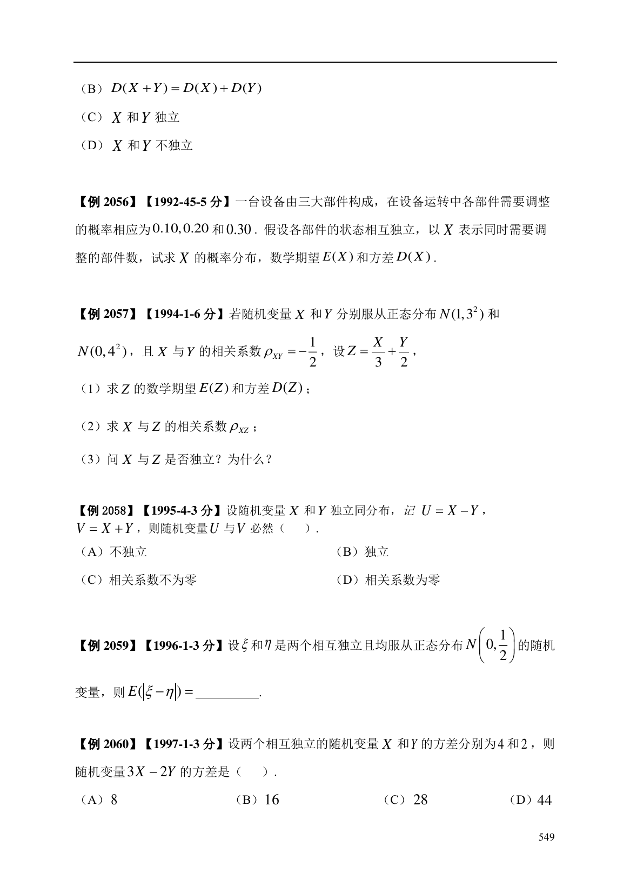

> 生成原页图的原因：包含 Symbol/私用区字形；包含疑似公式布局。

### 文本层（用于搜索/导入，公式可能失真）

~~~text
（B） D ( X + Y ) = D ( X ) + D (Y )

（C） X 和 Y 独立

（D） X 和 Y 不独立

【例 2056】【1992-45-5 分】一台设备由三大部件构成，在设备运转中各部件需要调整

的概率相应为 0.10, 0.20 和 0.30 . 假设各部件的状态相互独立，以 X 表示同时需要调

整的部件数，试求 X 的概率分布，数学期望 E ( X ) 和方差 D ( X ) .

【例 2057】【1994-1-6 分】若随机变量 X 和 Y 分别服从正态分布 N (1, 32 ) 和

                                   1      X Y
N (0, 4 2 ) ，且 X 与 Y 的相关系数  XY = − ，设 Z = + ，
                                   2      3 2
（1）求 Z 的数学期望 E ( Z ) 和方差 D ( Z ) ；

（2）求 X 与 Z 的相关系数  XZ ；

（3）问 X 与 Z 是否独立？为什么？

【例 2058】【1995-4-3 分】设随机变量 X 和 Y 独立同分布，记 U = X − Y ，
V = X + Y ，则随机变量 U 与 V 必然（            ）.
（A）不独立                                     （B）独立

（C）相关系数不为零                                 （D）相关系数为零

                                                           1
【例 2059】【1996-1-3 分】设  和 是两个相互独立且均服从正态分布 N  0,             的随机
                                                           2

变量，则 E (  −  ) =               .

【例 2060】【1997-1-3 分】设两个相互独立的随机变量 X 和 Y 的方差分别为 4 和 2 ，则

随机变量 3 X − 2Y 的方差是（              ）.

（A） 8                       （B） 16             （C） 28       （D）44

                                                                549
~~~

## PDF 第 68 页

### 原始页面（数学符号以此为准）

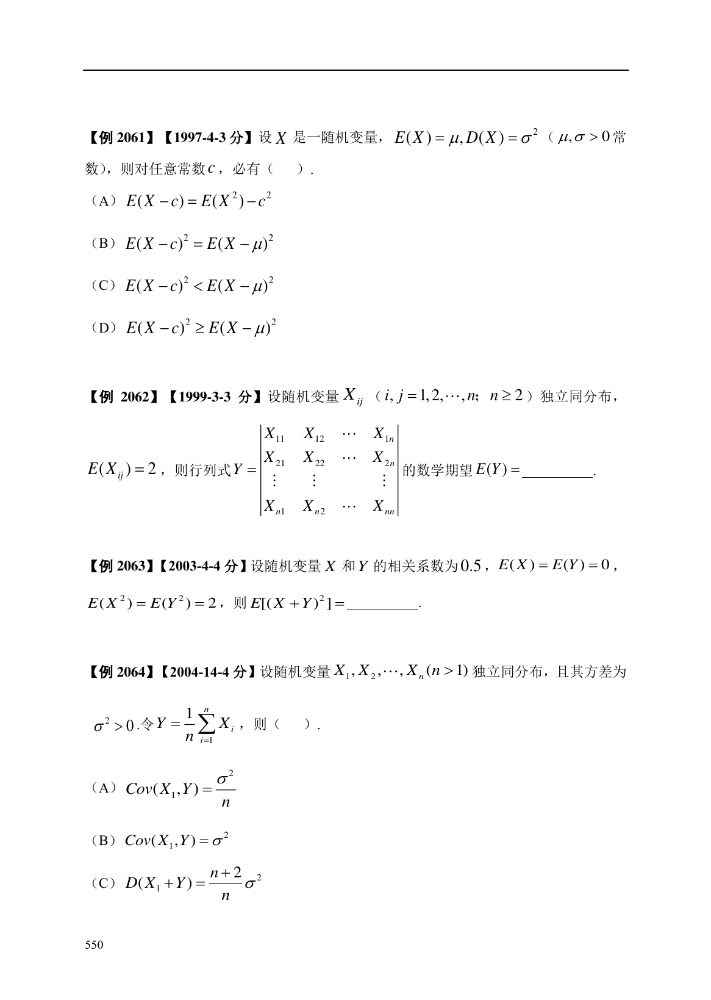

> 生成原页图的原因：包含 Symbol/私用区字形；包含疑似公式布局。

### 文本层（用于搜索/导入，公式可能失真）

~~~text
【例 2061】【1997-4-3 分】设 X 是一随机变量， E ( X ) =  , D ( X ) =  （  ,   0 常
                                                                         2

数），则对任意常数 c ，必有（                          ）.

（A） E ( X − c ) = E ( X ) − c
                               2   2

（B） E ( X − c)
                  2
                      = E ( X −  )2

（C） E ( X − c)
                  2
                       E ( X −  )2

（D） E ( X − c)
                  2
                       E ( X −  )2

【例 2062】【1999-3-3 分】设随机变量 X ij （ i, j = 1, 2,                  , n；n  2 ）独立同分布，

                                   X 11   X 12   X 1n
                                   X 21   X 22   X 2n
E ( X ij ) = 2 ，则行列式 Y =                                的数学期望 E (Y ) =       .

                                   X n1   X n2   X nn

【例 2063】【2003-4-4 分】设随机变量 X 和 Y 的相关系数为 0.5 ，E ( X ) = E (Y ) = 0 ，

E ( X 2 ) = E (Y 2 ) = 2 ，则 E[( X + Y ) 2 ] =             .

【例 2064】【2004-14-4 分】设随机变量 X 1 , X 2 ,                  , X n (n  1) 独立同分布，且其方差为

                  1 n
  2  0 .令 Y =      X i ，则（
                  n i =1
                                          ）.

                         2
（A） Cov( X 1 , Y ) =
                          n

（B） Cov( X 1 , Y ) = 
                           2

                        n+2 2
（C） D( X 1 + Y ) =         
                         n

550
~~~

## PDF 第 69 页

### 原始页面（数学符号以此为准）

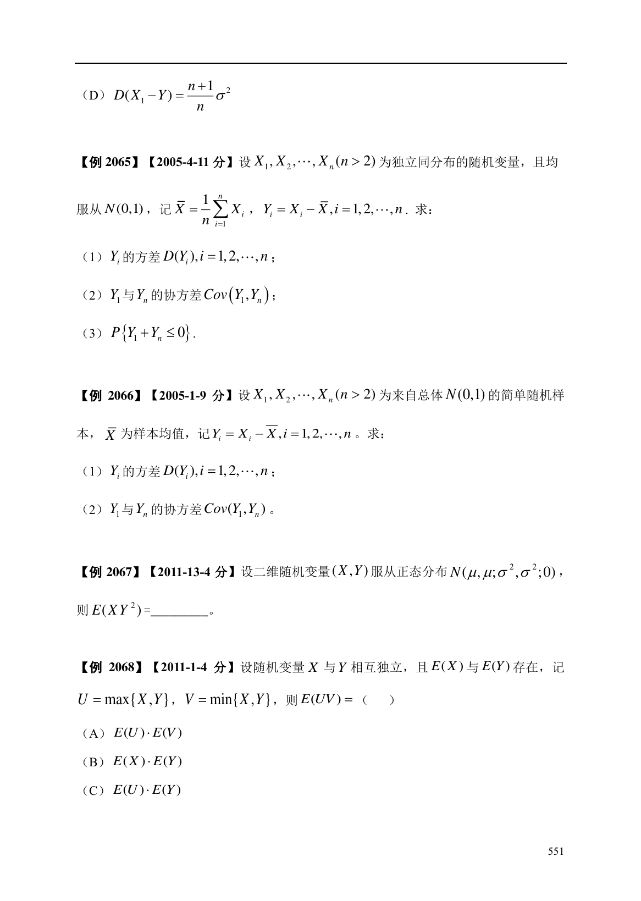

> 生成原页图的原因：包含 Symbol/私用区字形；包含疑似公式布局。

### 文本层（用于搜索/导入，公式可能失真）

~~~text
                       n +1 2
（D） D( X 1 − Y ) =         
                         n

【例 2065】【2005-4-11 分】设 X 1 , X 2 ,           , X n (n  2) 为独立同分布的随机变量，且均

                        1 n
服从 N (0,1) ，记 X =          X i ， Yi = X i − X , i = 1, 2,
                        n i =1
                                                             , n . 求：

（1） Yi 的方差 D(Yi ), i = 1, 2,      ,n ；

（2） Y1 与 Yn 的协方差 Cov (Y1 , Yn ) ；

（3） P Y1 + Yn  0 .

【例 2066】【2005-1-9 分】设 X 1 , X 2 ,            , X n (n  2) 为来自总体 N (0,1) 的简单随机样

本， X 为样本均值，记 Yi = X i − X , i = 1, 2,             , n 。求：

（1） Yi 的方差 D(Yi ), i = 1, 2,      ,n ；

（2） Y1 与 Yn 的协方差 Cov(Y1 , Yn ) 。

【例 2067】【2011-13-4 分】设二维随机变量 ( X , Y ) 服从正态分布 N (  ,  ;  ,  ;0) ，
                                                                        2   2

          2
则 E ( X Y ) =_________。

【例 2068】【2011-1-4 分】设随机变量 X 与 Y 相互独立，且 E ( X ) 与 E (Y ) 存在，记

U = max{ X , Y } ， V = min{ X , Y } ，则 E (UV ) = （           ）

（A） E (U )  E (V )

（B） E ( X )  E (Y )

（C） E (U )  E (Y )

                                                                                551
~~~

## PDF 第 70 页

### 原始页面（数学符号以此为准）

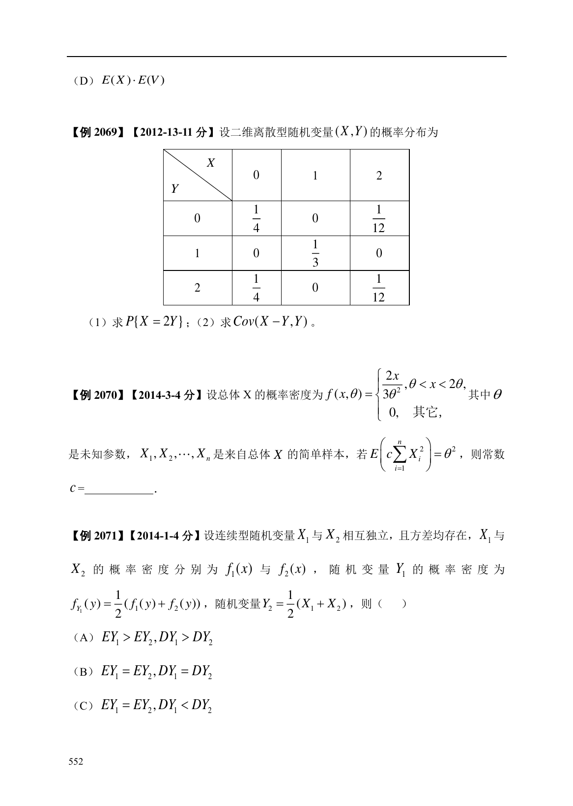

> 生成原页图的原因：包含 Symbol/私用区字形；包含疑似公式布局。

### 文本层（用于搜索/导入，公式可能失真）

~~~text
（D） E ( X )  E (V )

【例 2069】【2012-13-11 分】设二维离散型随机变量 ( X , Y ) 的概率分布为

                               X
                                     0           1            2
                       Y
                                     1                        1
                           0                     0
                                     4                       12
                                                 1
                           1         0                        0
                                                 3
                                     1                        1
                           2                     0
                                     4                       12
   （1）求 P{ X = 2Y } ；（2）求 Cov ( X − Y , Y ) 。

                                               2x
                                               2 ,  x  2 ,
【例 2070】【2014-3-4 分】设总体 X 的概率密度为 f ( x,  ) =  3              其中 
                                               0, 其它,

                                                    n       
是未知参数， X 1 , X 2 ,         , X n 是来自总体 X 的简单样本，若 E  c X i2  =  2 ，则常数
                                                    i =1    
c=               ．

【例 2071】【2014-1-4 分】设连续型随机变量 X 1 与 X 2 相互独立，且方差均存在， X 1 与

X 2 的 概 率 密 度 分 别 为 f1 ( x) 与 f 2 ( x) ， 随 机 变 量 Y1 的 概 率 密 度 为
           1                                  1
fY1 ( y ) = ( f1 ( y ) + f 2 ( y )) ，随机变量 Y2 = ( X 1 + X 2 ) ，则（   ）
           2                                  2
（A） EY1  EY2 , DY1  DY2

（B） EY1 = EY2 , DY1 = DY2

（C） EY1 = EY2 , DY1  DY2

552
~~~

## PDF 第 71 页

### 原始页面（数学符号以此为准）

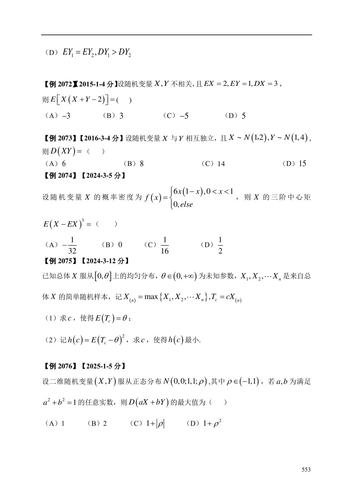

> 生成原页图的原因：包含 Symbol/私用区字形；包含疑似公式布局。

### 文本层（用于搜索/导入，公式可能失真）

~~~text
（D） EY1 = EY2 , DY1  DY2

       【2015-1-4 分】
【例 2072】                         且 EX = 2, EY = 1, DX = 3 ，
                  设随机变量 X , Y 不相关，

则 E  X ( X + Y − 2 )  = (       )

（A） −3               （B） 3                    （C） −5                   （D） 5

【例 2073】【2016-3-4 分】设随机变量 X 与 Y 相互独立，且 X ~ N (1，
                                               2 ) , Y ~ N (1, 4 ) ,
则 D ( XY ) = （        ）
（A） 6                           （B） 8                     （C） 14                  （D） 15
【例 2074】【2024-3-5 分】

                                                   6 x (1 − x ) , 0  x  1
                                                   
设 随 机 变 量 X 的 概 率 密 度 为 f ( x) =                                            ，则 X 的三阶中心矩
                                                   
                                                   0, else

E ( X − EX ) = （
               3
                           ）

         1                                     1                   1
（A） −                （B） 0              （C）               （D）
         32                                   16                   2
【例 2075】【2024-3-12 分】

已知总体 X 服从  0,   上的均匀分布，  ( 0, + ) 为未知参数，X 1 , X 2 ,                        X n 是来自总

体 X 的简单随机样本，记 X ( n ) = max  X 1 , X 2 ,                X n  , Tc = cX ( n )

（1）求 c ，使得 E (Tc ) =  ；

（2）记 h ( c ) = E (Tc −  ) ，求 c ，使得 h ( c ) 最小.
                                2

【例 2076】【2025-1-5 分】

设二维随机变量 ( X , Y ) 服从正态分布 N ( 0, 0;1,1;  ) ,其中   ( −1,1) ，若 a, b 为满足

a 2 + b 2 = 1 的任意实数，则 D ( aX + bY ) 的最大值为（                             ）

                                    （C） 1 +          （D） 1 + 
                                                                   2
（A）1               （B）2

                                                                                       553
~~~

## PDF 第 72 页

### 原始页面（数学符号以此为准）

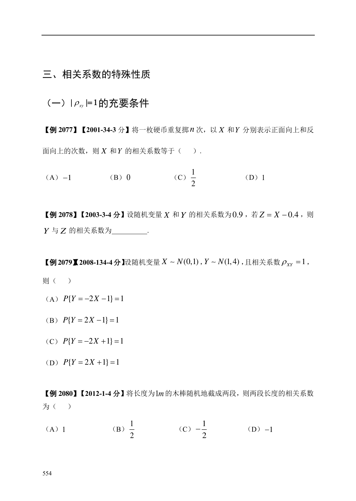

> 生成原页图的原因：包含 Symbol/私用区字形；包含疑似公式布局。

### 文本层（用于搜索/导入，公式可能失真）

~~~text
三、相关系数的特殊性质

（一）   xy =  的充要条件

【例 2077】【2001-34-3 分】将一枚硬币重复掷 n 次，以 X 和 Y 分别表示正面向上和反

面向上的次数，则 X 和 Y 的相关系数等于（                 ）.

                                        1
（A） −1            （B） 0           （C）                  （D） 1
                                        2

【例 2078】【2003-3-4 分】设随机变量 X 和 Y 的相关系数为 0.9 ，若 Z = X − 0.4 ，则

Y 与 Z 的相关系数为                  .

       【2008-134-4 分】
【例 2079】            设随机变量 X        N (0,1) ，Y    N (1, 4) ，且相关系数  XY = 1 ，

则（      ）

（A） P{Y = −2 X − 1} = 1

（B） P{Y = 2 X − 1} = 1

（C） P{Y = −2 X + 1} = 1

（D） P{Y = 2 X + 1} = 1

【例 2080】【2012-1-4 分】将长度为 1m 的木棒随机地截成两段，则两段长度的相关系数
为（      ）

                          1                  1
（A） 1              （B）            （C） −                 （D） −1
                          2                  2

554
~~~

## PDF 第 73 页

### 原始页面（数学符号以此为准）

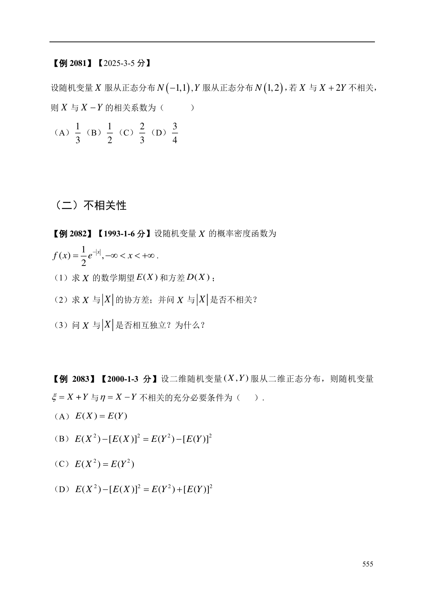

> 生成原页图的原因：包含 Symbol/私用区字形；包含疑似公式布局。

### 文本层（用于搜索/导入，公式可能失真）

~~~text
【例 2081】【2025-3-5 分】

设随机变量 X 服从正态分布 N ( −1,1) , Y 服从正态分布 N (1, 2 ) ，若 X 与 X + 2Y 不相关，

则 X 与 X − Y 的相关系数为（                    ）

       1    1   2    3
（A）      （B） （C） （D）
       3    2   3    4

（二）不相关性

【例 2082】【1993-1-6 分】设随机变量 X 的概率密度函数为
           1 −x
f ( x) =     e , −  x  + .
           2
（1）求 X 的数学期望 E ( X ) 和方差 D ( X ) ；

（2）求 X 与 X 的协方差；并问 X 与 X 是否不相关？

（3）问 X 与 X 是否相互独立？为什么？

【例 2083】【2000-1-3 分】设二维随机变量 ( X , Y ) 服从二维正态分布，则随机变量

 = X + Y 与 = X − Y 不相关的充分必要条件为（                   ）.

（A） E ( X ) = E (Y )

（B） E ( X ) − [ E ( X )] = E (Y ) − [ E (Y )]
              2           2      2          2

（C） E ( X ) = E (Y )
              2       2

（D） E ( X ) − [ E ( X )] = E (Y ) + [ E (Y )]
              2           2      2              2

                                                            555
~~~

## PDF 第 74 页

### 原始页面（数学符号以此为准）

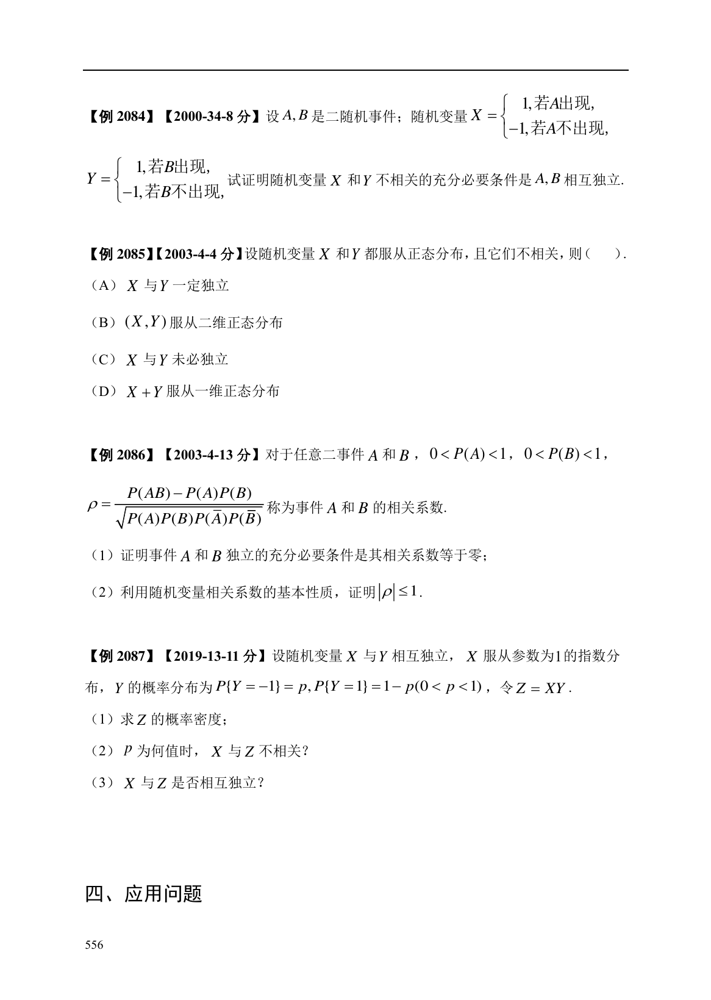

> 生成原页图的原因：包含 Symbol/私用区字形；包含疑似公式布局。

### 文本层（用于搜索/导入，公式可能失真）

~~~text
                                                         1, 若A出现,
【例 2084】【2000-34-8 分】设 A, B 是二随机事件；随机变量 X = 
                                                        −1, 若A不出现,

    1, 若B出现,
Y =           试证明随机变量 X 和 Y 不相关的充分必要条件是 A, B 相互独立.
    −1, 若B不出现,

【例 2085】
       【2003-4-4 分】设随机变量 X 和 Y 都服从正态分布，且它们不相关，则（                      ）.

（A） X 与 Y 一定独立

（B） ( X , Y ) 服从二维正态分布

（C） X 与 Y 未必独立

（D） X + Y 服从一维正态分布

【例 2086】【2003-4-13 分】对于任意二事件 A 和 B ， 0  P ( A)  1 ， 0  P ( B )  1 ，

      P( AB) − P( A) P( B)
=                               称为事件 A 和 B 的相关系数.
      P( A) P( B) P( A) P( B )

（1）证明事件 A 和 B 独立的充分必要条件是其相关系数等于零；

（2）利用随机变量相关系数的基本性质，证明   1 .

【例 2087】【2019-13-11 分】设随机变量 X 与 Y 相互独立， X 服从参数为 1 的指数分

布， Y 的概率分布为 P{Y = −1} = p, P{Y = 1} = 1 − p(0  p  1) ，令 Z = XY .

（1）求 Z 的概率密度；

（2） p 为何值时， X 与 Z 不相关？

（3） X 与 Z 是否相互独立？

四、应用问题

556
~~~

## PDF 第 75 页

### 原始页面（数学符号以此为准）

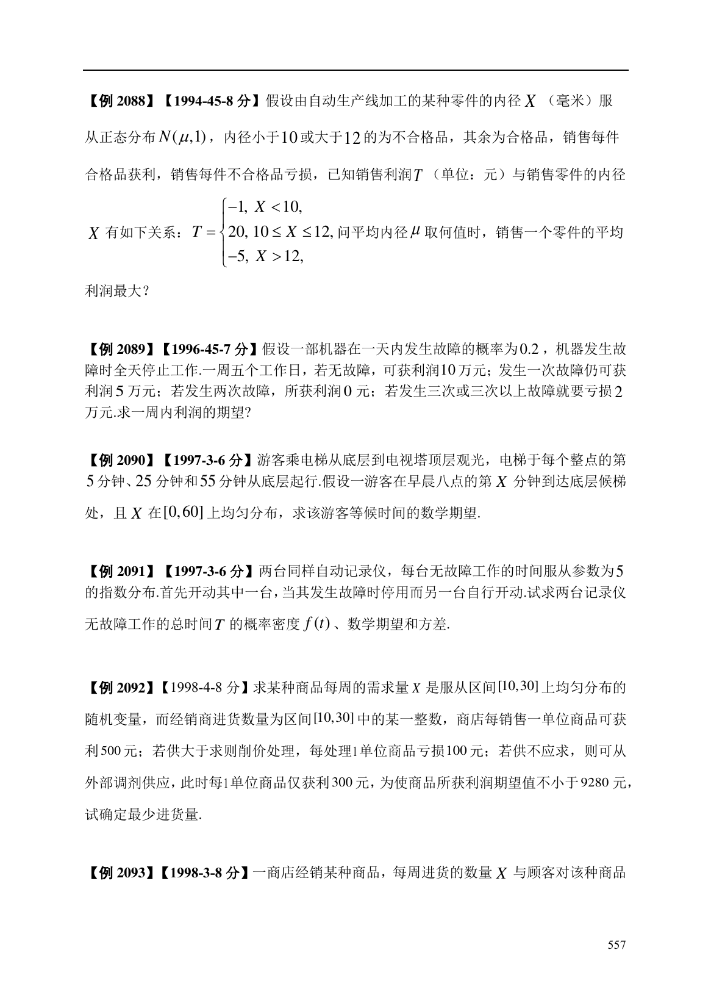

> 生成原页图的原因：包含 Symbol/私用区字形；包含疑似公式布局。

### 文本层（用于搜索/导入，公式可能失真）

~~~text
【例 2088】【1994-45-8 分】假设由自动生产线加工的某种零件的内径 X （毫米）服

从正态分布 N (  ,1) ，内径小于 10 或大于 12 的为不合格品，其余为合格品，销售每件

合格品获利，销售每件不合格品亏损，已知销售利润 T （单位：元）与销售零件的内径

             −1, X  10,
             
X 有如下关系： T = 20, 10  X  12, 问平均内径  取何值时，销售一个零件的平均
             −5, X  12,
             
利润最大？

【例 2089】【1996-45-7 分】假设一部机器在一天内发生故障的概率为 0.2 ，机器发生故
障时全天停止工作.一周五个工作日，若无故障，可获利润 10 万元；发生一次故障仍可获
利润 5 万元；若发生两次故障，所获利润 0 元；若发生三次或三次以上故障就要亏损 2
万元.求一周内利润的期望?

【例 2090】【1997-3-6 分】游客乘电梯从底层到电视塔顶层观光，电梯于每个整点的第
5 分钟、25 分钟和 55 分钟从底层起行.假设一游客在早晨八点的第 X 分钟到达底层候梯
处，且 X 在 [0, 60] 上均匀分布，求该游客等候时间的数学期望.

【例 2091】【1997-3-6 分】两台同样自动记录仪，每台无故障工作的时间服从参数为 5
的指数分布.首先开动其中一台，当其发生故障时停用而另一台自行开动.试求两台记录仪

无故障工作的总时间 T 的概率密度 f (t ) 、数学期望和方差.

【例 2092】【1998-4-8 分】求某种商品每周的需求量 X 是服从区间 [10,30] 上均匀分布的

随机变量，而经销商进货数量为区间 [10,30] 中的某一整数，商店每销售一单位商品可获

利 500 元；若供大于求则削价处理，每处理 1 单位商品亏损 100 元；若供不应求，则可从

外部调剂供应，此时每 1 单位商品仅获利 300 元，为使商品所获利润期望值不小于 9280 元，

试确定最少进货量.

【例 2093】【1998-3-8 分】一商店经销某种商品，每周进货的数量 X 与顾客对该种商品

                                                    557
~~~

## PDF 第 76 页

### 原始页面（数学符号以此为准）

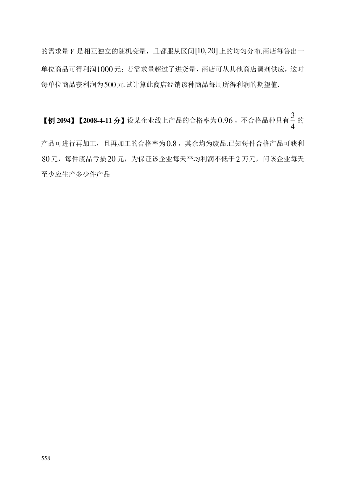

### 文本层（用于搜索/导入，公式可能失真）

~~~text
的需求量 Y 是相互独立的随机变量，且都服从区间 [10, 20] 上的均匀分布.商店每售出一

单位商品可得利润 1000 元；若需求量超过了进货量，商店可从其他商店调剂供应，这时

每单位商品获利润为 500 元.试计算此商店经销该种商品每周所得利润的期望值.

                                                   3
【例 2094】【2008-4-11 分】设某企业线上产品的合格率为 0.96 ，不合格品种只有     的
                                                   4

产品可进行再加工，且再加工的合格率为 0.8 ，其余均为废品.已知每件合格产品可获利

80 元，每件废品亏损 20 元，为保证该企业每天平均利润不低于 2 万元，问该企业每天
至少应生产多少件产品

558
~~~

## PDF 第 77 页

### 原始页面（数学符号以此为准）

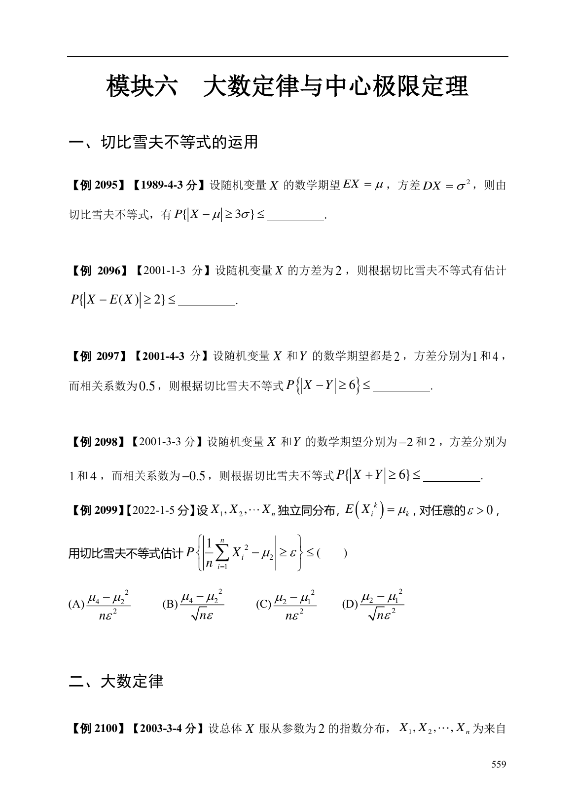

> 生成原页图的原因：包含 Symbol/私用区字形；包含疑似公式布局。

### 文本层（用于搜索/导入，公式可能失真）

~~~text
          模块六               大数定律与中心极限定理

一、切比雪夫不等式的运用

【例 2095】【1989-4-3 分】设随机变量 X 的数学期望 EX =  ，方差 DX =  2 ，则由

切比雪夫不等式，有 P{ X −   3 }                               .

【例 2096】【2001-1-3 分】设随机变量 X 的方差为 2 ，则根据切比雪夫不等式有估计

P{ X − E ( X )  2}                .

【例 2097】【2001-4-3 分】设随机变量 X 和 Y 的数学期望都是 2 ，方差分别为 1 和 4 ，

而相关系数为 0.5 ，则根据切比雪夫不等式 P X − Y  6                                           .

【例 2098】【2001-3-3 分】设随机变量 X 和 Y 的数学期望分别为 −2 和 2 ，方差分别为

1 和 4 ，而相关系数为 −0.5 ，则根据切比雪夫不等式 P{ X + Y  6}                                           .

       【2022-1-5 分】设 X 1 , X 2 ,
【例 2099】                                                         (      )
                                         X n 独立同分布，E X i k = k ，对任意的   0 ，

            1 n 2          
用切比雪夫不等式估计   X i − 2     (
          P                                                  )
             n i =1        

      4 − 2 2         4 − 2 2             2 − 12               2 − 12
(A)               (B)                   (C)                  (D)
        n 2               n                   n 2                    n 2

二、大数定律

【例 2100】【2003-3-4 分】设总体 X 服从参数为 2 的指数分布， X 1 , X 2 ,                                , X n 为来自

                                                                                            559
~~~

## PDF 第 78 页

### 原始页面（数学符号以此为准）

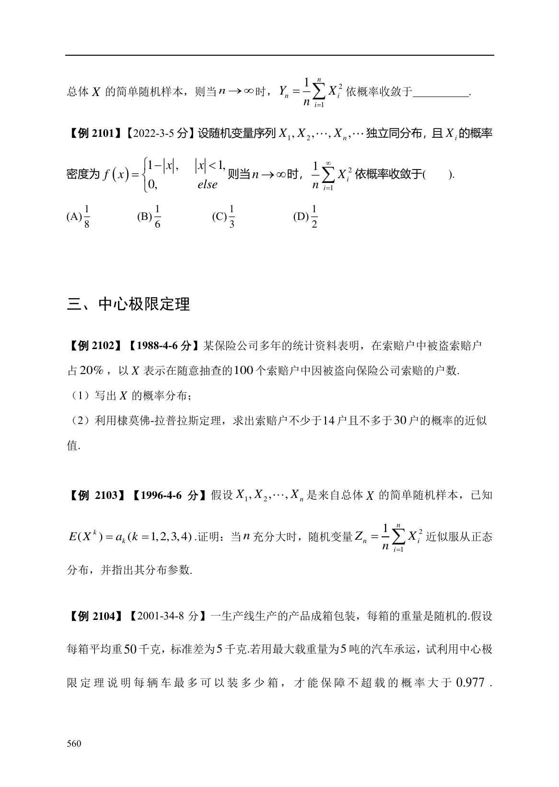

> 生成原页图的原因：包含 Symbol/私用区字形；包含数学专用符号；包含疑似公式布局。

### 文本层（用于搜索/导入，公式可能失真）

~~~text
                                           1 n 2
总体 X 的简单随机样本，则当 n →  时， Yn =                 X i 依概率收敛于
                                           n i =1
                                                                         .

【例 2101】【2022-3-5 分】设随机变量序列 X 1 , X 2 ,            , Xn,   独立同分布，且 X i 的概率

             1 − x ,   x  1,                 1  2
密度为 f ( x ) =                   则当 n →  时，      X i 依概率收敛于(      ).
             0,        else                   n i =1
      1           1              1             1
(A)         (B)            (C)           (D)
      8           6              3             2

三、中心极限定理

【例 2102】【1988-4-6 分】某保险公司多年的统计资料表明，在索赔户中被盗索赔户

占 20% ，以 X 表示在随意抽查的 100 个索赔户中因被盗向保险公司索赔的户数.

（1）写出 X 的概率分布；

（2）利用棣莫佛-拉普拉斯定理，求出索赔户不少于 14 户且不多于 30 户的概率的近似

值.

【例 2103】【1996-4-6 分】假设 X 1 , X 2 ,      , X n 是来自总体 X 的简单随机样本，已知

                                                            1 n 2
E ( X k ) = ak (k = 1, 2,3, 4) .证明：当 n 充分大时，随机变量 Z n =         X i 近似服从正态
                                                            n i =1
分布，并指出其分布参数.

【例 2104】【2001-34-8 分】一生产线生产的产品成箱包装，每箱的重量是随机的.假设

每箱平均重 50 千克，标准差为 5 千克.若用最大载重量为 5 吨的汽车承运，试利用中心极

限 定 理 说 明 每 辆 车 最 多 可 以 装 多 少 箱 ， 才 能 保 障 不 超 载 的 概 率 大 于 0.977 .

560
~~~

## PDF 第 79 页

### 原始页面（数学符号以此为准）

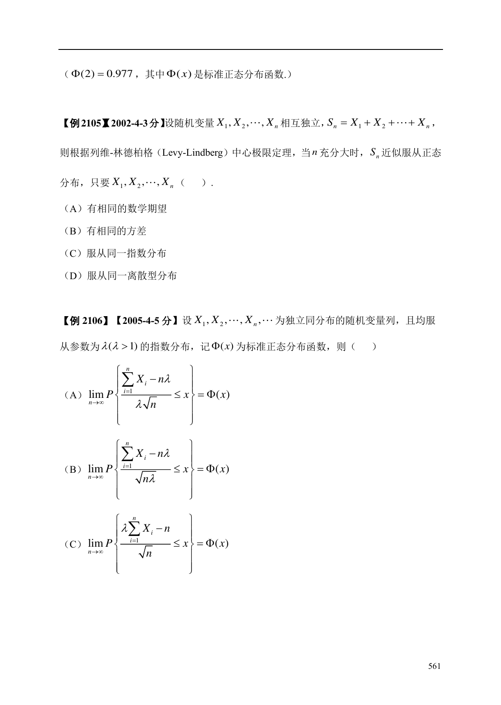

> 生成原页图的原因：包含 Symbol/私用区字形；包含数学专用符号；包含疑似公式布局。

### 文本层（用于搜索/导入，公式可能失真）

~~~text
（  (2) = 0.977 ，其中  ( x ) 是标准正态分布函数.）

       【2002-4-3 分】
【例 2105】          设随机变量 X 1 , X 2 ,               , X n 相互独立，S n = X 1 + X 2 +   + Xn ，

则根据列维-林德柏格（Levy-Lindberg）中心极限定理，当 n 充分大时， S n 近似服从正态

分布，只要 X 1 , X 2 ,     , Xn （    ）.

（A）有相同的数学期望

（B）有相同的方差

（C）服从同一指数分布

（D）服从同一离散型分布

【例 2106】【2005-4-5 分】设 X 1 , X 2 ,         , Xn,     为独立同分布的随机变量列，且均服

从参数为  (  1) 的指数分布，记  ( x ) 为标准正态分布函数，则（                              ）

           n               
            X i − n     
（A） lim P 
              i =1
                         x  =  ( x)
             n
    n →
                             
                           

           n               
            X i − n     
（B） lim P 
              i =1
                         x  =  ( x)
    n →
                  n        
                           

           n                
             X i − n     
（C） lim P 
               i =1
                          x  =  ( x)
    n →
                   n         
                            

                                                                                    561
~~~

## PDF 第 80 页

### 原始页面（数学符号以此为准）

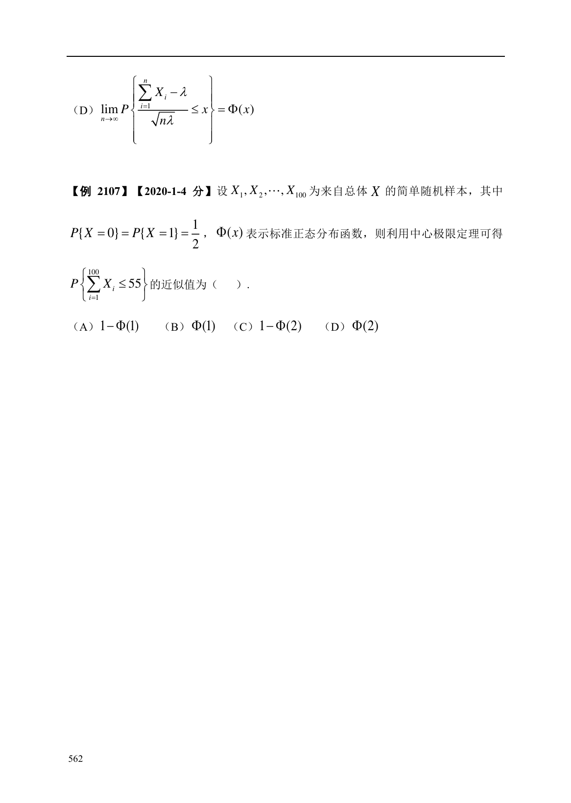

> 生成原页图的原因：包含 Symbol/私用区字形；包含数学专用符号；包含疑似公式布局。

### 文本层（用于搜索/导入，公式可能失真）

~~~text
           n              
            X i −      
（D） lim P 
              i =1
                        x  =  ( x)
    n →
                  n       
                          

【例 2107】【2020-1-4 分】设 X 1 , X 2 ,       , X 100 为来自总体 X 的简单随机样本，其中

                          1
P{ X = 0} = P{ X = 1} =     ，  ( x ) 表示标准正态分布函数，则利用中心极限定理可得
                          2

   100      
P  X i  55 的近似值为（            ）.
   i =1     

（A） 1 −  (1)     （B）  (1)    （C） 1 −  (2)   （D）  (2)

562
~~~

## PDF 第 81 页

### 原始页面（数学符号以此为准）

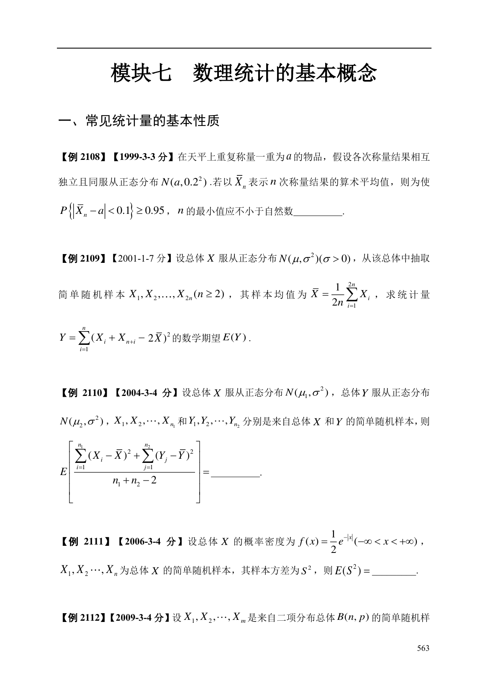

> 生成原页图的原因：包含 Symbol/私用区字形；包含疑似公式布局。

### 文本层（用于搜索/导入，公式可能失真）

~~~text
               模块七                       数理统计的基本概念

一、常见统计量的基本性质

【例 2108】【1999-3-3 分】在天平上重复称量一重为 a 的物品，假设各次称量结果相互

独立且同服从正态分布 N (a, 0.22 ) .若以 X n 表示 n 次称量结果的算术平均值，则为使

                    
P X n − a  0.1  0.95 ， n 的最小值应不小于自然数                                   .

【例 2109】【2001-1-7 分】设总体 X 服从正态分布 N (  ,  2 )(  0) ，从该总体中抽取

                                                                        1 2n
简 单 随 机 样 本 X 1, X 2 ,            , X 2 n ( n  2) ， 其 样 本 均 值 为 X =       Xi ， 求 统 计 量
                                                                       2n i =1

       n
Y =  ( X i + X n +i − 2 X ) 2 的数学期望 E (Y ) .
      i =1

【例 2110】【2004-3-4 分】设总体 X 服从正态分布 N ( 1 ,  ) ，总体 Y 服从正态分布
                                                                  2

N ( 2 ,  2 ) ，X 1 , X 2 ,   , X n1 和 Y1 , Y2 ,   , Yn2 分别是来自总体 X 和 Y 的简单随机样本，则

  n1                  n2
                                         
  i       −        +     (Y j − Y ) 2 
                   2
        ( X   X  )
E                                       =
   i =1                j =1
                                                        .
             n1 + n2 − 2                
                                        
                                        

                                                                       1 −x
【例 2111】【2006-3-4 分】设总体 X 的概率密度为 f ( x) =                                e (−  x  +) ，
                                                                       2
X1, X 2      , X n 为总体 X 的简单随机样本，其样本方差为 S 2 ，则 E ( S 2 ) = _________.

【例 2112】【2009-3-4 分】设 X 1 , X 2 ,                  , X m 是来自二项分布总体 B ( n, p ) 的简单随机样

                                                                                       563
~~~

## PDF 第 82 页

### 原始页面（数学符号以此为准）

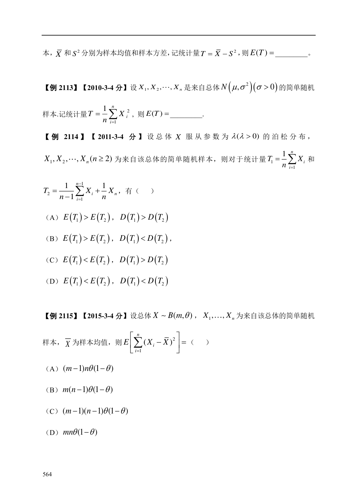

> 生成原页图的原因：包含 Symbol/私用区字形；包含疑似公式布局。

### 文本层（用于搜索/导入，公式可能失真）

~~~text
本，X 和 S 2 分别为样本均值和样本方差，记统计量 T = X − S 2 ，则 E (T ) = _________。

【例 2113】【2010-3-4 分】设 X 1 , X 2 ,           , X n 是来自总体 N        (  , ) (  0 ) 的简单随机
                                                                     2

                    1 n
样本.记统计量 T =            X i2 , 则 E (T ) = _________.
                    n i =1

【 例 2114 】 【 2011-3-4 分 】 设 总 体 X 服 从 参 数 为  (  0) 的 泊 松 分 布 ，

                                                                               1 n
X1, X 2 ,   , X n (n  2) 为来自该总体的简单随机样本，则对于统计量 T1 =                               Xi 和
                                                                               n i =1

        1 n −1         1
T2 =        
       n − 1 i =1
                  X i + X n ，有（
                       n
                                       ）

（A） E (T1 )  E (T2 ) ， D (T1 )  D (T2 )

（B） E (T1 )  E (T2 ) ， D (T1 )  D (T2 ) ，

（C） E (T1 )  E (T2 ) ， D (T1 )  D (T2 )

（D） E (T1 )  E (T2 ) ， D (T1 )  D (T2 )

【例 2115】【2015-3-4 分】设总体 X                   B (m,  ) ， X 1 ,   , X n 为来自该总体的简单随机

                                n               
样本， X 为样本均值，则 E 
                               
                                  ( X − X )  = （
                                i =1
                                       i
                                             2
                                                         ）

（A） ( m − 1) n (1 −  )

（B） m(n − 1) (1 −  )

（C） (m − 1)(n − 1) (1 −  )

（D） mn (1 −  )

564
~~~

## PDF 第 83 页

### 原始页面（数学符号以此为准）

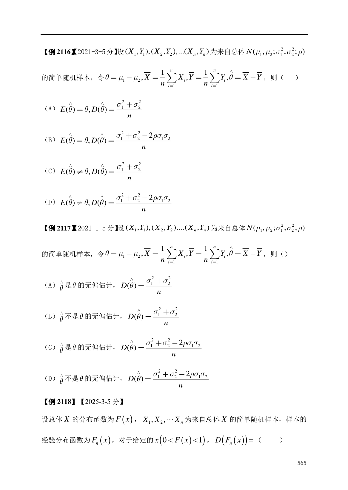

> 生成原页图的原因：包含 Symbol/私用区字形；包含疑似公式布局。

### 文本层（用于搜索/导入，公式可能失真）

~~~text
【例 2116】
       【2021-3-5 分】
                  设 ( X 1 , Y1 ), ( X 2 , Y2 ),...( X n , Yn ) 为来自总体 N ( 1 ,                  2   ; 12 ,   2
                                                                                                           2   ; )

                                                   1 n                     1 n
的简单随机样本，令                  1       2, X                  X i ,Y                  Yi ,   X   Y ，则（              ）
                                                   n i 1                   n i 1

                           2       2
（A） E ( )      , D( )      1       2

                               n

                          2        2
                                           2
（B） E ( )      , D( )     1        2               1 2

                                       n

                           2       2
（C） E ( )      , D( )      1       2

                               n

                          2        2
                                           2
（D） E ( )      , D( )     1        2               1 2

                                       n

【例 2117】
       【2021-1-5 分】
                  设 ( X 1 , Y1 ), ( X 2 , Y2 ),...( X n , Yn ) 为来自总体 N ( 1 ,                  2   ; 12 ,   2
                                                                                                           2   ; )

                                                   1 n                     1 n
的简单随机样本，令                  1       2, X                  X i ,Y                  Yi ,   X   Y ，则（）
                                                   n i 1                   n i 1

                                           2         2
（A） 是 的无偏估计， D( )                          1         2

                                               n

                                               2         2
（B） 不是 的无偏估计， D( )                             1         2

                                                    n

                                           2         2
                                                             2
（C） 是 的无偏估计， D( )                          1         2               1 2

                                                         n

                                               2         2
                                                                 2
（D） 不是 的无偏估计， D( )                             1         2             1 2

                                                             n

【例 2118】【2025-3-5 分】

设总体 X 的分布函数为 F ( x ) ， X 1 , X 2 ,                       X n 为来自总体 X 的简单随机样本，样本的

                                               (
经验分布函数为 Fn ( x ) ，对于给定的 x 0  F ( x )  1 ， D Fn ( x ) = （                 )      (     )           ）

                                                                                                               565
~~~

## PDF 第 84 页

### 原始页面（数学符号以此为准）

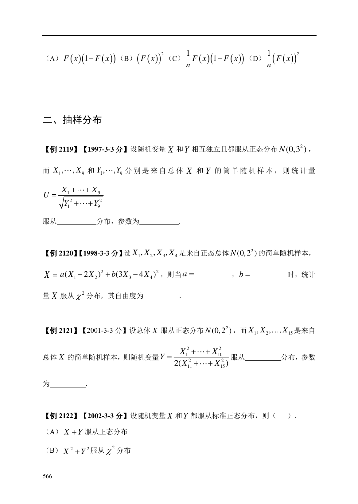

> 生成原页图的原因：包含 Symbol/私用区字形；包含疑似公式布局。

### 文本层（用于搜索/导入，公式可能失真）

~~~text
               (               )
（A） F ( x ) 1 − F ( x ) （B） F ( x )(   ) （C） 1n F ( x ) (1 − F ( x ) ) （D） 1n ( F ( x ) )
                                        2                                                   2

二、抽样分布

                                                                                                2
【例 2119】【1997-3-3 分】设随机变量 X 和 Y 相互独立且都服从正态分布 N (0,3 ) ，

而 X1,        , X 9 和 Y1 , , Y9 分 别 是 来 自 总 体 X 和 Y 的 简 单 随 机 样 本 ， 则 统 计 量

      X1 +         + X9
U=
        Y +
        1
         2
                       + Y92

服从                       分布，参数为               .

       【1998-3-3 分】设 X 1 , X 2 , X 3 , X 4 是来自正态总体 N (0, 2 2 ) 的简单随机样本，
【例 2120】

X = a ( X 1 − 2 X 2 )2 + b(3 X 3 − 4 X 4 )2 ，则当 a =              ，b =                时，统计

量 X 服从  2 分布，其自由度为                           .

【例 2121】【2001-3-3 分】设总体 X 服从正态分布 N (0, 2 2 ) ，而 X 1 , X 2 ,                       , X 15 是来自

                                              X 12 + + X 102
总体 X 的简单随机样本，则随机变量 Y =                                           服从                分布，参数
                                            2( X 112 + + X 152 )

为                  .

【例 2122】【2002-3-3 分】设随机变量 X 和 Y 都服从标准正态分布，则（                                         ）.

（A） X + Y 服从正态分布

（B） X 2 + Y 2 服从  分布
                               2

566
~~~

## PDF 第 85 页

### 原始页面（数学符号以此为准）

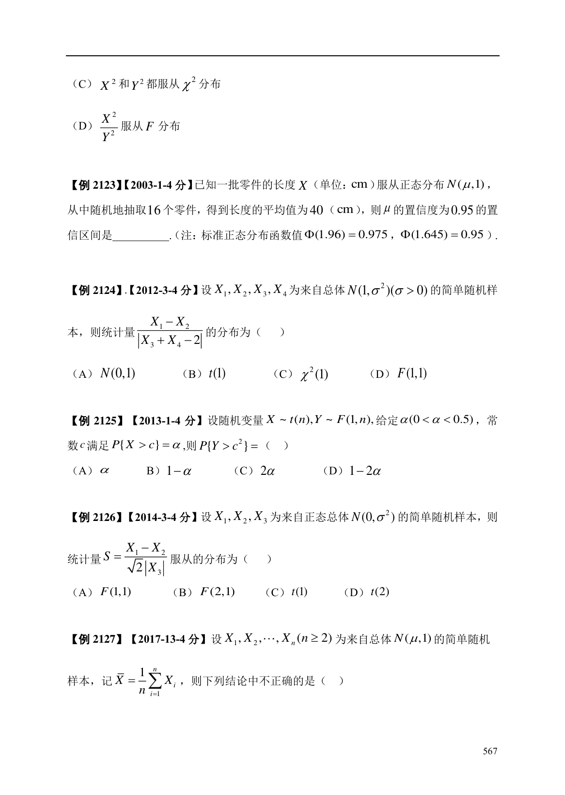

> 生成原页图的原因：包含 Symbol/私用区字形；包含疑似公式布局。

### 文本层（用于搜索/导入，公式可能失真）

~~~text
（C） X 2 和 Y 2 都服从  分布
                         2

      X2
（D）      服从 F 分布
      Y2

       【2003-1-4 分】已知一批零件的长度 X （单位：cm ）服从正态分布 N (  ,1) ，
【例 2123】

从中随机地抽取 16 个零件，得到长度的平均值为 40 （ cm ），则  的置信度为 0.95 的置

信区间是              .（注：标准正态分布函数值  (1.96) = 0.975 ， (1.645) = 0.95 ）.

【例 2124】.【2012-3-4 分】设 X 1 , X 2 , X 3 , X 4 为来自总体 N (1,  )(  0) 的简单随机样
                                                                2

               X1 − X 2
本，则统计量                    的分布为（          ）
              X3 + X4 − 2

                                     （C）  (1)
                                               2
（A） N (0,1)        （B） t (1)                              （D） F (1,1)

【例 2125】【2013-1-4 分】设随机变量 X ~ t (n), Y ~ F (1, n), 给定  (0    0.5) ，常

数 c 满足 P{ X  c} =  ,则 P{Y  c 2 } = （ ）

（A）          B） 1 −          （C） 2              （D） 1 − 2

【例 2126】【2014-3-4 分】设 X 1 , X 2 , X 3 为来自正态总体 N (0,  ) 的简单随机样本，则
                                                                    2

          X1 − X 2
统计量 S =            服从的分布为（           ）
           2 X3
（A） F (1,1)       （B） F (2,1)      （C） t (1)          （D） t (2)

【例 2127】【2017-13-4 分】设 X 1 , X 2 ,      , X n (n  2) 为来自总体 N (  ,1) 的简单随机

              1 n
样本，记 X =         X i ，则下列结论中不正确的是（ ）
              n i =1

                                                                         567
~~~

## PDF 第 86 页

### 原始页面（数学符号以此为准）

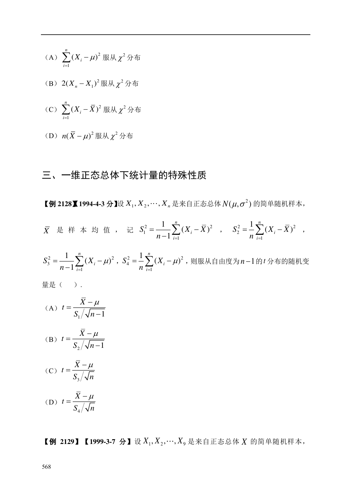

> 生成原页图的原因：包含 Symbol/私用区字形；包含疑似公式布局。

### 文本层（用于搜索/导入，公式可能失真）

~~~text
          n
（A）      ( X −  ) 服从  分布
         i =1
                 i
                       2   2

（B） 2( X n − X 1 ) 服从  2 分布
                       2

         n
（C）      ( X − X ) 服从  分布
        i =1
                 i
                       2   2

（D） n( X −  ) 2 服从  2 分布

三、一维正态总体下统计量的特殊性质

       【1994-4-3 分】设 X 1 , X 2 ,
【例 2128】                              , X n 是来自正态总体 N (  ,  2 ) 的简单随机样本，

                                       1 n                           1 n
X     是 样 本 均 值 ， 记 S1 =
                                  2
                                            i
                                      n − 1 i =1
                                                 ( X − X ) 2
                                                             ， S 2
                                                                 2 =    ( X i − X )2 ，
                                                                     n i =1

         1 n                            1 n
S32 =        
        n − 1 i =1
                   ( X i −  ) 2
                                 ，S 2
                                    4 =   
                                        n i =1
                                               ( X i −  )2 ，则服从自由度为 n − 1 的 t 分布的随机变

量是（             ）.

                  X −
（A） t =
                S1 n − 1

                  X −
（B） t =
                S2 n − 1

                X −
（C） t =
                S3 n

                X −
（D） t =
                S4 n

【例 2129】【1999-3-7 分】设 X 1 , X 2 ,          , X 9 是来自正态总体 X 的简单随机样本，

568
~~~

## PDF 第 87 页

### 原始页面（数学符号以此为准）

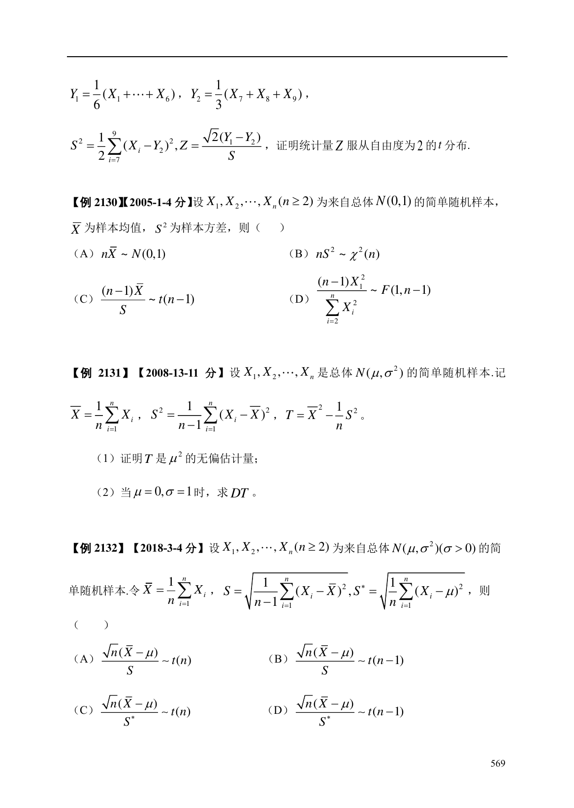

> 生成原页图的原因：包含 Symbol/私用区字形；包含疑似公式布局。

### 文本层（用于搜索/导入，公式可能失真）

~~~text
    1                          1
Y1 = ( X 1 +     + X 6 ) ， Y2 = ( X 7 + X 8 + X 9 ) ，
    6                          3

       1 9                        2(Y1 − Y2 )
S2 =     
       2 i =7
              ( X i − Y2 )2 , Z =
                                     S
                                              ，证明统计量 Z 服从自由度为 2 的 t 分布.

       【2005-1-4 分】设 X 1 , X 2 ,
【例 2130】                                 , X n (n  2) 为来自总体 N (0,1) 的简单随机样本，

X 为样本均值， S 2 为样本方差，则（                        ）

（A） nX ~ N (0,1)                              （B） nS 2 ~  2 ( n)

                                                        (n − 1) X 12
        (n − 1) X                                                      ~ F (1, n − 1)
（C）               ~ t (n − 1)                 （D）          n

            S                                             X
                                                          i=2
                                                                i
                                                                 2

【例 2131】【2008-13-11 分】设 X 1 , X 2 ,              , X n 是总体 N (  ,  2 ) 的简单随机样本.记

       1 n                 1 n                             1
                              
                                                         2
X=            X   ， S 2
                        =            ( X i − X )2 ， T = X − S 2 。
                          n − 1 i =1
                i
       n i =1                                              n

    （1）证明 T 是  的无偏估计量；
                         2

    （2）当  = 0,  = 1 时，求 DT 。

【例 2132】【2018-3-4 分】设 X 1 , X 2 ,           , X n (n  2) 为来自总体 N (  ,  2 )(  0) 的简

                      1 n                1 n                             1 n
单随机样本.令 X =              Xi ， S =
                      n i =1                 
                                        n − 1 i =1
                                                   ( X i − X ) 2
                                                                 , S 
                                                                       =   
                                                                         n i =1
                                                                                ( X i −  ) 2 ，则

（       ）

          n( X − )                                 n( X − )
（A）                    t ( n)             （B）                          t (n − 1)
             S                                         S

          n( X − )                                 n( X − )
（C）                    t ( n)             （D）                          t (n − 1)
             S                                        S

                                                                                                   569
~~~

## PDF 第 88 页

### 原始页面（数学符号以此为准）

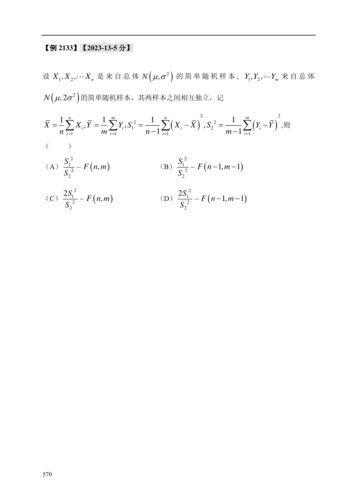

> 生成原页图的原因：包含 Symbol/私用区字形；包含疑似公式布局。

### 文本层（用于搜索/导入，公式可能失真）

~~~text
【例 2133】【2023-13-5 分】

设 X1, X 2 ,   X n 是 来 自 总 体 N (  ,  2 ) 的 简 单 随 机 样 本 , Y1 , Y2 ,         Ym 来 自 总 体

N (  , 2 2 ) 的简单随机样本，其两样本之间相互独立，记

                                                     2                        2
      1 n            1 m                1 n                     1 m
X=       i m
      n i =1
             X , Y =
                       i =1
                            Yi , S1
                                   2
                                     =       ( i ) 2 m −1 
                                       n − 1 i =1
                                                  X − X , S 2
                                                              =
                                                                  i =1
                                                                       (Yi − Y ) ,则
（       ）

   S12                                   S12
（A） 2         F ( n, m )              （B） 2         F ( n − 1, m − 1)
   S2                                    S2

       2S12                                  2S12
（C）            F ( n, m )             （D）            F ( n − 1, m − 1)
       S2 2                                  S2 2

570
~~~

## PDF 第 89 页

### 原始页面（数学符号以此为准）

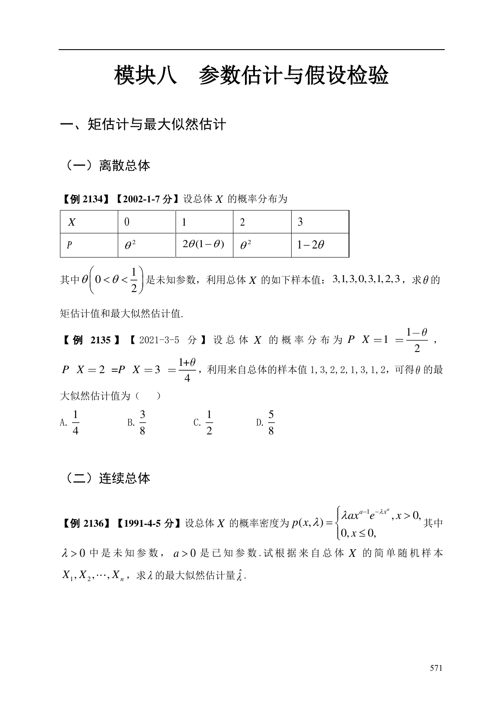

> 生成原页图的原因：包含 Symbol/私用区字形；包含疑似公式布局。

### 文本层（用于搜索/导入，公式可能失真）

~~~text
               模块八                参数估计与假设检验

一、矩估计与最大似然估计

（一）离散总体

【例 2134】【2002-1-7 分】设总体 X 的概率分布为

 X               0            1             2             3
 P              2            2 (1 −  )   2            1 − 2

                    1
其中   0            是未知参数，利用总体 X 的如下样本值： 3,1, 3, 0, 3,1, 2, 3 ，求  的
                    2

矩估计值和最大似然估计值.
                                                                       1
【 例 2135 】 【 2021-3-5 分 】 设 总 体 X 的 概 率 分 布 为 P X                  1           ，
                                                                           2
                              1+
P X          2 =P X       3      ，利用来自总体的样本值 1,3,2,2,1,3,1,2，可得 的最
                               4
大似然估计值为（                  ）
     1                3                1              5
A.               B.               C.             D.
     4                8                2              8

（二）连续总体

                                              ax a −1e−  x , x  0,
                                                                   a

【例 2136】【1991-4-5 分】设总体 X 的概率密度为 p( x,  ) =                           其中
                                              0, x  0,
  0 中是未知参数， a  0 是已知参数.试根据来自总体 X 的简单随机样本
X1, X 2 ,     , X n ，求  的最大似然估计量 ˆ .

                                                                               571
~~~

## PDF 第 90 页

### 原始页面（数学符号以此为准）

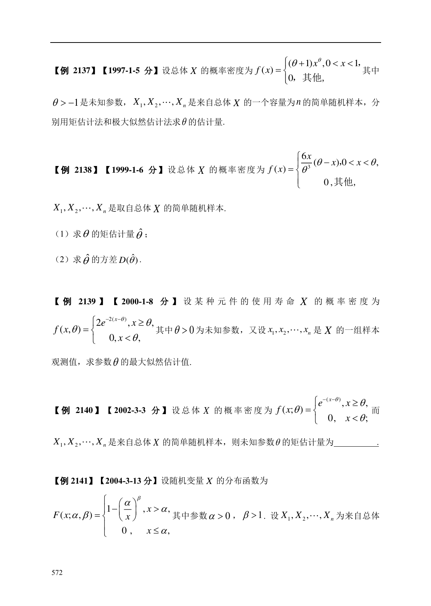

> 生成原页图的原因：包含 Symbol/私用区字形；包含疑似公式布局。

### 文本层（用于搜索/导入，公式可能失真）

~~~text
                                          ( + 1) x , 0  x  1，
                                                    
                                          
【例 2137】【1997-1-5 分】设总体 X 的概率密度为 f ( x) =                      其中
                                          
                                          0，其他,

  −1 是未知参数， X 1 , X 2 , , X n 是来自总体 X 的一个容量为 n 的简单随机样本，分
别用矩估计法和极大似然估计法求  的估计量.

                                                 6x
                                                 ( − x)， 0  x ,
【 例 2138】 【 1999-1-6 分 】 设总体 X 的概率密度为 f ( x ) =   3
                                                
                                                     0 , 其他,

X1, X 2 ,   , X n 是取自总体 X 的简单随机样本.

（1）求  的矩估计量 ˆ ；

（2）求 ˆ 的方差 D (ˆ) .

【 例 2139 】 【 2000-1-8 分 】 设 某 种 元 件 的 使 用 寿 命 X 的 概 率 密 度 为

            2e−2( x − ) , x   ,
f ( x, ) =                        其中   0 为未知参数，又设 x1 , x2 ,    , xn 是 X 的一组样本
             0, x   ,

观测值，求参数  的最大似然估计值.

                                                                         e− ( x − ) , x   ,
【 例 2140 】 【 2002-3-3 分 】 设 总 体 X 的 概 率 密 度 为 f ( x; ) =                                        而
                                                                          0, x   ;

X1, X 2 ,   , X n 是来自总体 X 的简单随机样本，则未知参数  的矩估计量为                                                  .

【例 2141】【2004-3-13 分】设随机变量 X 的分布函数为

                    
                 1 −      , x  ,
F ( x;  ,  ) =   x           其中参数   0 ，   1 . 设 X 1 , X 2 ,     , X n 为来自总体
                     0 , x  ,
                 

572
~~~

## PDF 第 91 页

### 原始页面（数学符号以此为准）

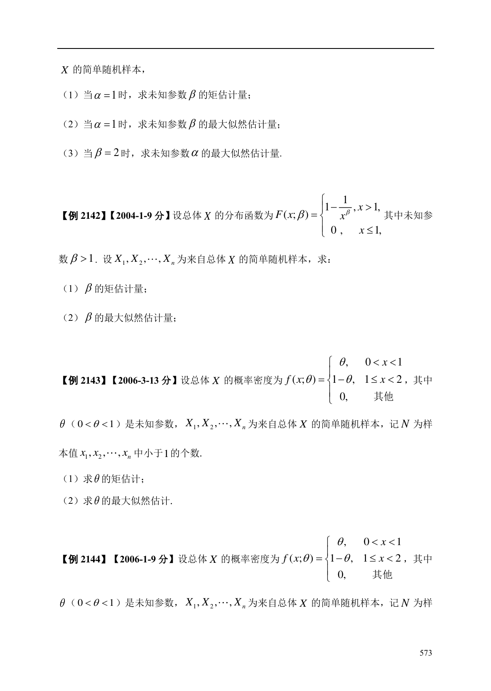

> 生成原页图的原因：包含 Symbol/私用区字形；包含疑似公式布局。

### 文本层（用于搜索/导入，公式可能失真）

~~~text
X 的简单随机样本，

（1）当  = 1 时，求未知参数  的矩估计量；

（2）当  = 1 时，求未知参数  的最大似然估计量；

（3）当  = 2 时，求未知参数  的最大似然估计量.

                                                   1
                                              1 −  , x  1,
【例 2142】【2004-1-9 分】设总体 X 的分布函数为 F ( x;  ) =     x          其中未知参
                                               0 , x  1,

数   1 . 设 X1, X 2 ,   , X n 为来自总体 X 的简单随机样本，求：

（1）  的矩估计量；

（2）  的最大似然估计量；

                                               , 0  x 1
                                              
【例 2143】【2006-3-13 分】设总体 X 的概率密度为 f ( x; ) = 1 −  , 1  x  2 ，其中
                                               0,       其他
                                              

 （ 0    1 ）是未知参数， X 1 , X 2 , , X n 为来自总体 X 的简单随机样本，记 N 为样

本值 x1 , x2 ,   , xn 中小于 1 的个数.

（1）求  的矩估计；

（2）求  的最大似然估计.

                                              ,     0  x 1
                                             
【例 2144】【2006-1-9 分】设总体 X 的概率密度为 f ( x; ) = 1 −  , 1  x  2 ，其中
                                              0,       其他
                                             

 （ 0    1 ）是未知参数， X 1 , X 2 , , X n 为来自总体 X 的简单随机样本，记 N 为样

                                                                 573
~~~

## PDF 第 92 页

### 原始页面（数学符号以此为准）

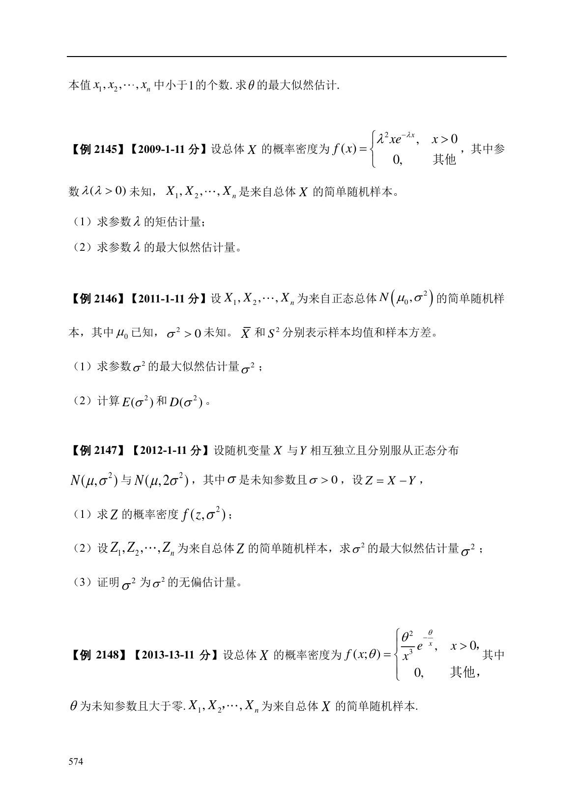

> 生成原页图的原因：包含 Symbol/私用区字形；包含疑似公式布局。

### 文本层（用于搜索/导入，公式可能失真）

~~~text
本值 x1 , x2 ,   , xn 中小于 1 的个数.求  的最大似然估计.

                                             2 xe−  x , x  0
【例 2145】【2009-1-11 分】设总体 X 的概率密度为 f ( x ) =                     ，其中参
                                             0,           其他

数  (  0) 未知， X 1 , X 2 ,   , X n 是来自总体 X 的简单随机样本。

（1）求参数  的矩估计量；

（2）求参数  的最大似然估计量。

【例 2146】【2011-1-11 分】设 X 1 , X 2 ,   , X n 为来自正态总体 N ( 0 ,  2 ) 的简单随机样

本，其中  0 已知，  2  0 未知。 X 和 S 2 分别表示样本均值和样本方差。

（1）求参数  2 的最大似然估计量  2 ；

（2）计算 E ( 2 ) 和 D ( 2 ) 。

【例 2147】【2012-1-11 分】设随机变量 X 与 Y 相互独立且分别服从正态分布

N (  ,  2 ) 与 N (  , 2 2 ) ，其中  是未知参数且   0 ，设 Z = X − Y ，

（1）求 Z 的概率密度 f ( z ,  ) ；
                              2

（2）设 Z1 , Z 2 ,   , Z n 为来自总体 Z 的简单随机样本，求  2 的最大似然估计量  2 ；

（3）证明  2 为  2 的无偏估计量。

                                                2 −x
                                                e , x  0，
【例 2148】【2013-13-11 分】设总体 X 的概率密度为 f ( x; ) =  x 3       其中
                                                0,     其他，
                                               

 为未知参数且大于零. X 1 , X 2， , X n 为来自总体 X 的简单随机样本.

574
~~~

## PDF 第 93 页

### 原始页面（数学符号以此为准）

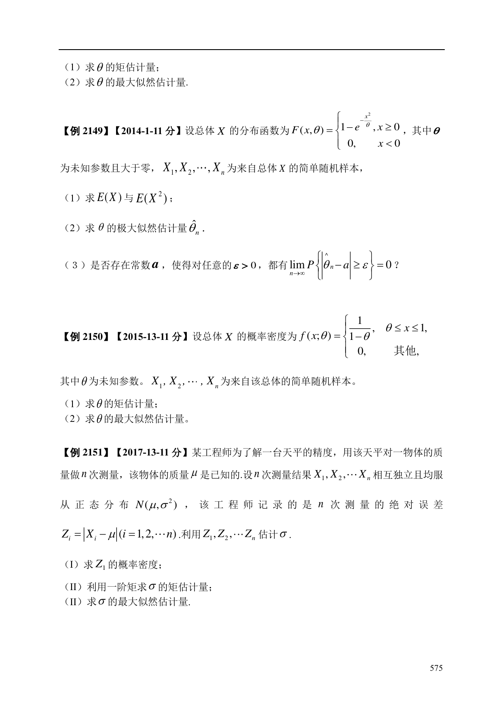

> 生成原页图的原因：包含 Symbol/私用区字形；包含数学专用符号；包含疑似公式布局。

### 文本层（用于搜索/导入，公式可能失真）

~~~text
（1）求  的矩估计量；
（2）求  的最大似然估计量.

                                               
                                                                        2
                                                        x
                                               1 − e −  , x  0
【例 2149】【2014-1-11 分】设总体 X 的分布函数为 F ( x,  ) =                   ，其中 
                                               
                                                0,         x0

为未知参数且大于零， X 1 , X 2 ,                  , X n 为来自总体 X 的简单随机样本，
                          2
（1）求 E ( X ) 与 E ( X ) ；

（2）求  的极大似然估计量 ˆn ．

                                                                  ^    
（３）是否存在常数 a ，使得对任意的   0 ，都有 lim P   n − a    = 0 ？
                                                           n →
                                                                       

                                                1
                                                     ,   x  1,
【例 2150】【2015-13-11 分】设总体 X 的概率密度为 f ( x; ) = 1 − 
                                               
                                                0,       其他,

其中  为未知参数。 X 1 , X 2 ,               , X n 为来自该总体的简单随机样本。
（1）求  的矩估计量；
（2）求  的最大似然估计量。

【例 2151】【2017-13-11 分】某工程师为了解一台天平的精度，用该天平对一物体的质

量做 n 次测量，该物体的质量  是已知的.设 n 次测量结果 X 1 , X 2 ,                           X n 相互独立且均服

从 正 态 分 布 N ( , ) ， 该 工 程 师 记 录 的 是 n 次 测 量 的 绝 对 误 差
                              2

Zi = X i −  (i = 1, 2,       n) .利用 Z1 , Z 2 ,   Z n 估计  .

（I）求 Z1 的概率密度；

（II）利用一阶矩求  的矩估计量；
（II）求  的最大似然估计量.

                                                                                575
~~~

## PDF 第 94 页

### 原始页面（数学符号以此为准）

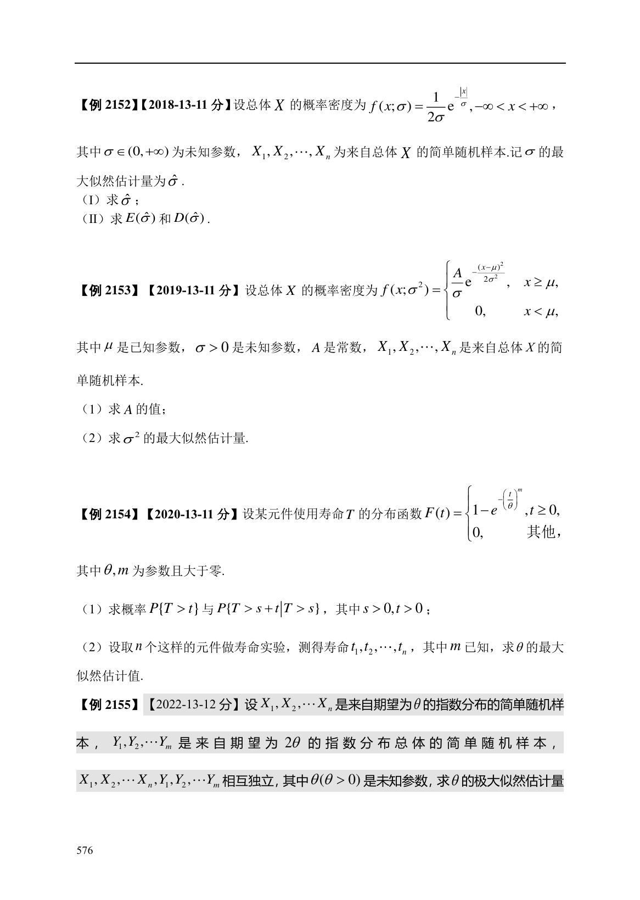

> 生成原页图的原因：包含 Symbol/私用区字形；包含疑似公式布局。

### 文本层（用于搜索/导入，公式可能失真）

~~~text
                                                           x
                                                       1 −
       【2018-13-11 分】设总体 X 的概率密度为 f ( x;  ) =
【例 2152】                                                 e , −  x  + ，
                                                      2

其中   (0, +) 为未知参数， X 1 , X 2 ,        , X n 为来自总体 X 的简单随机样本.记  的最

大似然估计量为 ˆ .
（Ⅰ）求 ˆ ；
（Ⅱ）求 E (ˆ ) 和 D (ˆ ) .

                                                 A − ( x − 2)
                                                                2

                                                 e 2 ,                x  ,
【例 2153】【2019-13-11 分】设总体 X 的概率密度为 f ( x;  ) =  
                                           2

                                                                       x  ,
                                                    0,

其中  是已知参数，   0 是未知参数， A 是常数， X 1 , X 2 ,            , X n 是来自总体 X 的简

单随机样本.

（1）求 A 的值；

（2）求  2 的最大似然估计量.

                                                
                                                                    m
                                                        t
                                                1 − e −   , t  0,
【例 2154】【2020-13-11 分】设某元件使用寿命 T 的分布函数 F (t ) = 
                                                0,            其他，

其中  , m 为参数且大于零.

（1）求概率 P{T  t} 与 P{T  s + t T  s} ，其中 s  0, t  0 ；

（2）设取 n 个这样的元件做寿命实验，测得寿命 t1 , t2 ,                , tn ，其中 m 已知，求  的最大
似然估计值.

【例 2155】【2022-13-12 分】设 X 1 , X 2 ,       X n 是来自期望为  的指数分布的简单随机样

本 ， Y1 , Y2 ,    Ym 是 来 自 期 望 为 2 的 指 数 分 布 总 体 的 简 单 随 机 样 本 ，

X1, X 2 ,   X n , Y1 , Y2 ,   Ym 相互独立，其中  (  0) 是未知参数，求  的极大似然估计量

576
~~~

## PDF 第 95 页

### 原始页面（数学符号以此为准）

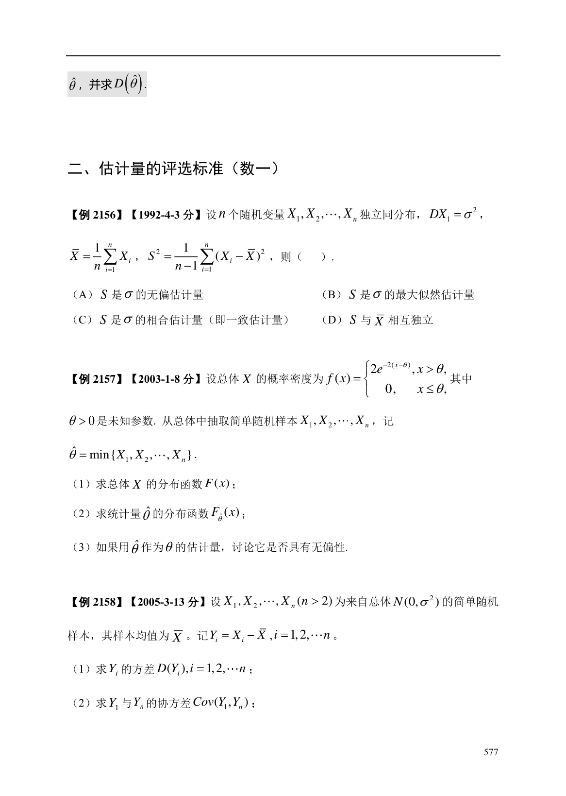

> 生成原页图的原因：包含 Symbol/私用区字形；包含疑似公式布局。

### 文本层（用于搜索/导入，公式可能失真）

~~~text
ˆ ，并求 D ˆ .()

二、估计量的评选标准（数一）

【例 2156】【1992-4-3 分】设 n 个随机变量 X 1 , X 2 ,                  , X n 独立同分布， DX 1 =  2 ，

      1 n                1 n
X=      
      n i =1
             Xi ， S 2 =      
                        n − 1 i =1
                                   ( X i − X )2 ，则（   ）.

（A） S 是  的无偏估计量                                      （B） S 是  的最大似然估计量

（C） S 是  的相合估计量 （即一致估计量）                             （D） S 与 X 相互独立

                                                               2e−2( x − ) , x   ,
【例 2157】【2003-1-8 分】设总体 X 的概率密度为 f ( x) =                                               其中
                                                                    0,      x ,

  0 是未知参数. 从总体中抽取简单随机样本 X 1 , X 2 , , X n ，记

ˆ = min{X 1 , X 2 ,   , X n} .

（1）求总体 X 的分布函数 F ( x ) ；

（2）求统计量 ˆ 的分布函数 Fˆ ( x ) ；

（3）如果用 ˆ 作为  的估计量，讨论它是否具有无偏性.

【例 2158】【2005-3-13 分】设 X 1 , X 2 ,  , X n (n  2) 为来自总体 N (0,  ) 的简单随机
                                                                                 2

样本，其样本均值为 X 。记 Yi = X i − X , i = 1, 2,               n。

（1）求 Yi 的方差 D (Yi ), i = 1, 2,       n；

（2）求 Y1 与 Yn 的协方差 Cov(Y1 , Yn ) ；

                                                                                              577
~~~

## PDF 第 96 页

### 原始页面（数学符号以此为准）

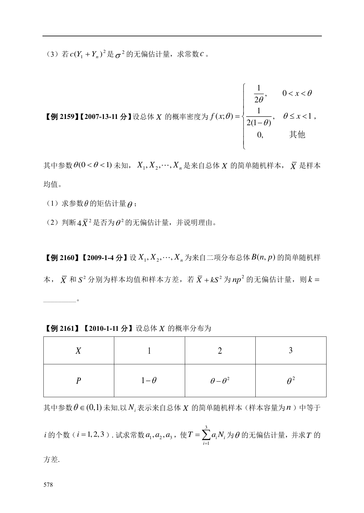

> 生成原页图的原因：包含 Symbol/私用区字形；包含疑似公式布局。

### 文本层（用于搜索/导入，公式可能失真）

~~~text
（3）若 c (Y1 + Yn ) 是  2 的无偏估计量，求常数 c 。
                 2

                                               1
                                               2 ,        0  x 
                                              
                                               1
       【2007-13-11 分】设总体 X 的概率密度为 f ( x; ) = 
【例 2159】                                                  ,   x 1 ，
                                               2(1 −  )
                                               0,            其他
                                              
                                              

其中参数  (0    1) 未知， X 1 , X 2 ,   , X n 是来自总体 X 的简单随机样本， X 是样本

均值。

（1）求参数  的矩估计量  ；

（2）判断 4X 2 是否为  2 的无偏估计量，并说明理由。

【例 2160】【2009-1-4 分】设 X 1 , X 2 ,    , X n 为来自二项分布总体 B ( n, p ) 的简单随机样

本， X 和 S 2 分别为样本均值和样本方差，若 X + kS 2 为 np 2 的无偏估计量，则 k =

_________。

【例 2161】【2010-1-11 分】设总体 X 的概率分布为

         X                    1                      2        3

         P                  1−                     − 2     2

其中参数   (0,1) 未知.以 N i 表示来自总体 X 的简单随机样本（样本容量为 n ）中等于

                                             3
i 的个数（ i = 1, 2, 3 ）.试求常数 a1 , a2 , a3 ，使 T =  ai Ni 为  的无偏估计量，并求 T 的
                                            i =1

方差.

578
~~~

## PDF 第 97 页

### 原始页面（数学符号以此为准）

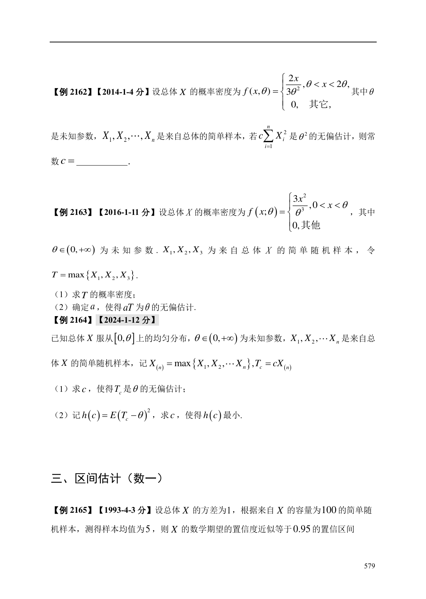

> 生成原页图的原因：包含 Symbol/私用区字形；包含疑似公式布局。

### 文本层（用于搜索/导入，公式可能失真）

~~~text
                                               2x
                                               2 ,   x  2 ,
【例 2162】【2014-1-4 分】设总体 X 的概率密度为 f ( x,  ) =  3               其中 
                                              
                                               0, 其它,
                                                           n
是未知参数， X 1 , X 2 ,              , X n 是来自总体的简单样本，若 c X i2 是  2 的无偏估计，则常
                                                          i =1

数c =                     ．

                                               3x 2
                                                    ,0  x 
【例 2163】【2016-1-11 分】设总体 X 的概率密度为 f ( x; ) =   3            ，其中
                                              0, 其他
                                              

  ( 0, + ) 为 未 知 参 数 . X 1 , X 2 , X 3 为 来 自 总 体 X 的 简 单 随 机 样 本 ， 令

T = max  X 1 , X 2 , X 3  .

（1）求 T 的概率密度；
（2）确定 a ，使得 aT 为  的无偏估计.
【例 2164】【2024-1-12 分】

已知总体 X 服从  0,   上的均匀分布，  ( 0, + ) 为未知参数，X 1 , X 2 ,               X n 是来自总

体 X 的简单随机样本，记 X ( n ) = max  X 1 , X 2 ,       X n  , Tc = cX ( n )

（1）求 c ，使得 Tc 是  的无偏估计；

（2）记 h ( c ) = E (Tc −  ) ，求 c ，使得 h ( c ) 最小.
                                 2

三、区间估计（数一）

【例 2165】【1993-4-3 分】设总体 X 的方差为 1 ，根据来自 X 的容量为 100 的简单随

机样本，测得样本均值为 5 ，则 X 的数学期望的置信度近似等于 0.95 的置信区间

                                                                              579
~~~

## PDF 第 98 页

### 原始页面（数学符号以此为准）

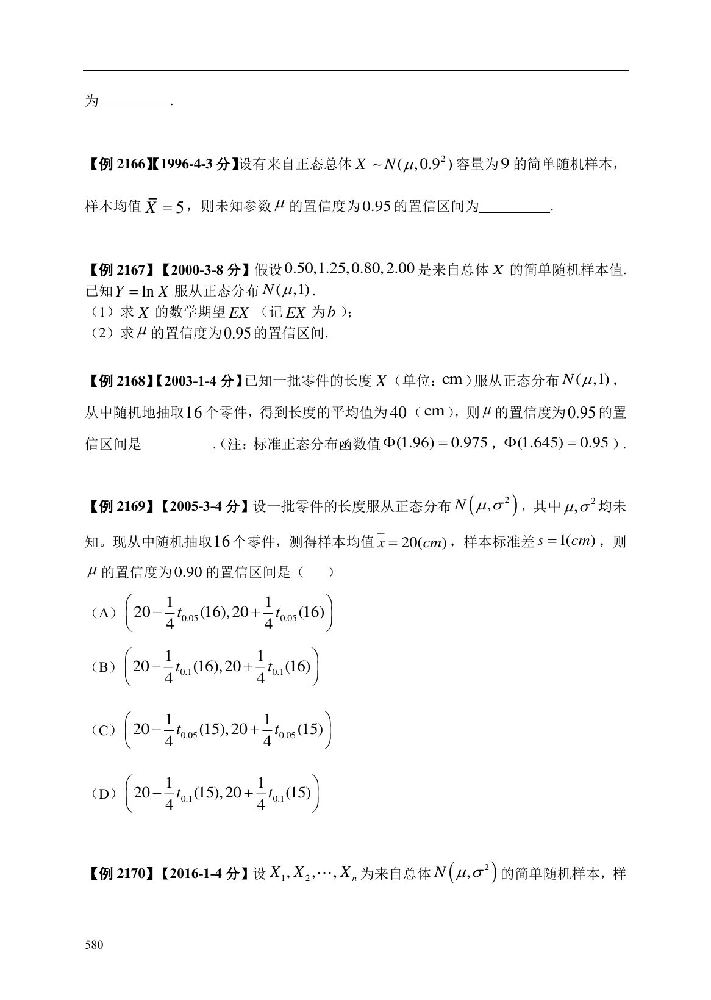

> 生成原页图的原因：包含 Symbol/私用区字形；包含疑似公式布局。

### 文本层（用于搜索/导入，公式可能失真）

~~~text
为             .

【例 2166】
       【1996-4-3 分】设有来自正态总体 X                        N (  , 0.9 2 ) 容量为 9 的简单随机样本，

样本均值 X = 5 ，则未知参数  的置信度为 0.95 的置信区间为                                    .

【例 2167】【2000-3-8 分】假设 0.50,1.25, 0.80, 2.00 是来自总体 X 的简单随机样本值.
已知 Y = ln X 服从正态分布 N (  ,1) .
（1）求 X 的数学期望 EX （记 EX 为 b ）     ；
      
（2）求 的置信度为 0.95 的置信区间.

       【2003-1-4 分】已知一批零件的长度 X （单位：cm ）服从正态分布 N (  ,1) ，
【例 2168】

从中随机地抽取 16 个零件，得到长度的平均值为 40 （ cm ），则  的置信度为 0.95 的置

信区间是                  .（注：标准正态分布函数值  (1.96) = 0.975 ， (1.645) = 0.95 ）.

【例 2169】【2005-3-4 分】设一批零件的长度服从正态分布 N  ,  ，其中  ,  2 均未
                                          2
                                                               (    )
知。现从中随机抽取 16 个零件，测得样本均值 x = 20(cm) ，样本标准差 s = 1(cm) ，则
 的置信度为 0.90 的置信区间是（                         ）

            1                 1           
（A）  20 −     t0.05 (16), 20 + t0.05 (16) 
            4                 4           
            1                1          
（B）  20 −     t0.1 (16), 20 + t0.1 (16) 
            4                4          

            1                 1           
（C）  20 −     t0.05 (15), 20 + t0.05 (15) 
            4                 4           

            1                1          
（D）  20 −     t0.1 (15), 20 + t0.1 (15) 
            4                4          

【例 2170】【2016-1-4 分】设 X 1 , X 2 ,              , X n 为来自总体 N (  ,  2 ) 的简单随机样本，样

580
~~~

## PDF 第 99 页

### 原始页面（数学符号以此为准）

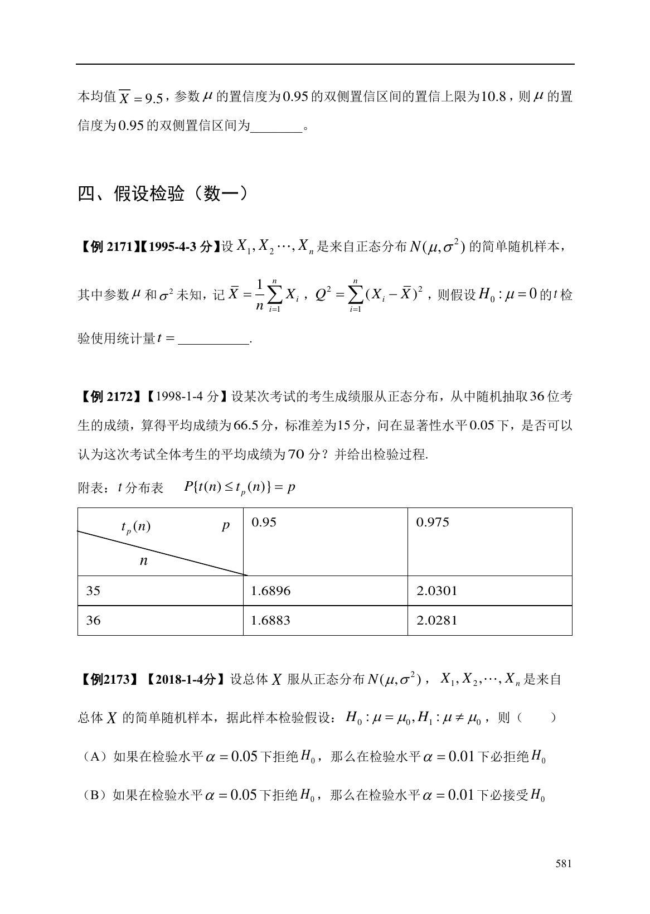

> 生成原页图的原因：包含 Symbol/私用区字形；包含疑似公式布局。

### 文本层（用于搜索/导入，公式可能失真）

~~~text
本均值 X = 9.5 ，参数  的置信度为 0.95 的双侧置信区间的置信上限为 10.8 ，则  的置

信度为 0.95 的双侧置信区间为________。

四、假设检验（数一）

       【1995-4-3 分】设 X 1 , X 2
【例 2171】                               , X n 是来自正态分布 N (  ,  2 ) 的简单随机样本，

                                                     n
                                 1 n
其中参数  和  2 未知，记 X =              
                                 n i =1
                                        X i ，Q 2 =  ( X i − X )2 ，则假设 H 0 :  = 0 的 t 检
                                                   i =1

验使用统计量 t =                   .

【例 2172】【1998-1-4 分】设某次考试的考生成绩服从正态分布，从中随机抽取 36 位考

生的成绩，算得平均成绩为 66.5 分，标准差为 15 分，问在显著性水平 0.05 下，是否可以

认为这次考试全体考生的平均成绩为 70 分？并给出检验过程.

附表： t 分布表        P{t (n)  t p (n)} = p

      t p ( n)          p     0.95                             0.975

           n
 35                           1.6896                           2.0301

 36                           1.6883                           2.0281

【例2173】【2018-1-4分】设总体 X 服从正态分布 N (  ,  ) ， X 1 , X 2 ,
                                                           2
                                                                           , X n 是来自

总体 X 的简单随机样本，据此样本检验假设： H 0 :  = 0 , H1 :   0 ，则（                              ）

（A）如果在检验水平  = 0.05 下拒绝 H 0 ，那么在检验水平  = 0.01 下必拒绝 H 0

（B）如果在检验水平  = 0.05 下拒绝 H 0 ，那么在检验水平  = 0.01 下必接受 H 0

                                                                                    581
~~~

## PDF 第 100 页

### 原始页面（数学符号以此为准）

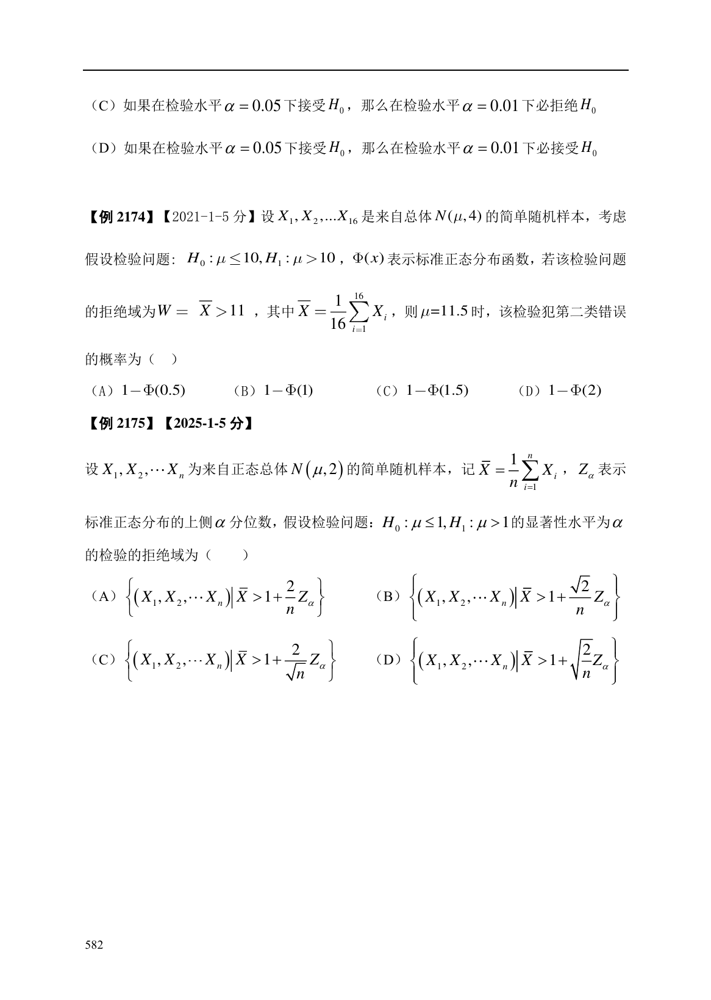

> 生成原页图的原因：包含 Symbol/私用区字形；包含疑似公式布局。

### 文本层（用于搜索/导入，公式可能失真）

~~~text
（C）如果在检验水平  = 0.05 下接受 H 0 ，那么在检验水平  = 0.01 下必拒绝 H 0

（D）如果在检验水平  = 0.05 下接受 H 0 ，那么在检验水平  = 0.01 下必接受 H 0

【例 2174】【2021-1-5 分】设 X 1 , X 2 ,... X 16 是来自总体 N ( , 4) 的简单随机样本，考虑

假设检验问题: H 0 :              10, H1 :         10 ， ( x ) 表示标准正态分布函数，若该检验问题

                                             1 16
的拒绝域为 W               X   11 ，其中 X                 X i ，则 =11.5 时，该检验犯第二类错误
                                            16 i 1

的概率为（ ）

（A） 1         (0.5)       （B） 1       (1)       （C） 1       (1.5)       （D） 1       (2)

【例 2175】【2025-1-5 分】

                                                                        1 n
设 X1, X 2 ,     X n 为来自正态总体 N (  , 2 ) 的简单随机样本，记 X =                      X i ， Z 表示
                                                                        n i =1

标准正态分布的上侧  分位数，假设检验问题：H 0 :   1, H1 :   1 的显著性水平为 

的检验的拒绝域为（                  ）

                                  2                  
                                                                                    2  
（A） ( X 1 , X 2 ,    X n ) X  1 + Z         （B） ( X 1 , X 2 ,   X n ) X  1+     Z 
                                  n                  
                                                                                   n    
                                                                                         

                                     2               
                                                                                   2  
（C） ( X 1 , X 2 ,    X n ) X  1+      Z     （D） ( X 1 , X 2 ,   X n ) X  1+    Z 
                                      n              
                                                                                   n  

582
~~~
